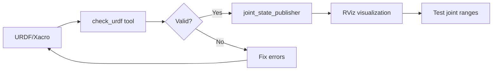
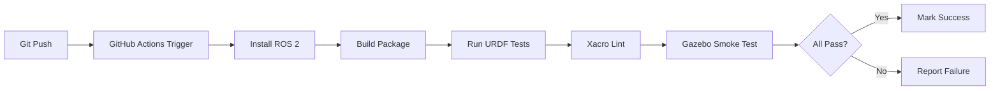
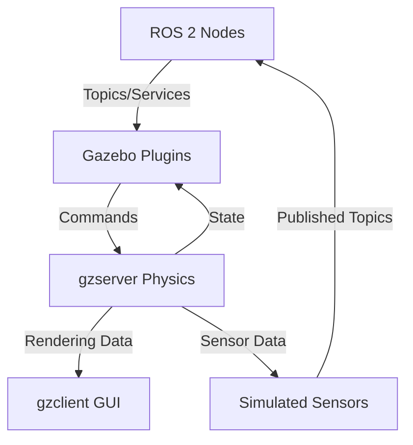

# Physical AI & Humanoid Robotics - FINAL MASTER BLUEPRINT

## Aligned with GIAIC Course Structure (2025)

---

## EXECUTIVE SUMMARY

**Course Philosophy:** Code-first, hands-on approach to Physical AI and humanoid robotics  
**Structure:** 4 modules matching official course requirements  
**Length:** 50 pages (Module 1: 12p, Module 2: 14p, Module 3: 13p, Module 4: 11p)  
**Pedagogy:** ROS 2 first → Simulation → AI perception → Voice-language-action integration  
**Hardware Focus:** Jetson Orin Nano/NX edge deployment, Unitree robots, RealSense cameras  
**Capstone:** Voice-controlled autonomous humanoid (Whisper → LLM → ROS actions)

---

## BOOK METADATA

**Title:** Physical AI & Humanoid Robotics: From ROS 2 to Voice-Controlled Autonomous Systems  
**Subtitle:** A Practical Guide to Building Intelligent Robots (2025 Edition)  
**Format:** Interactive Docusaurus textbook with embedded RAG chatbot  
**Target Audience:** Students, developers, engineers learning robotics  
**Prerequisites:** Basic Python, Linux command line, intro to AI/ML  
**Delivery Method:** Web-based book + integrated AI assistant

---

## CURRICULUM ALIGNMENT

This book directly supports the GIAIC quarter structure:

| Course Module                        | Book Module    | Focus Area                 | Hardware          |
| ------------------------------------ | -------------- | -------------------------- | ----------------- |
| **Module 1: Robotic Nervous System** | Module 1 (12p) | ROS 2, URDF, sensors       | Jetson Orin       |
| **Module 2: Digital Twin**           | Module 2 (14p) | Gazebo, Unity, simulation  | Workstation GPU   |
| **Module 3: AI-Robot Brain**         | Module 3 (13p) | Isaac Sim, Isaac ROS, Nav2 | Orin + RTX GPU    |
| **Module 4: VLA**                    | Module 4 (11p) | Whisper, LLMs, capstone    | Orin + microphone |

---

# MODULE 1: THE ROBOTIC NERVOUS SYSTEM (ROS 2) - 12 PAGES

## Module Overview

**Philosophy:** Code-first approach - students build and run ROS 2 nodes from Day 1. ROS 2 is taught as the nervous system that connects sensors, planning, and actuation throughout the entire course.

**Learning Outcomes:**

- Build and run ROS 2 nodes using rclpy (publishers, subscribers, services, actions)
- Create and validate URDF/XACRO humanoid robot descriptions
- Acquire, calibrate, and fuse sensor data (IMU, encoders, RealSense cameras)
- Deploy ROS 2 stacks to Jetson Orin Nano/NX edge devices
- Understand real-time considerations, QoS policies, and latency budgeting

**Hardware Context:**

- Development: Ubuntu 22.04 workstation
- Deployment target: Jetson Orin Nano (8GB) or Orin NX (16GB)
- Sensors: Intel RealSense D435i, BNO055 IMU

---

## Chapter 1.1: ROS 2 Fundamentals — Code First (5 pages)

**Chapter Overview:** Hands-on introduction to ROS 2 architecture and coding patterns with rclpy. Students start running nodes and exchanging messages immediately.

### Section 1.1.1: ROS 2 Architecture & Developer Workflow (1.0 pages)

**Content:**

- **DDS Middleware:** Data Distribution Service as the transport layer
- **Core Concepts:** Nodes (executables), topics (pub/sub), services (request/response), actions (long-running tasks)
- **Developer Flow:** Create package → build with colcon → source workspace → run nodes → inspect with CLI tools
- **QoS Basics:** Reliability, durability, history depth - why sensor data needs different QoS than commands

**Visual Content:**

- **Mermaid Diagram:** ROS 2 runtime graph showing perception node → planning node → controller node with topic/service connections
- **Example:** Simple camera → object_detector → motion_planner → motor_controller pipeline

**Learning Activities:**

- **Takeaway:** Understanding how message flows map to robot behaviors
- **Task:** Inspect a running ROS 2 graph using `ros2 node list`, `ros2 topic list`, `ros2 topic echo` and annotate the components
- **Quiz:** 3 MCQs on node communication patterns

**Key Commands:**

```bash
ros2 run demo_nodes_cpp talker
ros2 run demo_nodes_py listener
ros2 topic echo /chatter
ros2 node info /talker
```

---

### Section 1.1.2: rclpy Patterns & Example Nodes (1.5 pages)

**Content:**

- **Node Skeleton:** Minimal rclpy node structure (class-based)
- **Publisher Pattern:** Creating publishers, timer callbacks, publishing messages
- **Subscriber Pattern:** Creating subscribers, callback functions, processing data
- **Action Server/Client:** For long-running tasks (navigation, grasping)
- **Lifecycle Nodes:** Configurable, activatable, cleanupable states

**Code Example (12-16 lines - ready to run):**

```python
import rclpy
from rclpy.node import Node
from std_msgs.msg import String

class HeartbeatNode(Node):
    def __init__(self):
        super().__init__('heartbeat')
        self.publisher = self.create_publisher(String, '/robot/ready', 10)
        self.timer = self.create_timer(1.0, self.publish_heartbeat)

    def publish_heartbeat(self):
        msg = String()
        msg.data = 'Robot ready at ' + str(self.get_clock().now())
        self.publisher.publish(msg)
        self.get_logger().info(f'Published: {msg.data}')

def main():
    rclpy.init()
    node = HeartbeatNode()
    rclpy.spin(node)
```

**Learning Activities:**

- **Quiz:** 3 MCQs on node lifecycle and action semantics
- **Lab Microtask:** Build and run a "heartbeat" node that publishes `/robot/ready` every second
- **Extension:** Modify to accept a parameter for publish rate

---

### Section 1.1.3: Parameters, Launch Files & Package Layout (1.0 pages)

**Content:**

- **ROS 2 Package Structure:** Standard layout (src/, include/, launch/, config/, package.xml, CMakeLists.txt)
- **Python Launch Files:** Using `launch.py` to start multiple nodes, set parameters, remap topics
- **Parameter YAML Files:** Externalizing configuration for reproducible experiments
- **Best Practices:** Naming conventions, namespace usage, avoiding hardcoded values

**Visual Content:**

- **Table:** Recommended package directory layout

```
my_robot_package/
├── config/
│   └── params.yaml
├── launch/
│   └── robot.launch.py
├── my_robot_package/
│   ├── __init__.py
│   └── my_node.py
├── package.xml
└── setup.py
```

- **Common CLI Commands Table:**

| Command                     | Purpose              |
| --------------------------- | -------------------- |
| `ros2 pkg create`           | Create new package   |
| `colcon build`              | Build workspace      |
| `source install/setup.bash` | Source workspace     |
| `ros2 launch pkg launch.py` | Run launch file      |
| `ros2 param list`           | List node parameters |

**Learning Activities:**

- **Task:** Create a package scaffold with a launch file that starts two nodes (publisher + subscriber)
- **Lab Checkpoint:** Verify both nodes communicate via a topic

---

### Section 1.1.4: Real-Time Considerations & QoS Tuning (1.5 pages)

**Content:**

- **Real-Time Challenges:** Soft vs hard real-time, Linux RT_PREEMPT kernel
- **Latency Budgeting:** Control loop frequency requirements (100Hz+ for balance, 30Hz for vision)
- **DDS QoS Profiles:**
  - **Reliability:** Reliable (guaranteed delivery) vs Best Effort (lossy)
  - **Durability:** Transient Local (late joiners get last message) vs Volatile
  - **History:** Keep Last N vs Keep All
  - **Deadline:** Trigger callback if message not received within time

**Visual Content:**

- **QoS Settings Table:**

| Use Case          | Reliability | Durability      | History      | Deadline |
| ----------------- | ----------- | --------------- | ------------ | -------- |
| Sensor data (IMU) | Best Effort | Volatile        | Keep Last 1  | None     |
| Camera images     | Best Effort | Volatile        | Keep Last 1  | 100ms    |
| Joint commands    | Reliable    | Volatile        | Keep Last 10 | 10ms     |
| Map updates       | Reliable    | Transient Local | Keep Last 1  | None     |

**Learning Activities:**

- **Lab Checkpoint:** Measure latency between simulated IMU publisher and motion consumer
  - Use `ros2 topic hz` and `ros2 topic bw` to measure frequency and bandwidth
  - Tune QoS settings and observe impact on latency/reliability
- **Task:** Configure QoS for a high-frequency sensor (500Hz) vs a slow actuator (10Hz)

---

## Chapter 1.2: URDF, Xacro & Robot Description for Humanoids (4 pages)

**Chapter Overview:** Build humanoid robot descriptions using URDF/XACRO, attach sensors and actuators, validate kinematics, and visualize in RViz.

### Section 1.2.1: URDF Basics & Xacro Macros (1.0 pages)

**Content:**

- **URDF Components:**
  - **Links:** Robot body parts (visual geometry, collision geometry, inertial properties)
  - **Joints:** Connections between links (fixed, revolute, prismatic, continuous)
  - **Inertial Parameters:** Mass, center of mass, inertia tensor (critical for dynamics)
- **Xacro Advantages:**
  - Macros for reusable components (e.g., define a leg once, instantiate twice)
  - Variables and math expressions
  - File includes for modularity

**Code Example (Xacro snippet):**

```xml
<?xml version="1.0"?>
<robot xmlns:xacro="http://www.ros.org/wiki/xacro" name="simple_arm">

  <xacro:macro name="arm_link" params="name length mass">
    <link name="${name}">
      <visual>
        <geometry>
          <cylinder length="${length}" radius="0.05"/>
        </geometry>
        <material name="blue"/>
      </visual>
      <collision>
        <geometry>
          <cylinder length="${length}" radius="0.05"/>
        </geometry>
      </collision>
      <inertial>
        <mass value="${mass}"/>
        <inertia ixx="0.01" iyy="0.01" izz="0.001" ixy="0" ixz="0" iyz="0"/>
      </inertial>
    </link>
  </xacro:macro>

  <xacro:arm_link name="upper_arm" length="0.3" mass="1.5"/>

  <joint name="elbow" type="revolute">
    <parent link="upper_arm"/>
    <child link="forearm"/>
    <axis xyz="0 1 0"/>
    <limit lower="-2.0" upper="2.0" effort="100" velocity="2.0"/>
  </joint>
</robot>
```

**Learning Activities:**

- **Task:** Create a xacro fragment for an upper-arm link with realistic mass and dimensions
- **Extension:** Add a collision mesh (simplified geometry) different from visual mesh

---

### Section 1.2.2: Sensors in URDF & Plugin Wiring (1.0 pages)

**Content:**

- **Attaching Sensors:** Camera, IMU, LiDAR, force-torque sensors as URDF links
- **Gazebo Plugins:** Connecting URDF sensors to ROS topics via Gazebo plugins
  - `libgazebo_ros_camera.so` - publishes camera images to `/camera/image_raw`
  - `libgazebo_ros_imu.so` - publishes IMU data to `/imu/data`
  - `libgazebo_ros_ray_sensor.so` - for LiDAR

**Visual Content:**

- **Common Plugins Table:**

| Plugin                    | Sensor Type  | ROS Topics Published                       | Use Case                  |
| ------------------------- | ------------ | ------------------------------------------ | ------------------------- |
| `gazebo_ros_camera`       | RGB Camera   | `/camera/image_raw`, `/camera/camera_info` | Vision                    |
| `gazebo_ros_depth_camera` | Depth Camera | `/depth/image_raw`, `/depth/points`        | 3D perception             |
| `gazebo_ros_imu`          | IMU          | `/imu/data`                                | Orientation, acceleration |
| `gazebo_ros_ray_sensor`   | LiDAR        | `/scan` (LaserScan)                        | Obstacle detection        |
| `gazebo_ros_ft_sensor`    | Force/Torque | `/ft_sensor/data`                          | Contact forces            |

**Code Example:**

```xml
<gazebo reference="camera_link">
  <sensor name="camera" type="camera">
    <camera>
      <horizontal_fov>1.047</horizontal_fov>
      <image>
        <width>640</width>
        <height>480</height>
      </image>
    </camera>
    <plugin name="camera_controller" filename="libgazebo_ros_camera.so">
      <ros>
        <namespace>/robot</namespace>
        <remapping>image_raw:=camera/image</remapping>
      </ros>
    </plugin>
  </sensor>
</gazebo>
```

**Learning Activities:**

- **Lab Microtask:** Add a simulated RealSense D435i camera to your URDF
- **Verification:** Launch in Gazebo, confirm `/camera/depth/image_raw` topic appears
- **Task:** Subscribe to the depth image and print min/max depth values

---

### Section 1.2.3: Validating Kinematics & Joint Limits (1.0 pages)

**Content:**

- **Joint Limits:** Safety bounds (lower, upper, effort, velocity)
- **Mimic Joints:** Coupled joints (e.g., gripper fingers move together)
- **Joint State Publisher:** Publishes current joint positions for visualization
- **RViz Visualization:** Interactive joint sliders to test forward kinematics

**Visual Content:**

- **Mermaid: Kinematic Chain Inspection Flow**



**Learning Activities:**

- **Task:** Run `check_urdf` on your robot description and fix any errors
- **Lab:** Launch `joint_state_publisher_gui` + `rviz` and test joint ranges
  - Verify all joints move within specified limits
  - Check for collisions between links
  - Ensure end-effector reaches expected workspace

**Common Errors:**

- Missing inertial properties → Gazebo physics fails
- Incorrect joint axes → robot moves in wrong direction
- Collision geometry too large → false collision detections

---

### Section 1.2.4: Package Testing & CI Basics for Robot Descriptions (1.0 pages)

**Content:**

- **Unit Tests for URDF:** Python tests to validate URDF structure
- **Xacro Linting:** Check for syntax errors, unused macros
- **Simulation Smoke Tests:** Launch Gazebo, spawn robot, verify no crashes
- **CI Pipeline:** GitHub Actions workflow for automated testing

**Visual Content:**

- **Example CI Pipeline (Mermaid):**



**Code Example (Python test):**

```python
import unittest
from ament_index_python.packages import get_package_share_directory
import xacro

class TestRobotDescription(unittest.TestCase):
    def test_urdf_parses(self):
        urdf_path = get_package_share_directory('my_robot') + '/urdf/robot.xacro'
        robot_desc = xacro.process_file(urdf_path).toxml()
        self.assertIn('<robot', robot_desc)
        self.assertIn('</robot>', robot_desc)
```

**Learning Activities:**

- **Quiz:** 3 questions on common URDF errors (missing mass, wrong joint type, invalid limits)
- **Task:** Write a test that verifies all joints have valid limits defined

---

## Chapter 1.3: Sensors & Proprioception — Practical (3 pages)

**Chapter Overview:** Acquire and fuse proprioceptive (encoders, IMU) and exteroceptive (RealSense) sensor data in ROS 2 for reliable state estimation.

### Section 1.3.1: IMU & Encoder Basics + Calibration (1.0 pages)

**Content:**

- **IMU Fundamentals:**

  - **Accelerometer:** Measures linear acceleration (m/s²) in 3 axes
  - **Gyroscope:** Measures angular velocity (rad/s) in 3 axes
  - **Magnetometer:** Measures magnetic field (optional, for heading)
  - **Common Issues:** Bias drift, temperature sensitivity, coordinate frame confusion

- **Encoder Types:**

  - **Incremental:** Relative position (counts pulses)
  - **Absolute:** Absolute position (no drift)
  - **Resolution:** Counts per revolution (CPR)

- **Calibration Steps:**
  1. Static calibration: Robot stationary, measure bias
  2. Dynamic calibration: Known motion profile, compare expected vs measured
  3. Store calibration parameters in config file

**Visual Content:**

- **IMU Failure Modes Table:**

| Issue                     | Symptom                      | Solution                       |
| ------------------------- | ---------------------------- | ------------------------------ |
| Bias drift                | Orientation drifts over time | Periodic zero-velocity updates |
| Temperature sensitivity   | Values change with warmth    | Temperature compensation       |
| Vibration noise           | High-frequency spikes        | Low-pass filter                |
| Coordinate frame mismatch | Robot tilts wrong direction  | Verify axis definitions        |

**Learning Activities:**

- **Task:** Calibrate a sample IMU in simulation using recorded rosbag
- **Lab Checkpoint:** Collect static IMU data, compute bias, subtract from future readings
- **Extension:** Implement temperature compensation if data available

---

### Section 1.3.2: Sensor Fusion (Complementary & Kalman Intuition) (1.0 pages)

**Content:**

- **Why Fuse?** Each sensor has strengths and weaknesses
  - IMU: High frequency, drifts over time
  - Vision/encoders: Low frequency, absolute but noisy
- **Complementary Filter:**
  - Simple weighted average: `fused = α * high_freq + (1-α) * low_freq`
  - Typical α = 0.98 (trust IMU for short-term, vision for long-term)
- **Kalman Filter (Intuition):**
  - Predict step: Use model to estimate next state
  - Update step: Correct estimate using sensor measurement
  - Optimal for Gaussian noise
- **Extended Kalman Filter (EKF):** For nonlinear systems (most robots)
- **Pose Graph Optimization:** For SLAM (covered in Module 3)

**Code Example (10-line complementary filter):**

```python
class ComplementaryFilter:
    def __init__(self, alpha=0.98):
        self.alpha = alpha
        self.angle = 0.0

    def update(self, gyro_rate, accel_angle, dt):
        # Integrate gyro (high freq, drifts)
        gyro_estimate = self.angle + gyro_rate * dt

        # Fuse with accelerometer (low freq, absolute)
        self.angle = self.alpha * gyro_estimate + (1 - self.alpha) * accel_angle
        return self.angle
```

**Learning Activities:**

- **Lab Microtask:** Fuse encoder + IMU to estimate joint angle
  - Record data from both sensors
  - Apply complementary filter
  - Plot: encoder only, IMU only, fused (show improvement)
- **Extension:** Compare complementary vs simple EKF implementation

---

### Section 1.3.3: Deploying ROS 2 Stacks to Jetson Orin Nano/NX (1.0 pages)

**Content:**

- **Jetson Orin Overview:**

  - **Orin Nano (8GB):** 40 TOPS AI performance, suitable for perception inference
  - **Orin NX (16GB):** 100 TOPS, can run heavier models + multiple streams
  - **OS:** JetPack 6.0 (Ubuntu 22.04 + CUDA + TensorRT)

- **Deployment Workflow:**

  1. Develop on workstation (x86)
  2. Cross-compile ROS 2 packages (or use Docker)
  3. Flash Jetson with JetPack
  4. Transfer ROS 2 workspace
  5. Install dependencies (`rosdep install`)
  6. Build and run

- **Optimization Tips:**
  - Use lightweight nodes (avoid heavy dependencies)
  - Quantize models (FP32 → FP16 → INT8)
  - Monitor CPU/GPU with `tegrastats`
  - Add swap space (minimum 8GB) for Orin Nano

**Visual Content:**

- **Orin Comparison Table:**

| Feature             | Orin Nano (8GB)          | Orin NX (16GB)           | Notes                      |
| ------------------- | ------------------------ | ------------------------ | -------------------------- |
| AI Performance      | 40 TOPS                  | 100 TOPS                 | Tera Operations Per Second |
| GPU                 | 1024-core                | 1024-core                | Ampere architecture        |
| CPU                 | 6-core ARM               | 8-core ARM               | Cortex-A78AE               |
| Memory              | 8GB LPDDR5               | 16GB LPDDR5              | Shared CPU/GPU             |
| Power               | 15W                      | 25W                      | Typical                    |
| Price               | ~$249                    | ~$499                    | MSRP                       |
| **Recommended Use** | Single perception stream | Multi-stream or training |                            |

**Learning Activities:**

- **Task:** Flash Orin Nano with JetPack, install ROS 2 Humble
- **Lab:** Deploy the heartbeat node from Section 1.1.2 to Orin
  - SSH into Orin
  - Transfer workspace using `scp` or Git
  - Build with `colcon build`
  - Run node and verify `/robot/ready` topic
- **Extension:** Monitor resource usage during node execution

**Common Issues:**

- **Insufficient swap:** Compilation fails → add 16GB swap
- **USB permissions:** Camera not detected → add udev rules
- **Network discovery:** Nodes on Orin can't see workstation nodes → configure DDS/ROS_DOMAIN_ID

---

## MODULE 1 SUMMARY

**Visual & Interactive Assets:**

- **Mermaid Diagrams:** 2 (ROS 2 graph, CI pipeline)
- **Comparison Tables:** 3 (QoS settings, plugin table, Orin specs)
- **Code Examples:** 3 (rclpy node, xacro, complementary filter)
- **Labs:** 5 micro-labs (heartbeat node, URDF sensor, IMU fusion, RViz validation, Orin deployment)
- **Quizzes:** MCQs per chapter + reflection tasks

**Case Study:** "Hello ROS → Gazebo" classroom demo

- Deploy a simple ROS 2 controller to Unitree Go2 proxy robot
- Read IMU data, send velocity commands, visualize in RViz
- Demonstrates complete perception-to-action loop

**Learning Checkpoints:**

- Can students build and run a custom ROS 2 node?
- Can they create a valid URDF with sensors?
- Can they deploy to Jetson Orin and debug connectivity issues?

---

# MODULE 2: THE DIGITAL TWIN (GAZEBO & UNITY) - 14 PAGES

## Module Overview

**Philosophy:** Master physics simulation and environment building before deploying to hardware. "Sim-to-real" transfer requires understanding simulator capabilities and limitations.

**Learning Outcomes:**

- Configure Gazebo Classic and Gazebo Harmonic for humanoid simulation
- Build realistic environments with proper physics parameters
- Integrate Unity for high-fidelity rendering and HRI testing
- Simulate sensors (LiDAR, depth cameras, IMUs) and validate outputs
- Understand collision detection, contact dynamics, and solver tuning

**Hardware Context:**

- Workstation with RTX GPU (4070 Ti or better) for rendering
- Ubuntu 22.04 + ROS 2 Humble/Iron
- Gazebo Harmonic (latest) or Gazebo Classic 11

---

## Chapter 2.1: Gazebo Fundamentals for ROS-Centric Workflows (5 pages)

### Section 2.1.1: Gazebo Architecture & World Files (1.2 pages)

**Content:**

- **Gazebo Components:**
  - **gzserver:** Physics simulation backend (headless)
  - **gzclient:** GUI renderer
  - **Plugins:** Connect Gazebo to ROS 2
- **SDF (Simulation Description Format):**
  - More expressive than URDF (nested models, plugins, sensors)
  - World files define environment (ground plane, lighting, models)
- **Launch Integration:**
  - Use `gz_ros2_control` for joint control
  - Spawn models dynamically via `/spawn_entity` service

**Visual Content:**

- **Gazebo Architecture Diagram (Mermaid):**



**Learning Activities:**

- **Task:** Create a simple world file with ground plane, sun, and a box
- **Lab:** Launch Gazebo, spawn a robot URDF, move joints via `ros2 topic pub`

---

### Section 2.1.2: Physics Tuning & Contact Dynamics (1.5 pages)

**Content:**

- **Physics Engines:** ODE (default), Bullet, DART

  - **ODE:** Fast but less accurate for complex contacts
  - **Bullet:** Better for rigid body stacking
  - **DART:** Best for articulated robots (humanoids)

- **Solver Parameters:**

  - **Step size:** Smaller = more accurate but slower (default 0.001s)
  - **Iterations:** Constraint solver iterations (default 50)
  - **Contact parameters:** Friction, restitution, damping

- **Common Issues:**
  - Robot sinking through floor → increase contact stiffness
  - Jittery motion → decrease step size or increase damping
  - Slow simulation → reduce collision complexity

**Visual Content:**

- **Physics Engine Comparison Table:**

| Engine | Speed  | Accuracy  | Best For      | ROS 2 Support |
| ------ | ------ | --------- | ------------- | ------------- |
| ODE    | Fast   | Medium    | Mobile robots | Excellent     |
| Bullet | Medium | High      | Manipulation  | Good          |
| DART   | Slow   | Very High | Humanoids     | Excellent     |

**Code Example (World file physics settings):**

```xml
<world name="default">
  <physics type="dart">
    <max_step_size>0.001</max_step_size>
    <real_time_factor>1.0</real_time_factor>
    <real_time_update_rate>1000</real_time_update_rate>
  </physics>

  <model name="ground">
    <static>true</static>
    <link name="ground_link">
      <collision name="collision">
        <geometry>
          <plane><normal>0 0 1</normal></plane>
        </geometry>
        <surface>
          <friction>
            <ode><mu>100</mu><mu2>50</mu2></ode>
          </friction>
          <contact>
            <ode><kp>1e8</kp><kd>1e5</kd></ode>
          </contact>
        </surface>
      </collision>
    </link>
  </model>
</world>
```

**Learning Activities:**

- **Lab:** Adjust friction parameters, observe robot sliding vs gripping
- **Task:** Tune contact stiffness until robot stands stably without sinking
- **Extension:** Compare simulation speed across ODE/Bullet/DART

---

### Section 2.1.3: Sensor Simulation & Validation (1.3 pages)

**Content:**

- **Camera Simulation:**
  - RGB, depth, semantic segmentation
  - Noise models (Gaussian, salt-and-pepper)
  - Lens distortion parameters
- **LiDAR Simulation:**

  - Ray-based (fast but approximate)
  - GPU-accelerated (more realistic)
  - Range, resolution, scan rate tradeoffs

- **IMU Simulation:**
  - Noise models (white noise, random walk)
  - Bias modeling
  - Coordinate frame alignment

**Visual Content:**

- **Sensor Plugin Table:**

| Sensor       | Gazebo Plugin                | Topics                | Update Rate | Notes                         |
| ------------ | ---------------------------- | --------------------- | ----------- | ----------------------------- |
| RGB Camera   | `libgazebo_ros_camera`       | `/camera/image_raw`   | 30 Hz       | Add noise for realism         |
| Depth Camera | `libgazebo_ros_depth_camera` | `/camera/depth/image` | 30 Hz       | Check min/max range           |
| 2D LiDAR     | `libgazebo_ros_ray_sensor`   | `/scan`               | 10 Hz       | 360° or limited FOV           |
| 3D LiDAR     | `libgazebo_ros_velodyne`     | `/velodyne_points`    | 10 Hz       | Point cloud output            |
| IMU          | `libgazebo_ros_imu`          | `/imu/data`           | 100 Hz      | Must match physical IMU frame |

**Learning Activities:**

- **Lab:** Add LiDAR to robot, visualize `/scan` topic in RViz
- **Task:** Compare simulated vs real RealSense depth image (use recorded rosbag)
- **Validation:** Measure simulated IMU noise characteristics, verify match specs

---

### Section 2.1.4: ROS 2 Control Integration (1.0 pages)

**Content:**

- **ros2_control Framework:**

  - Hardware abstraction layer for actuators
  - Controller manager loads/unloads controllers at runtime
  - Common controllers: `joint_trajectory_controller`, `diff_drive_controller`

- **Gazebo Integration:**
  - `gz_ros2_control` plugin connects Gazebo joints to ros2_control
  - Define controller configuration in YAML
  - Load controllers via launch file

**Code Example (YAML config):**

```yaml
controller_manager:
  ros__parameters:
    update_rate: 100

    joint_state_broadcaster:
      type: joint_state_broadcaster/JointStateBroadcaster

    arm_controller:
      type: joint_trajectory_controller/JointTrajectoryController

arm_controller:
  ros__parameters:
    joints:
      - shoulder_pan_joint
      - shoulder_lift_joint
      - elbow_joint
    command_interfaces:
      - position
    state_interfaces:
```
