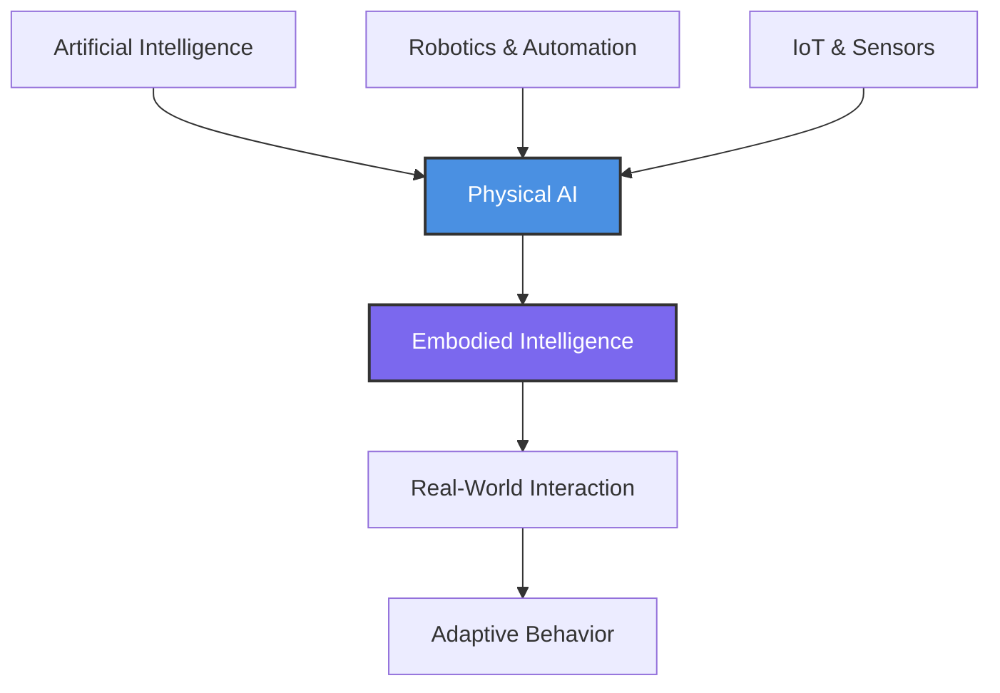
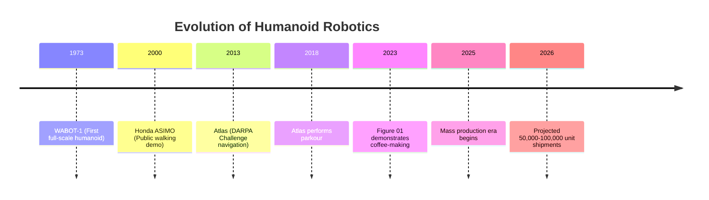

# Chapter 1: Foundations of Physical AI

## Learning Objectives

By the end of this chapter, you will be able to:

- Define Physical AI and explain why embodiment matters for artificial intelligence
- Understand the three distinct eras of robotics evolution and their key characteristics
- Identify the four core technological pillars enabling modern humanoid robots
- Recognize why 2025 represents a critical market inflection point for the robotics industry

---

## 1.1 What is Physical AI?

On October 15, 2024, a humanoid robot named Apollo cleared hurricane debris in disaster zones while human responders coordinated rescue efforts. Five years earlier, this same task would have required teleoperation for every movement—a human operator manually controlling each joint and motion through a remote interface. What changed? The answer lies in **Physical AI**—the convergence of generative artificial intelligence with industrial-grade robotics.

### Defining Physical AI

Physical AI represents the synthesis of artificial intelligence—encompassing machine learning, computer vision, and natural language processing—with physical hardware including robots, sensors, and actuators. This integration enables systems to not merely process information in virtual environments, but to interact with and adapt to the real world in meaningful ways.

Unlike digital AI, which operates entirely within computational spaces processing text, images, or data, Physical AI manipulates matter. It picks up objects, navigates unpredictable terrain, and responds to physical forces in real-time. This fundamental distinction matters because the physical world presents challenges that purely digital systems never encounter: friction, inertia, uncertainty, and the irreversibility of actions.

### The Concept of Embodied Intelligence

At the heart of Physical AI lies **embodied intelligence**—the principle that intelligence is not solely a computational process occurring in a "brain" (whether biological or silicon), but emerges from the dynamic interaction between body, brain, and environment. This concept, rooted in cognitive science and robotics research, suggests that the physical form of an agent shapes what it can learn and how it understands the world.

Consider how humans learn to grasp objects. We don't start with precise mathematical models of friction coefficients and force vectors. Instead, through thousands of physical interactions—dropping toys as infants, feeling textures, experiencing the weight of different materials—our brains build intuitive models grounded in bodily experience. Physical AI systems are beginning to learn in similar ways, developing "intuitions" about physics through interaction rather than pure simulation.

### Digital AI vs. Physical AI

The distinction between digital and physical AI is more than academic—it defines entirely different problem spaces:

**Digital AI** excels at:

- Processing language (ChatGPT, Claude, GPT-4)
- Analyzing images (DALL-E, Midjourney, medical imaging)
- Recognizing patterns in data (recommendation systems, fraud detection)
- Operating in deterministic, reversible environments (you can regenerate a response)

**Physical AI** must handle:

- Real-time sensorimotor integration (seeing, moving, adjusting simultaneously)
- Uncertainty and noise (sensors are imperfect, environments change)
- Physical constraints (gravity, momentum, torque limits)
- Irreversible actions (you can't "undo" dropping a fragile object)
- Safety-critical operations (mistakes can cause physical harm)

### The "ChatGPT Moment" for Robotics

Just as ChatGPT's November 2022 launch demonstrated the transformative potential of large language models to the general public, 2024-2025 marks robotics' equivalent inflection point. The catalyst? **Vision-Language-Action (VLA) models**—AI systems that process visual input, understand natural language instructions, and generate robot control commands end-to-end.

Where earlier robots required engineers to program explicit rules for every scenario, VLA models learn policies from vast datasets of robot interactions, enabling them to generalize to new situations. This is the difference between a robot that can only grasp cylindrical objects it was specifically programmed for versus one that can pick up a mug, a banana, or a smartphone because it has learned the abstract concept of "graspable object."

**Figure 1.1: The Physical AI Ecosystem** - Physical AI emerges from the convergence of digital intelligence, mechanical systems, and sensor networks, enabling embodied intelligence that adapts through real-world interaction.

### Market Growth and Economic Impact

The numbers tell a compelling story. The global Physical AI market reached $18.3 billion in 2023, with the humanoid robot segment specifically valued at $2.92 billion in 2025. Projections indicate explosive growth to $15.26 billion by 2030—a compound annual growth rate (CAGR) of 39.2%. To put this in perspective, this growth rate exceeds that of smartphones in their first decade of mass adoption.

This isn't just another technology trend. Physical AI represents a fundamental shift in how we approach labor-intensive tasks across manufacturing, logistics, healthcare, and domestic services. As costs decline and capabilities improve, the economic case for deployment becomes increasingly compelling.

---

## 1.2 The Three Eras of Robotics

The path to today's capable humanoid robots spans more than five decades, marked by three distinct eras of technological development. Understanding this evolution illuminates why 2025 represents a genuine inflection point rather than mere hype.

### Era 1: Symbolic AI + Hydraulics (1960s-1990s)

The first generation of humanoid robotics research began in Japan with **WABOT-1** in 1973, developed at Waseda University. This pioneering machine stood as the world's first full-scale anthropomorphic robot, featuring:

- Limbs controlled by hydraulic actuators
- Tactile sensors in its hands
- Visual perception through camera "eyes"
- A mouth capable of speech synthesis

However, WABOT-1 epitomized the limitations of its era. Every action required explicit programming—there was no learning, no adaptation. Its creators had to anticipate and code every scenario the robot might encounter. This **symbolic AI** approach, dominant from the 1960s through the 1990s, treated intelligence as rule-based symbol manipulation.

Honda's secretive E-series development program, running through the 1980s and 1990s, advanced mechanical design significantly but remained constrained by the same fundamental limitation: pre-programmed, fixed-task operation. These systems worked in carefully controlled laboratory environments but couldn't handle the variability of the real world.

**Characteristics of Era 1:**

- Top-down programming: experts codify rules
- Limited sensor integration
- Hydraulic actuation (powerful but inefficient)
- Research-only deployments, no commercial viability
- Behavior breaks down in unstructured environments

### Era 2: Statistical Learning + Electric Actuators (2000s-2010s)

The turn of the millennium brought two crucial innovations: **statistical machine learning** and **electric actuation technology**.

Honda's public unveiling of **ASIMO** in 2000 marked a watershed moment. For the first time, millions of people witnessed a humanoid robot walking smoothly, climbing stairs, and even running. ASIMO's electric actuators offered precise control and energy efficiency compared to hydraulics, though at the cost of lower power density.

More importantly, ASIMO incorporated early machine learning techniques—it could adapt its gait to different terrains and learn from demonstrations. No longer purely rule-based, Era 2 robots began to **learn from data**.

The 2013 DARPA Robotics Challenge showcased Boston Dynamics' **Atlas**, tasked with disaster response scenarios: opening doors, climbing ladders, operating tools. While impressive, Atlas's 50% task completion rate revealed persistent limitations. These robots could adapt to some variations but still struggled with novel situations.

**Characteristics of Era 2:**

- Bottom-up learning: robots learn from data
- Multi-modal sensor fusion
- Electric actuators with embedded control
- Still expensive ($2M+ per unit)
- Limited to structured or semi-structured environments
- Emerging commercial pilots (warehouses, factories)

### Era 3: Foundation Models + Whole-Body Intelligence (2020s+)

The current era crystallized around 2022-2023, driven by three converging breakthroughs:

**1. Edge Computing Latency Breakthrough**  
NVIDIA's Jetson Orin and subsequent Thor platform brought datacenter-class AI compute to robot-sized packages, with latency dropping below 20ms for perception-to-action loops. This enabled reactive control—robots could "see" and respond as fast as humans.

**2. Vision-Language-Action (VLA) Models**  
Building on the transformer architecture that powered GPT-3 and GPT-4, researchers developed models that unify vision, language understanding, and motor control. Google's RT-1 and RT-2, OpenAI's robotic experiments, and Figure AI's Helix model demonstrated that robots could learn complex manipulation tasks from diverse datasets and generalize to new objects and scenarios.

**3. Large Behavior Models (LBMs)**  
Just as Large Language Models (LLMs) learn the statistical structure of language from web-scale text, LBMs learn the structure of physical interaction from millions of robot interaction episodes. These models capture the "physics intuition" that makes tasks like pouring liquid or stacking blocks possible without explicit physical simulation.

By 2023, Figure 01's public demonstration of coffee-making—understanding a verbal request, navigating a kitchen, manipulating cups and machines—showcased capabilities that seemed like science fiction just years earlier. The 2025 mass production ramp by multiple companies signals that humanoid robots have transitioned from research curiosities to manufacturable products.

**Figure 1.2: Timeline of Humanoid Robotics Evolution** - Each era built on its predecessor, with Era 3 representing the convergence of AI, hardware, and manufacturing scale.

**Characteristics of Era 3:**

- Foundation models for robotics (VLAs, LBMs)
- End-to-end learning (raw sensors to motor commands)
- Whole-body intelligence (integrated perception-cognition-action)
- Costs declining toward $20K-50K per unit
- Deployable in unstructured, dynamic environments
- **2025: Transition from research to industry**

---

## 1.3 Core Technological Pillars

Modern humanoid robots stand on four essential technological pillars. Understanding these components and their interdependencies is crucial for anyone working in Physical AI.

### Pillar 1: Perception (Sensing)

Humanoid robots must perceive their environment and their own body state with sufficient fidelity to act safely and effectively. This requires two categories of sensors:

**Proprioceptive Sensors** (internal state):

- **Joint encoders**: Measure precise angles of all articulated joints (28-45 degrees of freedom in modern humanoids)
- **Inertial Measurement Units (IMUs)**: Track acceleration and rotational velocity for balance
- **Force/torque sensors**: Detect mechanical stress at joints and end-effectors, crucial for safe human interaction

**Exteroceptive Sensors** (external environment):

- **RGB-D cameras**: Color images plus depth, enabling 3D scene understanding (typically 2-4 cameras for 360° coverage)
- **LiDAR** (Light Detection and Ranging): Precise distance measurements for navigation and obstacle avoidance
- **Tactile arrays**: Distributed pressure sensors in hands/feet, enabling fine manipulation and terrain adaptation

The magic happens in **sensor fusion**—algorithms that combine these diverse inputs into a coherent estimate of the robot's state and surroundings. A typical fusion system might integrate:

- IMU data at 1000 Hz for fast balance reactions
- Joint encoders at 500 Hz for motor control feedback
- Camera data at 30-60 Hz for object recognition
- LiDAR at 10-20 Hz for mapping

Without fusion, sensors provide contradictory or incomplete information. Fusion algorithms (Kalman filters, particle filters, modern neural approaches) produce the "ground truth" that enables action.

### Pillar 2: Actuation (Movement)

Actuators are the muscles of a robot—they convert electrical or hydraulic energy into mechanical motion. Each technology involves fundamental tradeoffs:

**Electric Motors** (Tesla Optimus, Figure AI):

- **Advantages**: Energy efficient, precise control, easy power delivery
- **Disadvantages**: Lower torque density than hydraulics
- **Best for**: Manipulation tasks, indoor navigation, quiet operation

**Hydraulic Actuators** (Boston Dynamics legacy Atlas):

- **Advantages**: Extremely high power-to-weight ratio, explosive movements possible
- **Disadvantages**: Require pumps, valves, fluid management; less efficient
- **Best for**: Dynamic motions (jumping, running, recovering from falls)

**Quasi-Direct Drive** (Unitree G1):

- **Advantages**: No gearbox, very compliant (safe for human interaction)
- **Disadvantages**: Limited torque, larger motors required
- **Best for**: Expressive, life-like motion; collaborative robots

**Tendon-Driven Systems** (1X NEO):

- **Advantages**: Lightweight, naturally compliant, biomimetic
- **Disadvantages**: Complex routing, wear issues, nonlinear control
- **Best for**: Hands/arms requiring dexterity and human-like motion

The trend is toward **hybrid approaches**—electric actuation for most joints, with high-power hydraulics or quasi-direct drive for specific applications like legs or hands.

### Pillar 3: Computation (Intelligence)

The "brain" of a humanoid robot operates at multiple timescales simultaneously:

**Reactive Control (System 1) - Milliseconds:**

- Keeps robot balanced
- Prevents joint collisions
- Emergency stop reflexes
- Runs on dedicated microcontrollers at 1-2 kHz

**Behavioral Control (System 1/2 Hybrid) - 100ms:**

- Object tracking and manipulation
- Gait generation and terrain adaptation
- Real-time path planning
- Runs on edge AI accelerators (NVIDIA Jetson Thor: 2070 TFLOPS)

**Deliberative Planning (System 2) - Seconds:**

- Task planning ("Fetch me a coffee")
- Long-term navigation
- Learning from experience
- May leverage cloud resources for complex reasoning

**NVIDIA Jetson Thor** has become the de facto standard for Era 3 humanoids, integrating:

- Blackwell GPU architecture (AI inference)
- Grace CPU cores (traditional compute)
- 2070 TFLOPS of AI performance
- 25W-100W power envelope (robot-scale thermal design)

**Vision-Language-Action (VLA) Models** run on this hardware, processing camera feeds and language commands to generate motor commands 30-60 times per second. Unlike earlier approaches that separated perception, planning, and control into distinct modules, VLAs perform end-to-end reasoning in a unified neural network.

### Pillar 4: Energy (Power)

Despite revolutionary advances in AI and mechanics, energy remains the **primary bottleneck** for practical deployment.

**Current State (2025):**

- Typical battery capacity: 2.3 kWh (Figure 03)
- Runtime: 2-5 hours of active operation
- Weight penalty: 10-15 kg (22-33 lbs) for batteries
- Recharge time: 1-2 hours (fast charging)

**Power Budget Breakdown:**

- Actuators: 50-70% (varies wildly with task)
- Computation: 10-20% (100W for Jetson + VLA models)
- Sensors: 5-10%
- Idle losses: 10-15%

A robot walking on flat ground might consume 50-150W, but climbing stairs can spike to 800W+. Dynamic motions like jumping or running can exceed 2000W instantaneously, though batteries can handle short bursts.

**Future Outlook:**

- Solid-state batteries promise 50% improvement in energy density
- More efficient actuators (ongoing motor and inverter R&D)
- Better energy recovery from braking (regenerative control)
- Target: 8+ hour work shifts by 2027-2028

Until this "8-hour workday" threshold is reached, deployment scenarios favor environments with charging infrastructure or tasks with natural breaks for recharging.

---

## 1.4 Humanoid Robot Specifications (2025)

To ground the abstract concepts in concrete reality, let's examine the leading humanoid platforms available or in late-stage development as of 2025:

| Robot            | Company         | Height | DOF | Runtime | Price   | Key Feature                     |
| ---------------- | --------------- | ------ | --- | ------- | ------- | ------------------------------- |
| Optimus Gen 2    | Tesla           | 5'8"   | 28  | ~5h     | $20-30K | Automotive integration, scale   |
| Figure 03        | Figure AI       | 5'6"   | 19+ | 5h      | $55K    | Helix VLA, 3g tactile sensors   |
| Atlas (Electric) | Boston Dynamics | 5'9"   | 28  | 2h      | N/A     | Dynamic parkour, research focus |
| G1               | Unitree         | 4'7"   | 45  | 2-4h    | $16K    | Cost leader, quasi-direct drive |
| NEO              | 1X Technologies | 5'5"   | 24  | 2-4h    | $20K    | Home safety focus, tendon drive |

**Table 1.1: Humanoid Robot Specifications (2025)** - Comparison of leading platforms reveals the diversity of approaches and tradeoffs in current designs.

**Key Observations:**

1. **Price Compression**: A decade ago, humanoid robots cost $1-5 million. Today's frontrunners target $15K-50K, with some (Tesla Optimus) projecting sub-$20K at volume production. This 100× cost reduction over 10 years mirrors the early trajectory of solar panels and industrial robots.

2. **DOF Variation**: Degrees of freedom (DOF) range from 19 to 45. More DOF enables finer manipulation and more human-like motion but increases complexity, cost, and failure modes. The "sweet spot" appears to be 24-30 DOF for general-purpose humanoids.

3. **Runtime Convergence**: Despite different designs, runtime clusters around 2-5 hours. This consistency reflects fundamental battery physics and the shared challenge of energy-intensive bipedal locomotion.

4. **Feature Differentiation**: Companies are differentiating on software (Tesla's automotive control experience, Figure's Helix VLA), business model (Unitree's cost leadership), and target market (1X's home safety focus).

---

## 1.5 The 2025 Market Inflection Point

Why is 2025 different from previous waves of robotics hype? Several converging factors create genuine, sustained momentum:

### Technology Convergence

For the first time, all four pillars have matured simultaneously:

- **Perception**: Transformer-based vision models exceed human performance on many perception tasks
- **Actuation**: Electric actuators now offer acceptable power density at robot-affordable prices
- **Computation**: Edge AI accelerators bring datacenter intelligence to mobile platforms
- **Energy**: While still limiting, 2-5 hour runtime is sufficient for many commercial applications

Previous inflection points failed when one pillar lagged. The 1980s had actuation and computation but lacked AI. The 2010s had early AI and sensors but lacked affordable, capable edge compute. Today's convergence is genuine.

### Unprecedented Capital Formation

The funding environment for humanoid robotics companies has transformed:

**"Decacorn" Tier (Valuations >$10B):**

- **Figure AI**: $39 billion valuation after February 2024 Series B
- **Tesla Robots Division**: Implicit hundreds of billions (embedded in Tesla's $500B+ market cap)
- **Neura Robotics**: Targeting $11.6 billion (Germany)
- **1X Technologies**: $10 billion+ target (Norway/US)

This capital enables the **vertical integration** required for robotics companies to control their entire stack—from actuator design to AI model training to manufacturing. It also funds the customer acquisition, field testing, and iteration cycles necessary to refine products for real-world deployment.

### Commercial Validation

Early deployments have begun proving the business case:

- **BMW**: Deploying Figure 01 robots in manufacturing (announced January 2024)
- **Amazon**: Piloting multiple humanoid platforms in warehouses
- **Mercedes-Benz**: Testing humanoid assembly line assistants
- **Disaster Response**: Apptronik Apollo clearing hurricane debris (Florida, October 2024)

These pilots provide invaluable real-world data that feeds back into AI training, creating a virtuous cycle of improvement.

### Manufacturing Scale-Up

China's **$138 billion robotics fund** and coordinated supply chain investments aim to create capacity for 100,000-1,000,000 humanoid units annually by 2027-2028. This matters because manufacturing scale drives:

1. **Learning curve effects**: Unit costs decline 20-30% with each doubling of cumulative production
2. **Supply chain specialization**: Component suppliers emerge, reducing integration burden
3. **Talent ecosystem**: Engineers gain hands-on experience, accelerating innovation

### Geopolitical Dynamics

Two distinct models are emerging:

**United States: VC-Driven, AI-First**

- Prioritize frontier AI capabilities (VLA models, foundation models)
- Vertical integration (Figure, Tesla control full stack)
- Smaller production runs, higher unit prices
- Focus on complex tasks requiring advanced intelligence

**China: State-Backed, Capacity-First**

- Leverage existing manufacturing infrastructure
- Horizontal specialization (separate companies for actuators, sensors, assembly)
- Higher volume, lower margin strategy
- Focus on simpler tasks at scale (logistics, basic assembly)

Both models have merit, and the likely outcome is coexistence serving different market segments. U.S. companies may lead in premium applications (healthcare, advanced manufacturing), while Chinese manufacturers dominate cost-sensitive, high-volume deployments (warehouses, cleaning).

### The 2026 Production Ramp

Multiple sources project 2026 as the year when humanoid robot production shifts from thousands to tens of thousands of units:

- **Tesla**: Publicly targeting 100-500 Optimus units by late 2024, thousands in 2025, with exponential growth in 2026
- **Figure AI**: Aiming for commercial delivery to first customers in late 2025, volume production in 2026
- **Chinese manufacturers** (Unitree, UBTECH, others): Combined capacity buildout for 50,000+ units in 2026

If these projections hold, 2026 will resemble the inflection points of personal computers (1981-1982), smartphones (2009-2010), and electric vehicles (2020-2021)—the year a niche product becomes a mass market.

---

## Chapter Summary

**Key Takeaways:**

1. **Physical AI** is the convergence of artificial intelligence with physical robotics, enabling machines to interact with and adapt to the real world through embodied intelligence.

2. **Three eras** of development—Symbolic AI + Hydraulics (1960s-1990s), Statistical Learning + Electric Actuators (2000s-2010s), and Foundation Models + Whole-Body Intelligence (2020s+)—built progressively toward today's capabilities.

3. **Four technological pillars**—perception (sensing), actuation (movement), computation (intelligence), and energy (power)—must all advance for practical humanoid robots. Energy remains the primary bottleneck in 2025.

4. **2025 represents a genuine market inflection point** driven by technology convergence, unprecedented capital, commercial validation, manufacturing scale-up, and geopolitical competition. The 2026 production ramp may mark the transition from niche to mass market.

5. **Humanoid robots are becoming manufacturable products** at prices ($15K-50K) that enable commercial deployment across manufacturing, logistics, healthcare, and domestic services.

---

## Further Reading

**Academic Foundations:**

- Moravec, H. (1988). _Mind Children: The Future of Robot and Human Intelligence_. Harvard University Press.
- Brooks, R. (1991). "Intelligence Without Representation." _Artificial Intelligence_, 47(1-3), 139-159.
- Clark, A. (1997). _Being There: Putting Brain, Body, and World Together Again_. MIT Press.

**Industry Reports:**

- International Federation of Robotics (2024). "World Robotics 2024: Service Robots Report"
- Grand View Research (2024). "Physical AI Market Size, Share & Trends Analysis Report 2024-2030"
- Goldman Sachs (2023). "The Rise of the Robots: Humanoids Set to Transform the Global Economy"

**Technical Resources:**

- IEEE Robotics and Automation Society: [https://www.ieee-ras.org/](https://www.ieee-ras.org/)
- arXiv Robotics Section: [https://arxiv.org/list/cs.RO/recent](https://arxiv.org/list/cs.RO/recent)
- OpenAI Robotics Research: [https://openai.com/research/robotics](https://openai.com/research/robotics)

**Company Announcements:**

- Figure AI Newsroom: [https://www.figure.ai/news](https://www.figure.ai/news)
- Tesla AI Day Presentations: Available on YouTube
- Boston Dynamics Atlas Updates: [https://www.bostondynamics.com/atlas](https://www.bostondynamics.com/atlas)

---

**Next Chapter Preview:**  
Chapter 2 dives into the mechanical foundations of humanoid robots—how kinematic principles, actuation technologies, and structural design choices determine what a robot can do and how efficiently it performs.
