# Chapter 2: Kinematics, Actuation & Mechanical Design

## Learning Objectives

By the end of this chapter, you will be able to:

- Understand how humanoid anatomy maps to kinematic chains with degrees of freedom (DOF)
- Calculate forward kinematics and solve inverse kinematics problems for robot arms
- Compare actuation technologies (electric, hydraulic, QDD, tendon) and their fundamental tradeoffs
- Analyze structural design constraints balancing mass, stiffness, compliance, and cost

---

## 2.1 Anatomy of a Humanoid: Kinematic Chains

When engineers design a humanoid robot, they face a profound challenge: translating the elegant complexity of biological systems into mechanical equivalents. The human body achieves its remarkable dexterity through approximately **244 degrees of freedom** across all joints. Humanoid robots, constrained by cost, weight, and control complexity, typically implement **28-45 DOF**—enough to perform meaningful tasks while remaining practically controllable.

### Degrees of Freedom (DOF)

A **degree of freedom** represents an independent motion capability—a dimension along which a system can move. Understanding DOF is fundamental to robot design because it determines both capability and complexity.

**Human Hand Benchmark:**

- 27 bones connected by ligaments
- 34 muscles (intrinsic and extrinsic)
- Approximately 20 functional DOF
- Capable of power grips (holding a hammer) and precision grips (threading a needle)

**Humanoid Hand Implementations:**

- **Figure 03**: 16 DOF with 3-gram force resolution per finger
- **Tesla Optimus Gen 2**: 11 DOF with enhanced tactile sensing
- **Trade-off**: Each additional DOF adds cost ($300-800), weight (50-150g), and control complexity

**Full-Body DOF Distribution:**

| Robot System  | Total DOF | Arms (each) | Legs (each) | Hands (each) | Head/Torso |
| ------------- | --------- | ----------- | ----------- | ------------ | ---------- |
| Atlas         | 28        | 7           | 6           | 0 (gripper)  | 2          |
| Optimus Gen 2 | 28        | 7           | 6           | 5            | 3          |
| Figure 03     | 19+       | 7           | 6           | Variable     | Variable   |
| Unitree G1    | 45        | 7           | 6           | 12           | 6          |

The "sweet spot" for general-purpose humanoids appears to be **24-30 DOF**—sufficient for locomotion, manipulation, and human-like gestures without overwhelming control systems or budgets.

### Serial vs. Parallel Kinematic Chains

Robotic structures organize joints into two fundamental architectures:

**Serial Chains (Open Kinematic Chains):**

- Joints connected in sequence: base → link₁ → joint₁ → link₂ → joint₂ → end-effector
- Examples: Arms, legs, fingers
- Characteristics:
  - End-effector position depends on **all** preceding joint angles
  - Large workspace relative to robot size
  - Cumulative errors propagate through chain
  - Easier to manufacture and maintain

**Parallel Chains (Closed Kinematic Chains):**

- Multiple serial chains connect base to end-effector
- Examples: Delta robots, some gripper designs, flight simulators
- Characteristics:
  - High stiffness and precision
  - Limited workspace
  - Complex kinematics calculations
  - Better load distribution

Humanoid robots predominantly use **serial chains** for limbs because they maximize reach and human-like motion, despite the control challenges.

### Forward Kinematics: From Joints to Position

**Forward kinematics (FK)** answers the question: "Given joint angles θ<sub>1</sub>, θ<sub>2</sub>, ..., θ<sub>n</sub>, where is the end-effector?"

This is the "easy" direction computationally—we simply apply geometric transformations sequentially through the chain.

**Example: 2-DOF Planar Arm**

Consider a simple robot arm in a 2D plane with two links of lengths L<sub>1</sub> and L<sub>2</sub>:

```
Joint 1 angle: θ<sub>1</sub> (shoulder rotation)
Joint 2 angle: θ<sub>2</sub> (elbow rotation)

End-effector position:
x = L<sub>1</sub>·cos(θ<sub>1</sub>) + L<sub>2</sub>·cos(θ<sub>1</sub> + θ<sub>2</sub>)
y = L<sub>1</sub>·sin(θ<sub>1</sub>) + L<sub>2</sub>·sin(θ<sub>1</sub> + θ<sub>2</sub>)
```

For a 3D humanoid arm with 7 DOF, we use **transformation matrices** following the Denavit-Hartenberg (DH) convention. Each joint contributes a 4×4 homogeneous transformation matrix encoding rotation and translation. The complete FK solution multiplies these matrices:

```
T_end = T01 · T12 · T23 · ... · T67
```

Where T_end gives the position and orientation of the hand relative to the shoulder.

**Why FK Matters:**

- Robot always knows where its limbs are (given accurate joint encoders)
- Essential for collision detection
- Foundation for simulation and visualization
- Used in control loops running at 500-1000 Hz

```mermaid
graph LR
    A[Base/Torso] --> B[Shoulder Joint theta1]
    B --> C[Upper Arm Link L1]
    C --> D[Elbow Joint theta2]
    D --> E[Forearm Link L2]
    E --> F[Wrist Joint theta3]
    F --> G[Hand/End-Effector]

    style A fill:#e1f5ff,stroke:#333,stroke-width:2px
    style G fill:#ffe1e1,stroke:#333,stroke-width:2px
    style B fill:#fff4e1,stroke:#333,stroke-width:1px
    style D fill:#fff4e1,stroke:#333,stroke-width:1px
    style F fill:#fff4e1,stroke:#333,stroke-width:1px
```



**Figure 2.1: Serial Kinematic Chain** - A simplified 3-DOF arm showing the sequential connection of joints and links from base to end-effector.

### Inverse Kinematics: From Position to Joints

**Inverse kinematics (IK)** solves the opposite problem: "I want the hand at position (x, y, z) with orientation (roll, pitch, yaw)—what joint angles achieve this?"

This is the **hard** problem in robotics. Unlike FK's straightforward calculation, IK often has:

**1. Multiple Solutions (Redundancy):**

For our 2-DOF arm reaching a point, there might be two solutions: "elbow up" and "elbow down." A 7-DOF human-like arm reaching a point has **infinitely many solutions**—you can reach for a coffee cup with your elbow in countless configurations.

**2. No Solution (Unreachable Points):**

Points outside the robot's workspace simply cannot be reached, no matter how we configure the joints.

**3. Singular Configurations:**

Certain joint configurations lose DOF (e.g., fully extended arm can't move in certain directions without large joint motions).

**IK Solution Methods:**

**Analytical Solutions:**

- Closed-form equations derived from geometry
- Fast computation (microseconds)
- Only possible for specific kinematic structures
- Example: 6-DOF industrial arms with spherical wrists

**Jacobian-Based (Numerical):**

- Iteratively adjust joint angles using the Jacobian matrix
- Jacobian relates joint velocities to end-effector velocity: ẋ = J(θ)·θ̇
- Pseudo-inverse method handles redundancy
- Typical implementation in modern humanoids

**Optimization-Based:**

- Formulate IK as minimization problem with constraints
- Can incorporate additional objectives:
  - Avoid joint limits
  - Minimize energy expenditure
  - Stay far from singularities
  - Maintain balance
- Computationally expensive but flexible

**Real-World Application:**

When a humanoid reaches for an object:

1. Vision system provides target position (x, y, z)
2. IK solver computes required joint angles
3. Controller generates smooth trajectory from current to target configuration
4. Low-level motor controllers execute motion
5. FK confirms achieved position (closed-loop verification)

This entire cycle repeats at **30-60 Hz** for manipulation tasks, with the IK solve consuming 5-20ms of computation time.

---

## 2.2 Actuation Technologies

If kinematics defines **where** a robot can reach, actuation determines **how powerfully and precisely** it can move. The actuator—the "muscle" of a robot—converts electrical or hydraulic energy into mechanical motion. Choosing the right actuation technology involves navigating fundamental tradeoffs that shape the robot's capabilities and costs.

### The Actuator Selection Triangle

Every actuation technology balances three competing properties:

1. **Torque Density** (power-to-weight ratio): How much force can the actuator produce relative to its mass?
2. **Precision** (position control accuracy): How finely can we control the actuator's position?
3. **Backdrivability** (compliance/safety): How easily can external forces move the actuator?

No technology excels at all three. Engineers must prioritize based on the robot's intended tasks.

### Electric Actuators: The Modern Standard

**How They Work:**

Electric motors (typically brushless DC) rotate at high speeds with low torque. Planetary gearboxes multiply torque at the cost of speed reduction. For linear motion (e.g., extending a leg), **planetary roller screws** convert rotation to linear displacement with high force and durability.

**Advantages:**

- **Clean and quiet**: No hydraulic fluid leaks, minimal noise
- **Precise control**: Encoders provide sub-degree position accuracy
- **Easy maintenance**: Fewer failure modes, longer service intervals
- **Lower unit cost**: Mature supply chains, economies of scale
- **Energy efficiency**: 80-90% electrical-to-mechanical conversion

**Disadvantages:**

- **Lower power density**: Typically 100-300 W/kg vs. 500+ W/kg for hydraulics
- **Heat dissipation**: Sustained high-torque operations generate significant heat
- **Gear backlash**: Small "slop" in gearboxes affects precision and backdrivability
- **Size constraints**: Achieving high torque requires larger motors or higher gear ratios

**Current Users:** Tesla Optimus, Figure 03, most Chinese manufacturers (Unitree, UBTECH, Fourier Intelligence)

**Cost Projection:** Electric actuators for humanoids currently cost $200-800 per unit. At volume production (>100K units/year), costs could drop to $100-300 per unit, making $15K-20K retail prices viable.

### Hydraulic Actuators: Power at a Price

**How They Work:**

A hydraulic pump pressurizes fluid (typically oil), which drives pistons or rotary actuators. Valves control fluid flow, enabling precise force modulation. The high incompressibility of fluids enables immense force transmission in compact packages.

**Advantages:**

- **Highest power density**: 500-1500 W/kg, enabling explosive movements
- **Natural compliance**: Fluids compress slightly, providing shock absorption
- **Superior for dynamics**: Jumping, running, rapid direction changes (Atlas parkour demonstrations)
- **High force output**: Essential for heavy lifting or rough terrain

**Disadvantages:**

- **Messy operation**: Fluid leaks are inevitable, requiring containment and cleanup
- **System complexity**: Pumps, reservoirs, coolers, filters, hoses add 20-40% weight overhead
- **Maintenance intensive**: Regular fluid changes, seal replacements, leak monitoring
- **Harder to control precisely**: Fluid dynamics introduce delays and nonlinearities
- **Noise**: Pumps generate 60-80 dB (vs. &lt;45 dB for electric)

**Historical Dominance, Current Decline:**

Boston Dynamics' **Atlas** relied on hydraulics for its groundbreaking 2013-2023 capabilities—backflips, parkour, and human-like agility. However, in 2024, Boston Dynamics announced a **fully electric Atlas**, signaling the industry's shift. Hydraulics remain relevant for specialized applications (construction robots, heavy industry) but are unsuitable for indoor service robots or mass production.

### Specialized Systems: Bridging the Gap

#### Planetary Roller Screws (PRS)

**Innovation:** Convert motor rotation to linear motion with:

- 95%+ efficiency (vs. 20-30% for ball screws under high load)
- Extreme durability: 10M+ cycles at full load
- High force density: 50-100 kN in compact packages

**Application:** Hips and knees of most modern electric humanoids (Tesla, Figure)

**Market Impact:** The PRS market for humanoid robotics is projected to exceed $2 billion annually by 2035 as production scales. Only a handful of manufacturers (Rollvis, SKF, Schaeffler) produce precision PRS, creating supply chain concentration risk.

#### Quasi-Direct Drive (QDD)

**Concept:** Use low gear ratios (5:1 to 20:1) instead of typical 50:1 to 200:1 reductions. This trades peak torque for **backdrivability**—the actuator can be moved by external forces with minimal resistance.

**Advantages:**

- **Fast dynamic response**: Minimal gear inertia
- **Impact tolerance**: Can "give" when colliding with objects or people
- **Natural compliance**: Feels "soft" to touch, inherently safe
- **Cost-effective**: Simpler gearboxes reduce manufacturing cost

**Disadvantages:**

- **Lower peak torque**: Requires larger motors for equivalent force
- **Higher current draw**: Less mechanical advantage means more electrical power

**Competitive Edge:** Unitree's G1 achieves its $16K price point partly through QDD, which simplifies manufacturing and reduces material costs. The robot excels at dynamic motions but may struggle with sustained heavy lifting.

#### Tendon-Driven Actuation

**Biomimetic Approach:** Motors mounted in the torso pull cables (tendons) routed through pulleys to actuate distal joints (hands, feet). This mimics how human muscles in the forearm control finger movements via tendons.

**Advantages:**

- **Lightweight distal limbs**: No heavy motors in the extremities improves dynamics
- **Inherent safety**: Cables naturally limit force transmission
- **Redundancy**: Multiple tendons can control one joint, enabling fault tolerance
- **Human-like compliance**: Cable elasticity mimics biological softness

**Disadvantages:**

- **Complex routing**: Cables must avoid interference, maintain tension
- **Wear and maintenance**: Cables stretch, fray, and require regular replacement
- **Nonlinear control**: Cable elasticity and friction complicate precise positioning
- **Limited force**: Cables handle tension well but not compression

**Pioneering Implementation:** 1X Technologies' **NEO** robot features a patented tendon system designed for safe home environments. The company emphasizes that tendon drives are "fail-safe"—a cable break simply disables that DOF rather than causing sudden, dangerous motion.

### Actuation Technology Comparison

| Technology             | Power Density | Precision | Backdrivability | Cost   | Maintenance | Best Use Case                       |
| ---------------------- | ------------- | --------- | --------------- | ------ | ----------- | ----------------------------------- |
| **Electric (DC)**      | Medium        | High      | Low             | Low    | Easy        | Manipulation, structured tasks      |
| **Hydraulic**          | Very High     | Medium    | High            | Medium | Hard        | Dynamic locomotion, heavy lifting   |
| **QDD (Quasi-Direct)** | Medium-High   | High      | High            | Low    | Easy        | Agile motion, impact tolerance      |
| **Tendon-Driven**      | Low-Medium    | Medium    | Very High       | Medium | Medium      | Safe human interaction, lightweight |

**Table 2.1: Actuation Technology Comparison** - Each technology occupies a distinct niche in the design space, with electric systems emerging as the dominant choice for mass-market humanoids.

### The Electric Transition: Why Now?

The 2020-2025 period marks a decisive shift toward electric actuation, driven by:

**1. Motor Technology Maturation:**

- Rare-earth permanent magnets (NdFeB) increase torque density 40% over older designs
- Advanced winding techniques reduce copper losses
- Better thermal management extends continuous operation

**2. Power Electronics Advances:**

- Silicon carbide (SiC) inverters improve efficiency from 90% → 98%
- Smaller, lighter motor drivers reduce system weight
- Faster switching enables precise torque control at 20 kHz+

**3. Cost Trajectories:**

- Electric motor production scales with automotive electrification
- Shared supply chains with EVs drive volume pricing
- Hydraulic systems remain artisanal, low-volume manufacturing

**4. Software-Defined Control:**

- Modern control algorithms (model predictive control, adaptive control) compensate for electric actuator limitations
- Backdrivability can be simulated through force-sensing and compliant control
- Machine learning optimizes energy efficiency

The result: Electric humanoids in 2025 achieve **80-90% of hydraulic performance** in dynamics tests while costing **50-60% less** to manufacture and maintain.

---

## 2.3 Structural Design & Material Constraints

A humanoid robot's structure must simultaneously satisfy contradictory requirements: strong yet lightweight, stiff yet compliant, durable yet affordable. Material selection and structural design determine whether a robot remains a lab prototype or becomes a deployable product.

### The Mass-Strength Paradox

Every kilogram added to a robot's structure increases the torque required from every actuator in the kinematic chain. For a leg, this creates a multiplicative effect:

- 1 kg added to the foot requires X Nm at the ankle
- That same kg requires 2X Nm at the knee
- And 4X Nm at the hip

Thus, **lightweight distal components** (hands, feet) are paramount. But lightness cannot compromise strength—a robot hand gripping a 5 kg object experiences 10-15 kg equivalent loads during acceleration.

**Material Choices:**

**Carbon Fiber Composites:**

- **Specific strength**: 2-3× aluminum, 10× steel
- **Specific stiffness**: 5-7× aluminum
- **Cost**: $50-200/kg (vs. $3-5/kg for aluminum)
- **Manufacturing**: Labor-intensive layup processes, limited to low-volume production
- **Application**: High-performance arms, legs in research platforms (Atlas, some PhD projects)

**Aluminum Alloys (6061, 7075):**

- **Good balance**: Adequate strength (200-500 MPa yield), reasonable weight (2.7 g/cm³)
- **Machinability**: Easy to CNC, weld, and finish
- **Cost**: $3-8/kg in bulk, widely available
- **Application**: Structural frames, brackets, housings in most mass-market humanoids

**Advanced Polymers (PEEK, Carbon-Filled Nylon):**

- **Lightweight**: 1.3-1.6 g/cm³ (half of aluminum)
- **Lower stiffness**: 3-10 GPa (vs. 70 GPa for aluminum), acceptable for non-critical components
- **Cost**: $15-50/kg
- **Application**: Covers, fairings, some internal brackets

**Design Rule of Thumb:** Use carbon fiber where performance justifies cost (10-20% of structure by weight), aluminum for primary load paths (60-70%), and polymers for secondary structures (10-20%).

### Stiffness vs. Compliance: The Safety Dilemma

**Stiff structures** minimize vibrations, improve control precision, and maximize payload capacity. A perfectly rigid robot would be easiest to control—joint angles directly correspond to end-effector positions without bending or oscillation.

**Compliant structures** absorb impacts, enable safe human contact, and adapt to uneven terrain. Humans are inherently compliant—our soft tissues, elastic muscles, and flexible joints protect us from injury during falls or collisions.

**The Engineering Solution: Series Elastic Actuators (SEAs)**

SEAs intentionally insert a **calibrated spring** between the motor and the load. This provides:

1. **Force sensing**: Spring deflection directly measures applied force (F = k·x)
2. **Energy storage**: Springs store energy during stance phase, release during push-off (15-20% efficiency gain in walking)
3. **Impact absorption**: Springs cushion collisions, protecting gears and electronics
4. **Natural dynamics**: Spring-mass systems have resonant frequencies that can be tuned to match human gait

**Trade-off:** SEAs reduce bandwidth (how quickly force can change) from 200+ Hz to 20-40 Hz. This is acceptable for locomotion but problematic for fast manipulation.

**Alternative: Variable Impedance Control**

Modern electric actuators with fast torque control (>1 kHz) can **simulate compliance** through software:

```

τ_commanded = τ_desired + K_virtual · (θ_desired - θ_actual)

```

By adjusting K_virtual in real-time, the robot can be stiff when precision matters and compliant when safety matters—all without mechanical springs.

### Battery Integration: Structure + Energy

Traditional robots treat batteries as **payload**—dead weight that must be carried. Modern humanoids integrate batteries **structurally**, making them load-bearing components.

**Figure 03 Case Study:**

- **Battery capacity**: 2.3 kWh (approximately 25 kg at 200 Wh/kg)
- **Structural role**: Battery pack forms the robot's torso, directly supporting arm and leg attachment points
- **Weight savings**: 2-3 kg (10-12%) vs. separate battery module
- **Thermal management**: Waste heat from actuators preheats battery in cold environments, extending runtime

**Challenge:** High-power tasks (climbing stairs, lifting) can draw 800-2000W, generating significant heat. Battery packs must dissipate 50-100W continuously without overheating (>60°C degrades lithium-ion cells). This requires:

- Thermal interface materials (TIMs) conducting heat to chassis
- Convection cooling (fans, airflow channels)
- Active liquid cooling in high-performance systems

### Safety Standards and Compliance

As humanoid robots transition from labs to factories, warehouses, and homes, they must satisfy rigorous safety regulations.

**ISO 10218-1/2:2025 (Collaborative Robots):**

**Power and Force Limiting (PFL):**

- Contact forces must remain below **pain thresholds**: 150N chest impact, 65N head impact
- Actuators must detect and react to collisions within **100ms**
- Requires torque sensors or motor current monitoring at every joint

**Speed and Separation Monitoring (SSM):**

- Robot must maintain minimum separation from humans (typically 0.3-1.0m)
- If separation violated, robot must slow or stop before contact
- Requires reliable person detection (cameras, LiDAR, radar)

**Fail-Safe Design:**

- Single-fault tolerance: One component failure must not create hazards
- Emergency stops must activate mechanically (not software-dependent)
- Brakes must engage if power lost

**Certification Costs:** Achieving collaborative robot certification costs $50K-300K per robot design, involving extensive testing. This is viable for products with >1000 unit production volumes but prohibitive for one-off research platforms.

### Case Study: Tesla Optimus Design Evolution

Comparing Tesla's Gen 1 (2022) and Gen 2 (2024) prototypes illustrates practical design iteration:

**Weight Reduction:**

- **Gen 1**: 73 kg (161 lbs)
- **Gen 2**: 57 kg (126 lbs)
- **10 kg savings** through structural optimization, lighter actuators, integrated battery

**Dexterity Improvement:**

- **Gen 1**: 11 DOF hands, limited tactile feedback
- **Gen 2**: 11 DOF hands with enhanced tactile sensors, capable of handling fragile objects (eggs demo)

**Cost Reduction Pathway:**

- **Target**: $20K retail price at volume (>100K units/year)
- **Strategy**: Leverage Tesla's automotive supply chain (motors, power electronics, batteries, sensors)
- **Key Insight**: Automotive components are already designed for harsh environments, high reliability, and low cost—perfect for humanoid robots

**Manufacturing Scale:**

- Tesla's **Gigafactory capacity** (millions of EV batteries/year) can produce humanoid batteries as a side-product
- Existing motor production lines adapted for robot actuators
- Projected **production capacity**: 10,000 units/year by 2025, 100,000 by 2027

This vertical integration—controlling the entire supply chain from raw materials to finished robots—distinguishes Tesla's approach from competitors who rely on third-party component suppliers.

---

## Chapter Summary

**Key Takeaways:**

1. **Humanoid kinematics** map biological motion to mechanical systems with 28-45 degrees of freedom, balancing dexterity and control complexity. Forward kinematics calculates positions from joint angles; inverse kinematics enables goal-directed reaching.

2. **Actuation technologies** involve fundamental tradeoffs between torque density, precision, and backdrivability. Electric actuators have become the dominant choice for mass-market humanoids, displacing hydraulics despite lower power density, due to cost, maintenance, and control advantages.

3. **Specialized actuation systems**—planetary roller screws, quasi-direct drive, and tendon drives—address specific performance requirements and represent billion-dollar component markets as humanoid production scales.

4. **Structural design** balances contradictory demands: lightweight yet strong (carbon fiber vs. aluminum), stiff yet compliant (series elastic actuators, variable impedance control), and cost-effective yet durable (material selection, manufacturing processes).

5. **Battery integration** as structural components saves 10-15% weight while introducing thermal management challenges. Safety standards (ISO 10218) impose force limits and collision detection requirements essential for human-robot collaboration.

---

## Practical Exercise

**Mini-Project: Implement Forward Kinematics for a 2-DOF Planar Arm in Python**

```python
import numpy as np
import matplotlib.pyplot as plt

def forward_kinematics_2dof(theta1, theta2, L1=1.0, L2=1.0):
    """
    Calculate end-effector position for a 2-DOF planar arm.

    Args:
        theta1: Shoulder angle (radians)
        theta2: Elbow angle (radians)
        L1: Upper arm length (meters)
        L2: Forearm length (meters)

    Returns:
        (x, y): End-effector position
    """
    x = L1 * np.cos(theta1) + L2 * np.cos(theta1 + theta2)
    y = L1 * np.sin(theta1) + L2 * np.sin(theta1 + theta2)
    return x, y

def visualize_arm(theta1, theta2, L1=1.0, L2=1.0):
    """Visualize the arm configuration."""
    # Joint positions
    shoulder = (0, 0)
    elbow_x = L1 * np.cos(theta1)
    elbow_y = L1 * np.sin(theta1)
    elbow = (elbow_x, elbow_y)
    end_x, end_y = forward_kinematics_2dof(theta1, theta2, L1, L2)
    end_effector = (end_x, end_y)

    # Plot
    plt.figure(figsize=(8, 8))
    plt.plot([shoulder[0], elbow[0]], [shoulder[1], elbow[1]], 'b-o', linewidth=3, markersize=10, label='Upper Arm')
    plt.plot([elbow[0], end_effector[0]], [elbow[1], end_effector[1]], 'r-o', linewidth=3, markersize=10, label='Forearm')
    plt.plot(shoulder[0], shoulder[1], 'ko', markersize=15, label='Shoulder')
    plt.plot(end_effector[0], end_effector[1], 'go', markersize=15, label='End-Effector')

    plt.xlim(-2.5, 2.5)
    plt.ylim(-2.5, 2.5)
    plt.grid(True)
    plt.axis('equal')
    plt.legend()
    plt.title(f'theta1={np.degrees(theta1):.1f}°, theta2={np.degrees(theta2):.1f}°')
    plt.xlabel('X (meters)')
    plt.ylabel('Y (meters)')
    plt.show()

# Example: Visualize different configurations
visualize_arm(np.pi/4, np.pi/3)  # 45° shoulder, 60° elbow
```

**Extension Challenges:**

1. **Workspace Mapping**: Generate a plot showing all reachable points by sweeping θ₁ and θ₂ through their full ranges.

2. **3-DOF Arm**: Add a third joint (wrist rotation) and extend the FK equations. Observe how the workspace expands from a 2D circle to a 3D sphere.

3. **Simple IK**: Implement an analytical IK solver for the 2-DOF case. Handle the "elbow up" vs. "elbow down" solutions.

4. **Trajectory Generation**: Create smooth motion from one configuration to another using polynomial interpolation or cubic splines.

---

## Further Reading

**Academic Foundations:**

- Craig, J.J. (2017). _Introduction to Robotics: Mechanics and Control_ (4th ed.). Pearson. (The definitive textbook on robot kinematics and dynamics)
- Siciliano, B., & Khatib, O. (Eds.). (2016). _Springer Handbook of Robotics_ (2nd ed.). Springer. (Comprehensive reference, Chapter 2 covers kinematics)
- Lynch, K.M., & Park, F.C. (2017). _Modern Robotics: Mechanics, Planning, and Control_. Cambridge University Press. (Modern treatment with excellent online resources)

**Actuation Technology:**

- Verstraten, T., et al. (2016). "Modeling and Design of Geared DC Motors for Energy Efficiency: Comparison Between Theory and Experiments." _Mechatronics_, 30, 198-213.
- Seok, S., et al. (2013). "Design Principles for Energy-Efficient Legged Locomotion and Implementation on the MIT Cheetah Robot." _IEEE/ASME Transactions on Mechatronics_, 20(3), 1117-1129.

**Structural Design:**

- Pratt, G.A., & Williamson, M.M. (1995). "Series Elastic Actuators." _Proceedings of IEEE/RSJ International Conference on Intelligent Robots and Systems_, 399-406. (Foundational SEA paper)
- Haddadin, S., et al. (2017). "Robot Collisions: A Survey on Detection, Isolation, and Identification." _IEEE Transactions on Robotics_, 33(6), 1292-1312.

**Industry Resources:**

- Tesla AI Day 2022 & 2023 presentations (available on YouTube): Detailed Optimus design discussions
- Boston Dynamics Technical Blog: [https://bostondynamics.com/blog/](https://bostondynamics.com/blog/)
- IEEE Spectrum Robotics: [https://spectrum.ieee.org/robotics](https://spectrum.ieee.org/robotics)

---

**Next Chapter Preview:**  
Chapter 3 explores the computational and sensor systems that give humanoids the ability to perceive and understand their environment in real-time—examining edge computing platforms like NVIDIA Jetson Thor, sensor fusion techniques, and the latency constraints that define what's possible in Physical AI.
