# 1.2.2 Sensors in URDF & Plugin Wiring

## Why Add Sensors to URDF?

Your robot's brain needs eyes, ears, and balance sensors! In URDF, we define:

- 📷 **Cameras** (RGB, depth, stereo)
- 🧭 **IMUs** (orientation, acceleration)
- 📡 **LiDAR** (distance scanning)
- 🤖 **Joint encoders** (position/velocity feedback)


**Why this matters:**

- ✅ Test perception algorithms in simulation before buying hardware
- ✅ Simulate sensor noise and failures
- ✅ Visualize sensor data in RViz (camera frustums, LiDAR scans)
- ✅ Same URDF works in Gazebo, Isaac Sim, and real hardware

---

## Sensor Placement: Reference Frames

**Key Concept:** Every sensor needs a **reference frame** (link) that defines its position and orientation relative to the robot.

```mermaid
graph LR
    A[base_link<br/>Robot Center] -->|Transform| B[camera_link<br/>In head]
    A -->|Transform| C[imu_link<br/>In torso]
    A -->|Transform| D[lidar_link<br/>On top]

    B --> E[📷 Camera Frame<br/>X: Right<br/>Y: Down<br/>Z: Forward]
    C --> F[🧭 IMU Frame<br/>Measures rotation]
    D --> G[📡 LiDAR Frame<br/>Scans environment]
```



**Camera Frame Convention (REP-103):**

- **X**: Right
- **Y**: Down
- **Z**: Forward (optical axis)

**Robot Frame Convention:**

- **X**: Forward
- **Y**: Left
- **Z**: Up

---

## Adding a Camera to URDF

### Step 1: Create Camera Link

```xml
<!-- Camera link (physical housing) -->
<link name="camera_link">
  <visual>
    <geometry>
      <box size="0.05 0.05 0.03"/>  <!-- Small box -->
    </geometry>
    <material name="black">
      <color rgba="0 0 0 1"/>
    </material>
  </visual>
  <collision>
    <geometry>
      <box size="0.05 0.05 0.03"/>
    </geometry>
  </collision>
  <inertial>
    <mass value="0.1"/>  <!-- 100g camera -->
    <inertia ixx="0.0001" ixy="0" ixz="0" iyy="0.0001" iyz="0" izz="0.0001"/>
  </inertial>
</link>

<!-- Joint attaching camera to head -->
<joint name="camera_joint" type="fixed">
  <parent link="head_link"/>
  <child link="camera_link"/>
  <origin xyz="0.05 0 0.1" rpy="0 0 0"/>  <!-- 5cm forward, 10cm up -->
</joint>
```

### Step 2: Create Optical Frame

Cameras need a second frame rotated to match optical conventions:

```xml
<!-- Optical frame (rotated -90° around Z, then -90° around X) -->
<link name="camera_optical_frame"/>

<joint name="camera_optical_joint" type="fixed">
  <parent link="camera_link"/>
  <child link="camera_optical_frame"/>
  <!-- Rotation: Z=-90°, X=-90° to align with camera conventions -->
  <origin xyz="0 0 0" rpy="${-pi/2} 0 ${-pi/2}"/>
</joint>
```

**Why the rotation?**

- Robot frame: X=forward, Y=left, Z=up
- Camera optical: X=right, Y=down, Z=forward (into image)
- Rotation aligns them!

### Step 3: Add Gazebo Camera Plugin

For simulation, add a Gazebo plugin to generate actual images:

```xml
<gazebo reference="camera_link">
  <!-- Camera sensor plugin -->
  <sensor name="camera" type="camera">
    <update_rate>30.0</update_rate>  <!-- 30 FPS -->
    <camera>
      <horizontal_fov>1.3962634</horizontal_fov>  <!-- 80° FOV -->
      <image>
        <width>640</width>
        <height>480</height>
        <format>R8G8B8</format>  <!-- RGB -->
      </image>
      <clip>
        <near>0.02</near>  <!-- Min distance: 2cm -->
        <far>300</far>     <!-- Max distance: 300m -->
      </clip>
      <noise>
        <type>gaussian</type>
        <mean>0.0</mean>
        <stddev>0.007</stddev>  <!-- Realistic noise -->
      </noise>
    </camera>

    <!-- Publish to ROS 2 -->
    <plugin name="camera_controller" filename="libgazebo_ros_camera.so">
      <ros>
        <namespace>/robot</namespace>
        <remapping>image_raw:=camera/image_raw</remapping>
        <remapping>camera_info:=camera/camera_info</remapping>
      </ros>
      <camera_name>camera</camera_name>
      <frame_name>camera_optical_frame</frame_name>
    </plugin>
  </sensor>
</gazebo>
```

**What this does:**

- Generates 640×480 RGB images at 30 FPS
- Publishes to `/robot/camera/image_raw` topic
- Adds realistic Gaussian noise
- Uses `camera_optical_frame` for transforms

---

## Adding an IMU Sensor

IMUs (Inertial Measurement Units) measure orientation, angular velocity, and linear acceleration.

### Step 1: Create IMU Link

```xml
<!-- IMU link (in torso center) -->
<link name="imu_link">
  <visual>
    <geometry>
      <box size="0.02 0.02 0.01"/>  <!-- Tiny chip -->
    </geometry>
    <material name="green">
      <color rgba="0 1 0 1"/>
    </material>
  </visual>
  <inertial>
    <mass value="0.01"/>  <!-- 10g -->
    <inertia ixx="0.00001" ixy="0" ixz="0" iyy="0.00001" iyz="0" izz="0.00001"/>
  </inertial>
</link>

<joint name="imu_joint" type="fixed">
  <parent link="base_link"/>
  <child link="imu_link"/>
  <origin xyz="0 0 0.05" rpy="0 0 0"/>  <!-- Center of torso -->
</joint>
```

### Step 2: Add Gazebo IMU Plugin

```xml
<gazebo reference="imu_link">
  <sensor name="imu_sensor" type="imu">
    <update_rate>200</update_rate>  <!-- 200 Hz for balance control -->
    <imu>
      <angular_velocity>
        <x><noise type="gaussian"><mean>0</mean><stddev>2e-4</stddev></noise></x>
        <y><noise type="gaussian"><mean>0</mean><stddev>2e-4</stddev></noise></y>
        <z><noise type="gaussian"><mean>0</mean><stddev>2e-4</stddev></noise></z>
      </angular_velocity>
      <linear_acceleration>
        <x><noise type="gaussian"><mean>0</mean><stddev>1.7e-2</stddev></noise></x>
        <y><noise type="gaussian"><mean>0</mean><stddev>1.7e-2</stddev></noise></y>
        <z><noise type="gaussian"><mean>0</mean><stddev>1.7e-2</stddev></noise></z>
      </linear_acceleration>
    </imu>

    <plugin name="imu_plugin" filename="libgazebo_ros_imu_sensor.so">
      <ros>
        <namespace>/robot</namespace>
        <remapping>~/out:=imu/data</remapping>
      </ros>
      <frame_name>imu_link</frame_name>
    </plugin>
  </sensor>
</gazebo>
```

**Publishes to:** `/robot/imu/data` (type: `sensor_msgs/Imu`)

**Message contains:**

- `orientation` (quaternion: x, y, z, w)
- `angular_velocity` (rad/s: x, y, z)
- `linear_acceleration` (m/s²: x, y, z)

---

## Adding a Depth Camera (RealSense D435i)

Depth cameras provide both RGB images and depth maps. Here's the Intel RealSense D435i:

```xml
<!-- RealSense D435i (matches real hardware specs) -->
<link name="realsense_link">
  <visual>
    <geometry>
      <box size="0.025 0.09 0.025"/>  <!-- Real D435i dimensions -->
    </geometry>
    <material name="black"/>
  </visual>
  <collision>
    <geometry>
      <box size="0.025 0.09 0.025"/>
    </geometry>
  </collision>
  <inertial>
    <mass value="0.072"/>  <!-- 72g -->
    <inertia ixx="0.00001" ixy="0" ixz="0" iyy="0.00001" iyz="0" izz="0.00001"/>
  </inertial>
</link>

<joint name="realsense_joint" type="fixed">
  <parent link="head_link"/>
  <child link="realsense_link"/>
  <origin xyz="0.05 0 0.1" rpy="0 0 0"/>
</joint>

<!-- Optical frames for depth and color -->
<link name="realsense_depth_optical_frame"/>
<link name="realsense_color_optical_frame"/>

<joint name="realsense_depth_optical_joint" type="fixed">
  <parent link="realsense_link"/>
  <child link="realsense_depth_optical_frame"/>
  <origin xyz="0 0 0" rpy="${-pi/2} 0 ${-pi/2}"/>
</joint>

<joint name="realsense_color_optical_joint" type="fixed">
  <parent link="realsense_link"/>
  <child link="realsense_color_optical_frame"/>
  <origin xyz="0 0.015 0" rpy="${-pi/2} 0 ${-pi/2}"/>  <!-- 15mm offset -->
</joint>
```

### Gazebo RealSense Plugin

```xml
<gazebo reference="realsense_link">
  <sensor name="depth_camera" type="depth">
    <update_rate>30</update_rate>
    <camera>
      <horizontal_fov>1.5184</horizontal_fov>  <!-- 87° (D435i spec) -->
      <image>
        <width>640</width>
        <height>480</height>
        <format>R8G8B8</format>
      </image>
      <clip>
        <near>0.2</near>   <!-- Min: 0.2m -->
        <far>10.0</far>    <!-- Max: 10m -->
      </clip>
    </camera>

    <plugin name="depth_camera_controller" filename="libgazebo_ros_camera.so">
      <ros>
        <namespace>/robot</namespace>
        <remapping>image_raw:=camera/depth/image_raw</remapping>
        <remapping>camera_info:=camera/depth/camera_info</remapping>
        <remapping>points:=camera/depth/points</remapping>
      </ros>
      <frame_name>realsense_depth_optical_frame</frame_name>
      <min_depth>0.2</min_depth>
      <max_depth>10.0</max_depth>
    </plugin>
  </sensor>
</gazebo>
```

**Topics published:**

- `/robot/camera/depth/image_raw` - Depth image (distance at each pixel)
- `/robot/camera/depth/points` - 3D point cloud
- `/robot/camera/color/image_raw` - RGB image

---

## Adding a 2D LiDAR (Hokuyo/RPLIDAR)

LiDAR (Light Detection and Ranging) measures distances in a 2D plane:

```xml
<!-- LiDAR link -->
<link name="lidar_link">
  <visual>
    <geometry>
      <cylinder radius="0.05" length="0.07"/>
    </geometry>
    <material name="black"/>
  </visual>
  <collision>
    <geometry>
      <cylinder radius="0.05" length="0.07"/>
    </geometry>
  </collision>
  <inertial>
    <mass value="0.2"/>
    <inertia ixx="0.0001" ixy="0" ixz="0" iyy="0.0001" iyz="0" izz="0.00005"/>
  </inertial>
</link>

<joint name="lidar_joint" type="fixed">
  <parent link="base_link"/>
  <child link="lidar_link"/>
  <origin xyz="0 0 0.3" rpy="0 0 0"/>  <!-- On top -->
</joint>

<gazebo reference="lidar_link">
  <sensor name="lidar" type="ray">
    <update_rate>10</update_rate>  <!-- 10 Hz -->
    <ray>
      <scan>
        <horizontal>
          <samples>360</samples>           <!-- 360 rays -->
          <resolution>1</resolution>
          <min_angle>-3.14159</min_angle>  <!-- -180° -->
          <max_angle>3.14159</max_angle>   <!-- +180° -->
        </horizontal>
      </scan>
      <range>
        <min>0.12</min>  <!-- Min: 12cm -->
        <max>30.0</max>  <!-- Max: 30m -->
        <resolution>0.01</resolution>
      </range>
      <noise>
        <type>gaussian</type>
        <mean>0.0</mean>
        <stddev>0.01</stddev>
      </noise>
    </ray>

    <plugin name="lidar_controller" filename="libgazebo_ros_ray_sensor.so">
      <ros>
        <namespace>/robot</namespace>
        <remapping>~/out:=scan</remapping>
      </ros>
      <frame_name>lidar_link</frame_name>
      <output_type>sensor_msgs/LaserScan</output_type>
    </plugin>
  </sensor>
</gazebo>
```

**Publishes to:** `/robot/scan` (type: `sensor_msgs/LaserScan`)

**Message contains:**

- `ranges[]` - Array of 360 distances (meters)
- `angle_min`, `angle_max` - Scan angle range
- `range_min`, `range_max` - Valid distance range

---

## Sensor Summary Table

| Sensor             | Update Rate | Topics                                               | Use Case                          |
| ------------------ | ----------- | ---------------------------------------------------- | --------------------------------- |
| **RGB Camera**     | 30 Hz       | `/camera/image_raw`                                  | Object detection, visual servoing |
| **Depth Camera**   | 30 Hz       | `/camera/depth/image_raw`<br/>`/camera/depth/points` | Obstacle avoidance, 3D mapping    |
| **IMU**            | 200 Hz      | `/imu/data`                                          | Balance control, orientation      |
| **2D LiDAR**       | 10 Hz       | `/scan`                                              | 2D SLAM, navigation               |
| **3D LiDAR**       | 10 Hz       | `/points`                                            | 3D SLAM, terrain mapping          |
| **Joint Encoders** | 100 Hz      | `/joint_states`                                      | Kinematics, control               |

---

## Visualizing Sensors in RViz

### Step 1: Launch Robot

```bash
ros2 launch my_robot_description display.launch.py
```

### Step 2: Add Sensor Displays

In RViz, click "Add" and select:

- **Camera** - Shows camera feed
- **DepthCloud** - 3D point cloud visualization
- **LaserScan** - 2D LiDAR rays
- **TF** - Shows all coordinate frames

### Step 3: Verify Transforms

```bash
# View transform tree
ros2 run tf2_tools view_frames

# Check specific transform
ros2 run tf2_ros tf2_echo base_link camera_optical_frame
```

---

## Best Practices

### 1. Sensor Frame Naming

✅ **Good:**

- `camera_link`, `camera_optical_frame`
- `imu_link`
- `lidar_link`

❌ **Bad:**

- `sensor1`, `sensor2`
- `cam` (too short)

### 2. Update Rates

**Match real hardware:**

- Camera: 30 Hz (consumer) to 60 Hz (robotics)
- IMU: 100-500 Hz (balance control needs high rate)
- LiDAR: 5-40 Hz depending on model
- Joint encoders: 100-1000 Hz

### 3. Noise Models

**Always add realistic noise!** Algorithms trained in perfect simulation fail on real hardware.

```xml
<noise type="gaussian">
  <mean>0.0</mean>
  <stddev>0.01</stddev>  <!-- Adjust based on sensor datasheet -->
</noise>
```

### 4. Topic Namespacing

Use clear namespaces:

```
/robot/camera/image_raw       ✅ Clear hierarchy
/robot/camera/depth/image_raw ✅ Organized
/img                          ❌ Unclear
```

---

## Checkpoint: Add Sensors to Your Robot

**Task:** Add a camera and IMU to your robot arm from Section 1.2.1

**Requirements:**

1. Camera link attached to end effector
2. IMU link at base
3. Gazebo plugins for both
4. Visualize in RViz

**Verification:**

```bash
# List all sensor topics
ros2 topic list | grep -E "(camera|imu)"

# Should see:
# /robot/camera/image_raw
# /robot/imu/data
```

---

## Summary

**What you learned:**

- ✅ Add camera, IMU, and LiDAR sensors to URDF
- ✅ Create optical frames with correct rotations
- ✅ Configure Gazebo plugins for sensor simulation
- ✅ Set realistic update rates and noise models
- ✅ Visualize sensor data in RViz
- ✅ Follow sensor naming conventions

**Next:** Section 1.2.3 - Validating kinematics and joint limits

---

## Further Reading

- [Gazebo Sensor Plugins](https://classic.gazebosim.org/tutorials?tut=ros_gzplugins)
- [RealSense URDF](https://github.com/IntelRealSense/realsense-ros)
- [REP-145: Camera Frame Conventions](https://www.ros.org/reps/rep-0145.html)
