# 1.2.4 Package Testing & CI Basics

## Why Test Your URDF Package?

**Scenario:** You update the robot's shoulder joint. Everything looks fine in RViz. You push to GitHub. Your teammate pulls the code and... **the robot won't load** because you forgot to update a sensor transform.

```mermaid
graph LR
    A[Code Change] -->|No Tests| B[Push to Git]
    B --> C[Teammate Pulls]
    C --> D[💥 Robot Broken<br/>Lost 4 hours]

    A -->|Automated Tests| E{Tests Pass?}
    E -->|No| F[Fix Issues]
    F --> E
    E -->|Yes| G[✅ Safe to Push]

    style D fill:#FF6B6B
    style G fill:#90EE90
```



**Automated tests catch errors BEFORE they reach your team!**

---

## Types of URDF Tests

### 1. Syntax Validation

✅ Is the XML valid?  
✅ Are all required tags present?  
✅ Are joint limits specified?

### 2. Kinematic Tests

✅ Do transforms connect properly?  
✅ Is the kinematic tree valid?  
✅ Are there disconnected links?

### 3. Collision Tests

✅ Does the robot self-collide in default pose?  
✅ Are collision meshes defined for all links?

### 4. Sensor Tests

✅ Are all sensor frames defined?  
✅ Do optical frames exist for cameras?  
✅ Are sensor plugins correctly configured?

### 5. Integration Tests

✅ Can the robot spawn in Gazebo?  
✅ Do RViz visualizations work?  
✅ Can MoveIt load the robot?

---

## Setting Up pytest for ROS 2

### Step 1: Create Test Directory

```bash
cd ~/ros2_ws/src/my_robot_description
mkdir -p test
```

### Step 2: Install Test Dependencies

```bash
# In package.xml, add:
```

```xml
<test_depend>ament_cmake_pytest</test_depend>
<test_depend>launch_testing</test_depend>
<test_depend>launch_testing_ament_cmake</test_depend>
<test_depend>python3-pytest</test_depend>
```

### Step 3: Create Test File

**test/test_urdf_syntax.py:**

```python
#!/usr/bin/env python3
import os
import pytest
from ament_index_python.packages import get_package_share_directory
import xml.etree.ElementTree as ET

def get_urdf_path():
    """Get path to robot URDF file"""
    package_dir = get_package_share_directory('my_robot_description')
    urdf_path = os.path.join(package_dir, 'urdf', 'robot.urdf')
    return urdf_path

def test_urdf_file_exists():
    """Test 1: URDF file exists"""
    urdf_path = get_urdf_path()
    assert os.path.exists(urdf_path), f"URDF not found: {urdf_path}"

def test_urdf_valid_xml():
    """Test 2: URDF is valid XML"""
    urdf_path = get_urdf_path()
    try:
        tree = ET.parse(urdf_path)
        root = tree.getroot()
        assert root.tag == 'robot', "Root element must be <robot>"
    except ET.ParseError as e:
        pytest.fail(f"XML parsing failed: {e}")

def test_robot_has_name():
    """Test 3: Robot has a name attribute"""
    urdf_path = get_urdf_path()
    tree = ET.parse(urdf_path)
    root = tree.getroot()
    assert 'name' in root.attrib, "Robot must have 'name' attribute"
    assert len(root.attrib['name']) > 0, "Robot name cannot be empty"

def test_has_base_link():
    """Test 4: Robot has base_link"""
    urdf_path = get_urdf_path()
    tree = ET.parse(urdf_path)
    links = tree.findall('.//link')
    link_names = [link.get('name') for link in links]
    assert 'base_link' in link_names, "Robot must have 'base_link'"

def test_joints_have_limits():
    """Test 5: Revolute joints have limits"""
    urdf_path = get_urdf_path()
    tree = ET.parse(urdf_path)

    for joint in tree.findall('.//joint[@type="revolute"]'):
        joint_name = joint.get('name')
        limit = joint.find('limit')
        assert limit is not None, f"Joint {joint_name} missing <limit>"

        assert 'lower' in limit.attrib, f"{joint_name}: missing 'lower' limit"
        assert 'upper' in limit.attrib, f"{joint_name}: missing 'upper' limit"
        assert 'effort' in limit.attrib, f"{joint_name}: missing 'effort'"
        assert 'velocity' in limit.attrib, f"{joint_name}: missing 'velocity'"

        # Check limits are realistic
        lower = float(limit.get('lower'))
        upper = float(limit.get('upper'))
        assert lower < upper, f"{joint_name}: lower >= upper"

def test_links_have_inertia():
    """Test 6: All links have inertial properties"""
    urdf_path = get_urdf_path()
    tree = ET.parse(urdf_path)

    for link in tree.findall('.//link'):
        link_name = link.get('name')
        inertial = link.find('inertial')

        # Skip if it's just a visual/sensor frame
        if link.find('visual') is None and link.find('collision') is None:
            continue

        assert inertial is not None, f"Link {link_name} missing <inertial>"

        mass = inertial.find('mass')
        assert mass is not None, f"{link_name}: missing <mass>"
        assert float(mass.get('value')) > 0, f"{link_name}: mass must be positive"

def test_joints_have_valid_axes():
    """Test 7: Revolute/prismatic joints have axis"""
    urdf_path = get_urdf_path()
    tree = ET.parse(urdf_path)

    for joint in tree.findall('.//joint'):
        joint_type = joint.get('type')
        if joint_type in ['revolute', 'continuous', 'prismatic']:
            joint_name = joint.get('name')
            axis = joint.find('axis')
            assert axis is not None, f"{joint_name}: missing <axis>"

            xyz = axis.get('xyz')
            assert xyz, f"{joint_name}: axis missing 'xyz' attribute"
```

---

## Running Tests

### Local Testing

```bash
# Build and run tests
cd ~/ros2_ws
colcon build --packages-select my_robot_description
colcon test --packages-select my_robot_description

# View test results
colcon test-result --verbose
```

**Expected output:**

```
test/test_urdf_syntax.py::test_urdf_file_exists PASSED
test/test_urdf_syntax.py::test_urdf_valid_xml PASSED
test/test_urdf_syntax.py::test_robot_has_name PASSED
test/test_urdf_syntax.py::test_has_base_link PASSED
test/test_urdf_syntax.py::test_joints_have_limits PASSED
test/test_urdf_syntax.py::test_links_have_inertia PASSED
test/test_urdf_syntax.py::test_joints_have_valid_axes PASSED

=========================== 7 passed in 0.8s ===========================
```

---

## Integration Test: Spawning in Gazebo

**test/test_gazebo_spawn.py:**

```python
#!/usr/bin/env python3
import unittest
import rclpy
from launch import LaunchDescription
from launch_ros.actions import Node
from launch_testing.actions import ReadyToTest
import launch_testing.markers

@launch_testing.markers.keep_alive
def generate_test_description():
    """Launch robot in Gazebo"""
    return LaunchDescription([
        Node(
            package='gazebo_ros',
            executable='spawn_entity.py',
            arguments=[
                '-entity', 'test_robot',
                '-file', '/path/to/robot.urdf',
                '-x', '0', '-y', '0', '-z', '1.0'
            ],
            output='screen'
        ),
        ReadyToTest()
    ])

class TestGazeboSpawn(unittest.TestCase):

    def test_robot_spawned(self, proc_output):
        """Check that robot spawned without errors"""
        proc_output.assertWaitFor('Spawn status: success', timeout=10)

    def test_no_warnings(self, proc_output):
        """Check for common warnings"""
        # This will fail if Gazebo prints warnings about missing collision geometry
        proc_output.assertNotInStdout('No collision geometry')
```

### Run Gazebo Test

```bash
colcon test --packages-select my_robot_description --ctest-args -R test_gazebo_spawn
```

---

## Continuous Integration with GitHub Actions

### Step 1: Create Workflow File

**.github/workflows/ros2-ci.yml:**

```yaml
name: ROS 2 CI

on:
  push:
    branches: [main, develop]
  pull_request:
    branches: [main]

jobs:
  build-and-test:
    runs-on: ubuntu-22.04

    steps:
      # 1. Checkout code
      - name: Checkout repository
        uses: actions/checkout@v3

      # 2. Install ROS 2 Humble
      - name: Setup ROS 2
        uses: ros-tooling/setup-ros@v0.6
        with:
          required-ros-distributions: humble

      # 3. Install dependencies
      - name: Install dependencies
        run: |
          sudo apt update
          sudo apt install -y python3-colcon-common-extensions
          rosdep update
          rosdep install --from-paths src --ignore-src -y

      # 4. Build workspace
      - name: Build workspace
        run: |
          source /opt/ros/humble/setup.bash
          colcon build --symlink-install

      # 5. Run tests
      - name: Run tests
        run: |
          source /opt/ros/humble/setup.bash
          source install/setup.bash
          colcon test
          colcon test-result --verbose

      # 6. Upload test results
      - name: Upload test results
        uses: actions/upload-artifact@v3
        if: always()
        with:
          name: test-results
          path: build/*/test_results/**/*.xml
```

### Step 2: Enable GitHub Actions

```bash
# Create workflow directory
mkdir -p .github/workflows

# Copy workflow file
cp ros2-ci.yml .github/workflows/

# Commit and push
git add .github/workflows/ros2-ci.yml
git commit -m "Add CI pipeline"
git push
```

### Step 3: View Results

Go to your GitHub repo → Actions tab. You'll see:

- ✅ Green checkmark = all tests passed
- ❌ Red X = tests failed (click to see logs)

---

## Pre-Commit Hooks for Local Validation

**Install pre-commit:**

```bash
pip install pre-commit
```

**Create .pre-commit-config.yaml:**

```yaml
repos:
  # Check URDF syntax before committing
  - repo: local
    hooks:
      - id: check-urdf
        name: Validate URDF syntax
        entry: check_urdf
        language: system
        files: \\.urdf$

      - id: xmllint
        name: Validate XML
        entry: xmllint --noout
        language: system
        files: \\.(urdf|xacro|xml)$

      - id: python-tests
        name: Run Python tests
        entry: pytest
        language: system
        pass_filenames: false
        always_run: true
```

**Install hooks:**

```bash
pre-commit install
```

**Now, every `git commit` automatically:**

1. Validates URDF syntax
2. Checks XML formatting
3. Runs pytest
4. Blocks commit if tests fail!

---

## Code Coverage for Python Nodes

**Install coverage:**

```bash
pip install pytest-cov
```

**Run tests with coverage:**

```bash
pytest --cov=my_robot_description --cov-report=html test/
```

**View report:**

```bash
firefox htmlcov/index.html
```

**Coverage shows:**

- Which lines of code were executed
- Which branches were taken
- What percentage is covered

**Target: 80%+ coverage**

---

## Best Practices

### 1. Test Pyramid


**Why?**

- Unit tests are fast (milliseconds)
- Integration tests are slower (seconds)
- E2E tests are slow (minutes)

**Run unit tests on every save, E2E tests only in CI**

### 2. Test Data Fixtures

Store test URDFs in `test/fixtures/`:

```
test/
├── fixtures/
│   ├── simple_robot.urdf
│   ├── invalid_robot.urdf  # For negative tests
│   └── minimal_robot.urdf
└── test_urdf_syntax.py
```

### 3. Parameterized Tests

Test multiple URDFs with one test:

```python
import pytest

@pytest.mark.parametrize("urdf_name", [
    "simple_robot.urdf",
    "humanoid.urdf",
    "quadruped.urdf"
])
def test_urdf_loads(urdf_name):
    path = f"test/fixtures/{urdf_name}"
    tree = ET.parse(path)
    assert tree.getroot().tag == 'robot'
```

### 4. Mock External Dependencies

For tests that need ROS 2 nodes:

```python
from unittest.mock import Mock, patch

@patch('rclpy.node.Node')
def test_robot_node(mock_node):
    # Test without launching actual ROS 2
    node = MyRobotNode()
    assert node.initialized
```

---

## Debugging Failed Tests

### 1. Verbose Output

```bash
colcon test --packages-select my_robot_description --pytest-args -v
```

### 2. Stop on First Failure

```bash
pytest -x  # Stop after first failure
pytest --lf  # Run only last-failed tests
```

### 3. Interactive Debugging

```python
def test_something():
    import pdb; pdb.set_trace()  # Debugger breakpoint
    assert some_condition
```

### 4. Print Debug Info

```python
def test_joint_limits():
    urdf_path = get_urdf_path()
    tree = ET.parse(urdf_path)

    for joint in tree.findall('.//joint[@type="revolute"]'):
        print(f"Testing joint: {joint.get('name')}")  # Debug print
        limit = joint.find('limit')
        assert limit is not None
```

---

## Checkpoint: Add Tests to Your Package

**Task:** Add automated tests to your robot package

**Requirements:**

1. Create `test/test_urdf_syntax.py` with 5+ tests
2. Run tests locally and verify they pass
3. Set up GitHub Actions CI
4. Add pre-commit hooks

**Verification:**

```bash
# All tests should pass
colcon test --packages-select my_robot_description
colcon test-result --verbose

# GitHub Actions should show green checkmark
git push
# Check github.com/your-repo/actions
```

---

## Summary

**What you learned:**

- ✅ Write pytest tests for URDF validation
- ✅ Test syntax, kinematics, collisions, sensors
- ✅ Set up GitHub Actions CI pipeline
- ✅ Use pre-commit hooks for local validation
- ✅ Measure code coverage
- ✅ Debug failed tests effectively
- ✅ Follow test pyramid best practices

**Next:** Lab 2 - Build a complete humanoid URDF with tests!

---

## Further Reading

- [pytest Documentation](https://docs.pytest.org/)
- [launch_testing Tutorial](https://github.com/ros2/launch/tree/master/launch_testing)
- [GitHub Actions for ROS 2](https://github.com/ros-tooling/setup-ros)
- [Pre-commit Hooks](https://pre-commit.com/)
- [Code Coverage](https://pytest-cov.readthedocs.io/)
