# 1.1.1 ROS 2 Architecture & Developer Workflow

## What is ROS 2? (Starting from Scratch)

Imagine you're building a humanoid robot. Your robot needs:

- 👁️ **Eyes** (cameras) to see the world
- 🧠 **Brain** (computer) to make decisions
- 💪 **Muscles** (motors) to move

But here's the challenge: **How do these parts talk to each other?**

- Your camera captures 30 images per second
- Your planning algorithm needs those images to detect obstacles
- Your motors need movement commands 100 times per second
- Everything runs on different processors (camera on one chip, motors on another)

**This is where ROS 2 comes in.**

ROS 2 (Robot Operating System 2) is like the **nervous system** of your robot - it's the infrastructure that lets all the parts communicate, just like your nervous system connects your eyes, brain, and muscles.

### Real-World Analogy: A Restaurant Kitchen

Think of a robot like a restaurant:

```mermaid
graph LR
    A[👨‍🍳 Chef<br/>Brain]
    B[🍽️ Waiter<br/>Sensors]
    C[🔥 Cook<br/>Motors]
    D[📋 Order Tickets<br/>ROS 2 Messages]

    B -->|Customer order| D
    D -->|Recipe| A
    A -->|Cooking instructions| D
    D -->|Execute| C

    style D fill:#e1f5ff
```



- **Waiter** (Sensors) takes orders from customers → sends to kitchen
- **Chef** (Brain) reads orders → decides what to cook
- **Cook** (Motors) receives instructions → prepares food
- **Order Tickets** (ROS 2 Messages) connect everyone without them talking directly

**Key insight:** The waiter doesn't need to know which chef reads the order. The chef doesn't need to know which cook executes it. They're **decoupled** but coordinated.

This is exactly how ROS 2 works!

---

## ROS 2 is NOT an Operating System

Despite the name, ROS 2 is **middleware** (software that sits between your code and the operating system):


- **Operating System** (Ubuntu): Manages CPU, memory, files
- **ROS 2**: Manages communication between robot programs
- **Your Code**: The actual robot logic (detect objects, plan path, move motors)

**Why do we need middleware?**  
Without ROS 2, you'd have to write thousands of lines of networking code just to send a camera image from one program to another. ROS 2 does this in **3 lines of Python**.

---

## Introduction: What Problems Does ROS 2 Solve?

ROS 2 solves the unique challenges of **distributed robotic systems**:

### Challenge 1: Multiple Programs Need to Communicate

A humanoid robot isn't one program - it's **dozens of programs** running simultaneously:


**Without ROS 2:** You'd need to write custom networking code for every connection (HTTP? TCP? UDP? Shared memory?). Nightmare! 😱

**With ROS 2:** Each program publishes/subscribes to named "channels" (called **topics**). ROS 2 handles all the networking automatically. ✅

### Challenge 2: Real-Time Performance Matters

Your camera produces 30 images/second. Your motors need commands 100 times/second. Your balance controller runs at 500Hz.

**Questions:**

- What happens if an image arrives late? (Skip it? Wait?)
- What if the WiFi drops a packet? (Retry? Ignore?)
- What if memory fills up? (Drop old messages? New ones?)

**ROS 2's solution:** **Quality of Service (QoS) policies** let you configure these decisions per-topic. We'll cover this in Section 1.1.4.

### Challenge 3: Code Reusability

You want to test your object detection on:

1. Your laptop (x86 CPU)
2. The robot's Jetson Orin (ARM CPU)
3. In simulation (no real hardware)

**With ROS 2:** Write once, run anywhere. The same Python code runs on all three because ROS 2 abstracts the hardware.

---

Think of ROS 2 as the nervous system of your robot: it routes messages between perception (eyes), planning (brain), and actuation (muscles) with microsecond precision.

## Core Architecture: DDS Middleware

At the heart of ROS 2 is **DDS (Data Distribution Service)**, a proven middleware standard used in military systems, financial trading, and industrial automation since 2004.

**Why DDS?**

- **Decentralized:** No single point of failure (unlike ROS 1's master node)
- **Real-Time:** Predictable latency with Quality of Service (QoS) guarantees
- **Discovery:** Nodes automatically find each other on the network
- **Security:** Built-in authentication, encryption, and access control

### ROS 2 Runtime Architecture

```mermaid
graph TB
    subgraph "Perception Node"
        A[Camera Driver] --> B[Image Publisher]
    end

    subgraph "DDS Middleware"
        B --> C[/camera/image_raw Topic]
        C --> D[Object Detector Subscriber]
    end

    subgraph "Planning Node"
        D --> E[Object Detector]
        E --> F[Motion Planner]
        F --> G[Command Publisher]
    end

    subgraph "DDS Middleware"
        G --> H[/cmd_vel Topic]
        H --> I[Motor Controller Subscriber]
    end

    subgraph "Actuation Node"
        I --> J[Motor Driver]
        J --> K[Hardware Interface]
    end

    style C fill:#e1f5ff
    style H fill:#e1f5ff
```

**Data Flow Example:**

1. **Camera Driver** captures 640×480 RGB image
2. **Publisher** sends image to `/camera/image_raw` topic
3. **DDS** routes message to all subscribers (could be 0, 1, or 100 nodes)
4. **Object Detector** processes image, finds target
5. **Motion Planner** calculates trajectory
6. **Command Publisher** sends velocity to `/cmd_vel`
7. **Motor Controller** executes motion

## Core Concepts: The Building Blocks of ROS 2

ROS 2 has 4 fundamental building blocks. Let's understand each one with analogies and visuals.

---

### 1. Nodes: Individual Programs That Do One Job

**What is a Node?**  
A **node** is a single program (executable) that does **one specific job**. Think of it like a person in a team - each person has their own role.

```mermaid
graph LR
    A[📷 Camera Node<br/>Captures images]
    B[🧠 Detector Node<br/>Finds objects]
    C[🗺️ Planner Node<br/>Plans path]
    D[🦾 Motor Node<br/>Moves robot]
```



**Real-World Analogy:**  
In a car factory:

- **Welder Node**: Only does welding
- **Painter Node**: Only does painting
- **Inspector Node**: Only does quality checks

Each node is independent. If the painter breaks, the welder keeps working!

**Example ROS 2 Nodes:**

- `camera_driver` - Reads from camera hardware, publishes images
- `object_detector` - Subscribes to images, detects obstacles
- `motion_planner` - Subscribes to obstacles, plans safe path
- `motor_controller` - Subscribes to path, sends commands to motors

**Why separate nodes?**

- ✅ **Modularity**: Replace camera without touching detector code
- ✅ **Debugging**: If detector crashes, camera keeps running
- ✅ **Scalability**: Run each node on different computers if needed

**Best Practice:** One node = one responsibility. Don't put camera + detector + planner in one node!

---

### 2. Topics: Broadcasting Messages (Many-to-Many Communication)

**What is a Topic?**  
A **topic** is a named channel where nodes send/receive messages. Think of it like a **radio station** - anyone can broadcast, anyone can listen.

```mermaid
graph TB
    subgraph Publishers
        A[📷 Camera Node]
        B[📷 Second Camera]
    end

    C[📻 Topic: /camera/image]

    subgraph Subscribers
        D[🧠 Object Detector]
        E[💾 Video Recorder]
        F[📊 Debug Visualizer]
    end

    A -->|Publish| C
    B -->|Publish| C
    C -->|Subscribe| D
    C -->|Subscribe| E
    C -->|Subscribe| F

    style C fill:#FFD700
```



**Key Characteristics:**

- **Asynchronous**: Publisher doesn't wait for subscribers
- **Many-to-Many**: Multiple publishers, multiple subscribers
- **Fire-and-Forget**: Publisher doesn't know if anyone is listening
- **Typed**: Messages have fixed structure (e.g., `Image` always has width, height, data)

**Real-World Analogy:**  
Topics are like **YouTube channels**:

- Camera is the YouTuber posting videos
- Object detector, recorder, visualizer are subscribers watching
- If a subscriber unsubscribes, YouTuber keeps posting
- If YouTuber stops, subscribers just see no new videos

**Example Topics in a Humanoid Robot:**

| Topic Name          | Message Type             | Frequency | Purpose                   |
| ------------------- | ------------------------ | --------- | ------------------------- |
| `/camera/image_raw` | `sensor_msgs/Image`      | 30 Hz     | RGB camera feed           |
| `/imu/data`         | `sensor_msgs/Imu`        | 200 Hz    | Orientation, acceleration |
| `/cmd_vel`          | `geometry_msgs/Twist`    | 10 Hz     | Velocity commands         |
| `/joint_states`     | `sensor_msgs/JointState` | 100 Hz    | Joint angles              |
| `/robot/ready`      | `std_msgs/String`        | 1 Hz      | Heartbeat status          |

**When to use Topics?**  
✅ Continuous data streams (sensor readings, commands)  
✅ Data that many nodes need (camera feed)  
✅ No response needed (just broadcast and move on)

---

### 3. Services: Request-Response (One-to-One Communication)

**What is a Service?**  
A **service** is like calling a function on another node. You send a request, wait for the response. Think of it like **ordering food at a restaurant**.

```mermaid
sequenceDiagram
    participant Client as 🤖 Client Node
    participant Service as 🔧 Service Server

    Client->>Service: Request: "Enable motors"
    Note over Service: Process request<br/>(turn on motors)
    Service-->>Client: Response: "SUCCESS: Motors enabled"
    Note over Client: Continue execution
```



**Key Characteristics:**

- **Synchronous**: Client waits for response (blocking)
- **One-to-One**: One client, one server at a time
- **Request/Response**: Always get an answer (success or error)

**Real-World Analogy:**  
Services are like **calling customer support**:

- You ask a question (request)
- They think about it (processing)
- They give you an answer (response)
- You wait on hold until they respond!

**Example Services in a Humanoid Robot:**

| Service Name      | Type            | Purpose             | Request        | Response      |
| ----------------- | --------------- | ------------------- | -------------- | ------------- |
| `/emergency_stop` | `Trigger`       | Stop all motors     | (empty)        | success: true |
| `/set_parameters` | `SetParameters` | Change config       | parameter list | results[]     |
| `/save_map`       | `Trigger`       | Save navigation map | (empty)        | success: true |
| `/calibrate_imu`  | `Trigger`       | Run IMU calibration | (empty)        | success: true |

**When to use Services?**  
✅ One-time actions (enable/disable, save, load)  
✅ You need confirmation (success/failure)  
✅ Stateful operations (changing configuration)

❌ **Don't use for:**

- Continuous data (use Topics instead)
- Long-running tasks (use Actions instead)

---

### 4. Actions: Long-Running Tasks with Feedback (Goal-Oriented)

**What is an Action?**  
An **action** is like a service, but for tasks that **take time** (seconds to minutes). You get progress updates along the way, and you can **cancel** mid-execution.

```mermaid
sequenceDiagram
    participant Client as 🤖 Action Client
    participant Server as 🎯 Action Server

    Client->>Server: Goal: "Navigate to (10, 5)"
    Server-->>Client: Accepted

    loop Every second
        Server-->>Client: Feedback: "Distance: 8m remaining"
        Server-->>Client: Feedback: "Distance: 6m remaining"
        Server-->>Client: Feedback: "Distance: 3m remaining"
    end

    Server-->>Client: Result: "SUCCESS: Arrived at goal"
```



**Key Characteristics:**

- **Asynchronous**: Client doesn't block (can do other work)
- **Feedback**: Get progress updates (% complete, distance remaining)
- **Cancelable**: Client can abort mid-execution
- **Result**: Final outcome (success, failure, error)

**Real-World Analogy:**  
Actions are like **food delivery tracking**:

- Goal: "Deliver pizza to my house"
- Feedback: "Driver picked up order... 5 minutes away... 2 minutes away"
- You can cancel before it arrives
- Result: "Delivered successfully" or "Order canceled"

**Example Actions in a Humanoid Robot:**

| Action Name         | Purpose            | Goal             | Feedback           | Result            |
| ------------------- | ------------------ | ---------------- | ------------------ | ----------------- |
| `/navigate_to_pose` | Drive to location  | target (x, y, θ) | distance remaining | success/failure   |
| `/grasp_object`     | Close gripper      | object ID        | gripper force      | grasped/failed    |
| `/follow_path`      | Execute trajectory | waypoint list    | current waypoint   | completed/aborted |
| `/stand_up`         | Get up from ground | (empty)          | balance score      | standing/fallen   |

**When to use Actions?**  
✅ Tasks that take seconds/minutes (navigation, grasping)  
✅ You want progress updates (how much longer?)  
✅ User might cancel (stop navigating midway)

**Action Lifecycle:**

1. **Client** sends goal
2. **Server** accepts/rejects goal
3. **Server** executes, publishes feedback
4. **Client** can cancel anytime
5. **Server** returns final result

---

## Communication Patterns: Choosing the Right Tool

Here's a quick decision tree:


**Summary Table:**

| Pattern     | Speed  | Direction    | Use Case              | Can Cancel? |
| ----------- | ------ | ------------ | --------------------- | ----------- |
| **Topic**   | Fast   | Many-to-Many | Sensor data, commands | N/A         |
| **Service** | Medium | One-to-One   | Quick actions         | No          |
| **Action**  | Slow   | One-to-One   | Long tasks            | Yes         |

## Developer Workflow

### Step 1: Create a ROS 2 Package

```bash
# Navigate to your workspace
cd ~/ros2_ws/src

# Create package with Python support
ros2 pkg create my_robot_package \
  --build-type ament_python \
  --dependencies rclpy std_msgs geometry_msgs

# Result: my_robot_package/ with setup.py, package.xml
```

### Step 2: Write a Node (Python)

Minimal ROS 2 node structure:

```python
import rclpy
from rclpy.node import Node
from std_msgs.msg import String

class MinimalPublisher(Node):
    def __init__(self):
        super().__init__('minimal_publisher')
        self.publisher_ = self.create_publisher(String, 'topic', 10)
        self.timer = self.create_timer(1.0, self.timer_callback)

    def timer_callback(self):
        msg = String()
        msg.data = 'Hello ROS 2!'
        self.publisher_.publish(msg)
        self.get_logger().info(f'Publishing: "{msg.data}"')

def main(args=None):
    rclpy.init(args=args)
    node = MinimalPublisher()
    rclpy.spin(node)
    node.destroy_node()
    rclpy.shutdown()
```

### Step 3: Build the Workspace

```bash
# Return to workspace root
cd ~/ros2_ws

# Build all packages
colcon build --symlink-install

# Source the workspace
source install/setup.bash
```

**What happens during build:**

1. `colcon` finds all packages in `src/`
2. Resolves dependencies from `package.xml`
3. Compiles C++ nodes, installs Python nodes
4. Generates `install/` directory with executables

### Step 4: Run Nodes

```bash
# Terminal 1: Run publisher
ros2 run my_robot_package minimal_publisher

# Terminal 2: Echo topic (verify messages)
ros2 topic echo /topic

# Terminal 3: Inspect node graph
ros2 node list
ros2 node info /minimal_publisher
ros2 topic list
ros2 topic hz /topic  # Measure publish frequency
```

## Quality of Service (QoS) Basics

QoS policies control how DDS handles message delivery. **Critical concept:** Different data types need different reliability/latency tradeoffs.

### Key QoS Parameters

| Parameter       | Options                       | Use Case                                              |
| --------------- | ----------------------------- | ----------------------------------------------------- |
| **Reliability** | `RELIABLE`, `BEST_EFFORT`     | Commands need reliability, sensor data tolerates loss |
| **Durability**  | `VOLATILE`, `TRANSIENT_LOCAL` | Volatile for streams, transient for maps              |
| **History**     | `KEEP_LAST(n)`, `KEEP_ALL`    | Keep last 1 for sensors, last 10 for commands         |
| **Deadline**    | `Duration`                    | Trigger callback if no message within time            |

### Example QoS Profiles

**High-Frequency Sensor (IMU at 500Hz):**

```python
from rclpy.qos import QoSProfile, ReliabilityPolicy, HistoryPolicy

imu_qos = QoSProfile(
    reliability=ReliabilityPolicy.BEST_EFFORT,  # Accept packet loss
    history=HistoryPolicy.KEEP_LAST,
    depth=1  # Only care about latest value
)
```

**Critical Commands (Motor Control):**

```python
cmd_qos = QoSProfile(
    reliability=ReliabilityPolicy.RELIABLE,  # Guarantee delivery
    history=HistoryPolicy.KEEP_LAST,
    depth=10,  # Buffer last 10 commands
    deadline=Duration(seconds=0, nanoseconds=10_000_000)  # 10ms timeout
)
```

## Common CLI Commands

| Command                   | Purpose            | Example                           |
| ------------------------- | ------------------ | --------------------------------- |
| `ros2 run <pkg> <node>`   | Execute node       | `ros2 run demo_nodes_cpp talker`  |
| `ros2 topic list`         | Show all topics    | `ros2 topic list -t` (with types) |
| `ros2 topic echo <topic>` | Print messages     | `ros2 topic echo /chatter`        |
| `ros2 topic hz <topic>`   | Measure frequency  | `ros2 topic hz /camera/image_raw` |
| `ros2 topic bw <topic>`   | Measure bandwidth  | `ros2 topic bw /camera/image_raw` |
| `ros2 node list`          | Show running nodes | `ros2 node list`                  |
| `ros2 node info <node>`   | Node details       | `ros2 node info /talker`          |
| `ros2 service list`       | Show services      | `ros2 service list -t`            |
| `ros2 action list`        | Show actions       | `ros2 action list -t`             |

---

## 💡 Knowledge Check

import QuizAccordion from '@site/src/components/Quiz/QuizAccordion';

<QuizAccordion
sectionId="1.1.1-architecture"
title="ROS 2 Architecture Knowledge Check"
questions={[
{
quizId: "1.1.1-q1",
question: "What is the primary role of DDS (Data Distribution Service) in ROS 2?",
options: [
"Compile Python code to C++ for faster execution",
"Enable distributed communication between nodes without a central server",
"Render 3D graphics in RViz visualization tool",
"Manage file systems and package dependencies"
],
correctAnswer: 1,
explanation: "DDS is the middleware layer that allows ROS 2 nodes to discover each other and exchange messages in a peer-to-peer fashion, eliminating the single point of failure that existed in ROS 1's master node architecture.",
hint: "Think about how ROS 2 differs from ROS 1... what major architectural change removed the roscore dependency?",
difficulty: "easy"
},
{
quizId: "1.1.1-q2",
question: "Which communication pattern should you use for a long-running task like 'navigate to waypoint' that needs progress updates?",
options: [
"Topics (Publisher/Subscriber)",
"Services (Request/Response)",
"Actions (Goal/Feedback/Result)",
"Parameters (Key/Value Store)"
],
correctAnswer: 2,
explanation: "Actions are designed for long-running tasks that need: (1) A goal to start the task, (2) Periodic feedback during execution, and (3) A final result when complete. Navigation is a classic example - you want to know the robot's progress as it moves.",
hint: "What pattern allows you to cancel a task mid-execution and get progress updates?",
difficulty: "medium"
},
{
quizId: "1.1.1-q3",
question: "True or False: In ROS 2, all nodes must run on the same computer for topics to work.",
options: [
"True - nodes can only communicate via localhost",
"False - DDS discovery works across network boundaries automatically"
],
correctAnswer: 1,
explanation: "One of ROS 2's key strengths is DDS's automatic discovery across networks. Nodes on different computers (or even different subnets with proper multicast configuration) can discover and communicate with each other without manual configuration.",
hint: "Remember the 'decentralized discovery' advantage of DDS...",
difficulty: "easy"
},
{
quizId: "1.1.1-q4",
question: "Which QoS reliability setting is most appropriate for high-frequency IMU sensor data at 500Hz?",
options: [
"Reliable - guarantee every message arrives",
"Best Effort - allow message loss for lower latency",
"Transient Local - store messages for late joiners",
"Volatile - no special handling"
],
correctAnswer: 1,
explanation: "For high-frequency sensors like IMU (500Hz), Best Effort is preferred because: (1) Losing a few samples is acceptable (next one arrives in 2ms), (2) Retransmitting old data adds latency, (3) Only the latest value matters for control loops. Reliable QoS would create buffering delays.",
hint: "At 500Hz, a new message arrives every 2 milliseconds. Do you really need to guarantee delivery of a 5ms-old IMU reading?",
difficulty: "hard"
},
{
quizId: "1.1.1-q5",
question: "What is the correct workflow for building and running a ROS 2 package?",
options: [
"python setup.py install → source devel/setup.bash → rosrun",
"colcon build → source install/setup.bash → ros2 run",
"catkin_make → source devel/setup.bash → ros2 launch",
"cmake → make install → ros2 run"
],
correctAnswer: 1,
explanation: "ROS 2 uses colcon as the build tool (not catkin_make from ROS 1). The standard workflow is: (1) colcon build - compiles packages, (2) source install/setup.bash - adds packages to environment, (3) ros2 run <package> <node> - executes the node.",
hint: "This is the 'three-step development loop' mentioned in the Key Takeaways...",
difficulty: "medium"
}
]}
/>

---

## Key Takeaways

✅ **ROS 2 is middleware**, not an OS - it handles communication between processes  
✅ **DDS provides decentralized discovery** - no single point of failure  
✅ **Topics for streams** (sensors, odometry), **services for state** (save map), **actions for tasks** (navigate)  
✅ **QoS policies matter** - sensor data tolerates loss, commands demand reliability  
✅ **colcon build, source, run** - the three-step development loop

## 🧪 Lab Checkpoint

**Task:** Inspect a running ROS 2 system

1. Start demo nodes: `ros2 run demo_nodes_cpp talker` and `ros2 run demo_nodes_py listener`
2. List topics: `ros2 topic list`
3. Echo messages: `ros2 topic echo /chatter`
4. Measure frequency: `ros2 topic hz /chatter`
5. Visualize graph: `rqt_graph`

**Expected Output:** You should see `/chatter` topic at ~1Hz, listener node receiving messages

## Next Section

Now that you understand the architecture, let's write real nodes! In **Section 1.1.2: rclpy Patterns & Example Nodes**, you'll implement publishers, subscribers, and learn best practices for node design.

➡️ [Continue to 1.1.2: rclpy Patterns & Example Nodes](./1.1.2-rclpy-patterns.md)
