# 1.1.2 rclpy Patterns & Example Nodes

## What You'll Learn (From Zero to Running Code)

In this section, we'll build **real, working ROS 2 nodes** in Python. No theory-only explanations - you'll have copy-paste-ready code that runs on real robots.

**Learning Path:**

```mermaid
graph LR
    A[📝 Node Structure] --> B[📤 Publisher Pattern]
    B --> C[📥 Subscriber Pattern]
    C --> D[🔧 Service Pattern]
    D --> E[🎯 Action Pattern]
    E --> F[🚀 Lab 1: Build Your First Node]

    style F fill:#90EE90
```



**By the end, you'll be able to:**

- ✅ Create ROS 2 nodes from scratch
- ✅ Publish sensor data at specific rates (e.g., 30Hz camera, 100Hz IMU)
- ✅ Subscribe to topics and process incoming data
- ✅ Call services for one-time actions (enable motors, save map)
- ✅ Use actions for long-running tasks (navigate, grasp)

---

## Prerequisites: What You Need to Know

Before starting, make sure you understand:

- ✅ **Python basics**: Classes, functions, imports, `self`
- ✅ **ROS 2 installed**: Completed Module 1 Overview setup guide
- ✅ **Core concepts**: Read Section 1.1.1 (nodes, topics, services, actions)

**Don't worry if you're rusty on Python classes!** We'll explain every line.

## Node Skeleton: The Foundation (Every Node Uses This)

**What is a Node again?**  
A node is a single Python program that does **one job** (read camera, detect objects, control motors). In ROS 2, we write nodes as Python classes.

**Visual Structure:**


### Basic Template (Copy This Every Time)

All ROS 2 Python nodes follow this template:

```python
import rclpy
from rclpy.node import Node

class MyCustomNode(Node):
    def __init__(self):
        super().__init__('my_node_name')  # Node name (unique identifier)
        # Initialize publishers, subscribers, timers here
        self.get_logger().info('Node initialized successfully')

    # Add callback methods here

def main(args=None):
    rclpy.init(args=args)          # Initialize ROS 2
    node = MyCustomNode()           # Create node instance
    rclpy.spin(node)                # Keep node alive, processing callbacks
    node.destroy_node()             # Cleanup
    rclpy.shutdown()                # Shutdown ROS 2

if __name__ == '__main__':
    main()
```

**Key Components Explained:**

1. **`import rclpy` and `from rclpy.node import Node`**  
   These give you access to ROS 2 functionality. Think of it like importing `requests` for HTTP.

2. **`class MyCustomNode(Node):`**  
   Your node inherits from `Node`, which provides methods like `create_publisher()`, `create_subscription()`, etc.

   **Analogy:** Like inheriting from `JFrame` in Java Swing - you get window functionality for free.

3. **`super().__init__('my_node_name')`**  
   Registers your node with ROS 2. The name **must be unique** on the network!

   **Example names:** `camera_driver`, `object_detector`, `motor_controller_left_arm`

4. **`rclpy.init(args=args)`**  
   Initializes the ROS 2 Python client library. Call this **once** at the start.

5. **`rclpy.spin(node)`**  
   This is the **event loop** - it keeps your node alive and processes incoming messages.

   **Analogy:** Like `while True:` in a game loop - keeps checking for events.

   **What it does:**

   - Checks for new messages on subscribed topics
   - Triggers timer callbacks
   - Handles service requests
   - Manages action goals

6. **`node.destroy_node()` and `rclpy.shutdown()`**  
   Clean up resources (close connections, free memory). Always call these on exit!

---

### How Data Flows Through a Node


## Publisher Pattern: Broadcasting Data to the World

**What is Publishing?**  
Publishing means **sending messages to a topic** without caring who (if anyone) is listening. It's like a radio station broadcasting - you transmit, and whoever tunes in receives.

**Real-World Use Cases:**

- 📷 Camera node publishes images at 30 Hz
- 🧭 IMU node publishes orientation at 200 Hz
- 🤖 Joint controller publishes positions at 100 Hz
- ❤️ Heartbeat node publishes "I'm alive" at 1 Hz

**Visual Pattern:**


---

### Example: Heartbeat Node (Robot Health Monitor)

Let's build a **heartbeat node** that publishes a message every second, announcing your robot is ready. This pattern is used in **every production robot** to monitor system health.

**Why heartbeats?**  
If the heartbeat stops, you know something crashed! It's like a pulse - if it stops, the robot is "dead".

### Complete Heartbeat Publisher

```python
import rclpy
from rclpy.node import Node
from std_msgs.msg import String
from datetime import datetime

class HeartbeatNode(Node):
    def __init__(self):
        super().__init__('heartbeat_publisher')

        # Create publisher: topic name, message type, queue size
        self.publisher_ = self.create_publisher(String, '/robot/ready', 10)

        # Create timer: period (1.0 sec), callback function
        self.timer = self.create_timer(1.0, self.publish_heartbeat)

        self.counter = 0
        self.get_logger().info('Heartbeat node started - publishing to /robot/ready')

    def publish_heartbeat(self):
        """Timer callback - executes every 1.0 seconds"""
        msg = String()
        msg.data = f'READY: Heartbeat #{self.counter} at {datetime.now().isoformat()}'

        self.publisher_.publish(msg)
        self.get_logger().info(f'Published: {msg.data}')

        self.counter += 1

def main(args=None):
    rclpy.init(args=args)
    node = HeartbeatNode()

    try:
        rclpy.spin(node)
    except KeyboardInterrupt:
        pass
    finally:
        node.destroy_node()
        rclpy.shutdown()

if __name__ == '__main__':
    main()
```

### Step-by-Step Code Walkthrough

Let's break down the heartbeat node **line by line**:

#### Step 1: Create Publisher (in `__init__`)

```python
self.publisher_ = self.create_publisher(String, '/robot/ready', 10)
#    ^1              ^2                  ^3      ^4              ^5
```

**Explanation:**

1. **`self.publisher_`** - Store publisher as instance variable (so callback can access it)
2. **`create_publisher()`** - Method from `Node` class that creates a publisher
3. **`String`** - Message type (imported from `std_msgs.msg`). This is like a "data contract"
4. **`'/robot/ready'`** - Topic name (absolute path starting with `/`). Convention: lowercase with underscores
5. **`10`** - Queue size. If subscribers are slow, buffer up to 10 messages before dropping

**Message Types Cheat Sheet:**
| Type | Package | Use Case |
|------|---------|----------|
| `String` | `std_msgs.msg` | Simple text |
| `Int32` | `std_msgs.msg` | Integer numbers |
| `Image` | `sensor_msgs.msg` | Camera images |
| `Imu` | `sensor_msgs.msg` | IMU data |
| `Twist` | `geometry_msgs.msg` | Velocity commands |
| `JointState` | `sensor_msgs.msg` | Joint positions |

---

#### Step 2: Create Timer (in `__init__`)

```python
self.timer = self.create_timer(1.0, self.publish_heartbeat)
#            ^1                ^2   ^3
```

**Explanation:**

1. **`create_timer()`** - Creates a timer that fires periodically
2. **`1.0`** - Period in seconds (1.0 = once per second = 1 Hz)
3. **`self.publish_heartbeat`** - Callback function to call (NO parentheses! We're passing the function itself)

**Common Periods:**

- `0.033` = 30 Hz (camera)
- `0.01` = 100 Hz (joint control)
- `0.005` = 200 Hz (IMU)
- `1.0` = 1 Hz (heartbeat)

---

#### Step 3: Callback Function (separate method)

```python
def publish_heartbeat(self):
    # 1. Create message object
    msg = String()

    # 2. Fill in data
    msg.data = f'READY: Heartbeat #{self.counter} at {datetime.now().isoformat()}'

    # 3. Publish to topic
    self.publisher_.publish(msg)

    # 4. Log to console (optional but helpful for debugging)
    self.get_logger().info(f'Published: {msg.data}')

    # 5. Increment counter
    self.counter += 1
```

**Message Object Details:**

- **`String()`** - Creates empty message
- **`msg.data`** - Field name (specific to `String` type). Other types have different fields:
  - `Image` has `width`, `height`, `data`
  - `Twist` has `linear`, `angular`
  - `Imu` has `orientation`, `angular_velocity`, `linear_acceleration`

**Logging Levels:**

```python
self.get_logger().debug('Detailed debug info')
self.get_logger().info('Normal operation')     # Most common
self.get_logger().warn('Something unusual')
self.get_logger().error('Recoverable error')
self.get_logger().fatal('Critical failure')
```

---

### How to Run This Node

**Step 1: Save the code**

```bash
# Create file
cd ~/ros2_ws/src
mkdir -p my_first_package/my_first_package
touch my_first_package/my_first_package/heartbeat_node.py

# Copy the complete code above into heartbeat_node.py
```

**Step 2: Make it executable**

```bash
chmod +x my_first_package/my_first_package/heartbeat_node.py
```

**Step 3: Build (if package already configured)**

```bash
cd ~/ros2_ws
colcon build --packages-select my_first_package
source install/setup.bash
```

**Step 4: Run the node**

```bash
ros2 run my_first_package heartbeat_node

# Output:
# [INFO] [heartbeat_publisher]: Heartbeat node started - publishing to /robot/ready
# [INFO] [heartbeat_publisher]: Published: READY: Heartbeat #0 at 2025-12-07T10:30:00
# [INFO] [heartbeat_publisher]: Published: READY: Heartbeat #1 at 2025-12-07T10:30:01
```

**Step 5: Verify it's publishing**

Open a **second terminal**:

```bash
# List all topics
ros2 topic list
# Should show: /robot/ready

# Echo messages
ros2 topic echo /robot/ready
# Shows messages in real-time

# Check publish rate
ros2 topic hz /robot/ready
# Should show: average rate: 1.000 Hz
```

## Subscriber Pattern: Echo Node

Now let's build a **subscriber** that listens to the heartbeat and logs received messages.

### Complete Subscriber

```python
import rclpy
from rclpy.node import Node
from std_msgs.msg import String

class HeartbeatListener(Node):
    def __init__(self):
        super().__init__('heartbeat_listener')

        # Create subscriber: topic name, message type, callback, queue size
        self.subscription = self.create_subscription(
            String,
            '/robot/ready',
            self.heartbeat_callback,
            10
        )

        self.get_logger().info('Listener started - waiting for heartbeats...')

    def heartbeat_callback(self, msg):
        """Called whenever a message arrives on /robot/ready"""
        self.get_logger().info(f'Received: {msg.data}')

        # Process heartbeat (e.g., update health dashboard)
        if 'READY' in msg.data:
            self.get_logger().info('✅ Robot is operational')

def main(args=None):
    rclpy.init(args=args)
    node = HeartbeatListener()
    rclpy.spin(node)
    node.destroy_node()
    rclpy.shutdown()

if __name__ == '__main__':
    main()
```

### Subscriber Pattern Breakdown

**1. Create Subscription:**

```python
self.subscription = self.create_subscription(
    String,                    # Message type
    '/robot/ready',            # Topic to subscribe to
    self.heartbeat_callback,   # Callback function
    10                         # Queue size
)
```

**2. Callback Function:**

```python
def heartbeat_callback(self, msg):
    # msg is the received String message
    print(msg.data)  # Access message data
```

**⚠️ Common Mistake:** Forgetting to store subscription reference:

```python
# WRONG - subscription gets garbage collected!
self.create_subscription(String, '/topic', self.callback, 10)

# CORRECT - store reference
self.subscription = self.create_subscription(...)
```

## Service Pattern: Emergency Stop

Services provide **request/response** communication for stateful operations.

### Service Server (Provides Functionality)

```python
from std_srvs.srv import Trigger  # Empty request, bool response

class EmergencyStopServer(Node):
    def __init__(self):
        super().__init__('emergency_stop_server')

        self.srv = self.create_service(
            Trigger,                  # Service type
            '/emergency_stop',        # Service name
            self.emergency_stop_callback
        )

        self.motors_enabled = True

    def emergency_stop_callback(self, request, response):
        """Execute emergency stop"""
        self.get_logger().warn('🚨 EMERGENCY STOP ACTIVATED')

        # Disable motors (hardware interface call here)
        self.motors_enabled = False

        response.success = True
        response.message = 'Motors disabled successfully'
        return response
```

### Service Client (Calls Service)

```python
from std_srvs.srv import Trigger

class EmergencyStopClient(Node):
    def __init__(self):
        super().__init__('emergency_stop_client')

        self.client = self.create_client(Trigger, '/emergency_stop')

        # Wait for service to become available
        while not self.client.wait_for_service(timeout_sec=1.0):
            self.get_logger().info('Waiting for emergency_stop service...')

    def call_emergency_stop(self):
        request = Trigger.Request()  # Empty request

        future = self.client.call_async(request)
        rclpy.spin_until_future_complete(self, future)

        response = future.result()
        if response.success:
            self.get_logger().info(f'✅ {response.message}')
        else:
            self.get_logger().error(f'❌ Emergency stop failed')
```

## Action Pattern: Navigate to Pose

Actions handle **long-running tasks** with feedback and cancellation.

```python
from rclpy.action import ActionServer
from nav2_msgs.action import NavigateToPose

class NavigationActionServer(Node):
    def __init__(self):
        super().__init__('navigation_server')

        self._action_server = ActionServer(
            self,
            NavigateToPose,
            '/navigate_to_pose',
            self.execute_callback
        )

    async def execute_callback(self, goal_handle):
        """Execute navigation goal"""
        self.get_logger().info(f'Navigating to: {goal_handle.request.pose}')

        feedback_msg = NavigateToPose.Feedback()

        # Simulate navigation (real: use Nav2 controller)
        for i in range(10):
            feedback_msg.distance_remaining = 10.0 - i
            goal_handle.publish_feedback(feedback_msg)
            await asyncio.sleep(1.0)

        goal_handle.succeed()

        result = NavigateToPose.Result()
        result.error_code = 0  # Success
        return result
```

## Lifecycle Nodes: Advanced Pattern

**Lifecycle nodes** provide explicit state management (configure → activate → deactivate → cleanup).

```python
from rclpy.lifecycle import Node as LifecycleNode
from rclpy.lifecycle import State, TransitionCallbackReturn

class ManagedNode(LifecycleNode):
    def on_configure(self, state: State):
        self.get_logger().info('Configuring...')
        # Load parameters, initialize resources
        return TransitionCallbackReturn.SUCCESS

    def on_activate(self, state: State):
        self.get_logger().info('Activating...')
        # Start publishing, enable motors
        return TransitionCallbackReturn.SUCCESS

    def on_deactivate(self, state: State):
        self.get_logger().info('Deactivating...')
        # Stop publishing, disable motors
        return TransitionCallbackReturn.SUCCESS

    def on_cleanup(self, state: State):
        self.get_logger().info('Cleaning up...')
        # Release resources
        return TransitionCallbackReturn.SUCCESS
```

## Best Practices

### 1. Naming Conventions

```python
# Node names: lowercase_with_underscores
super().__init__('object_detector')

# Topic names: absolute paths with /
self.create_publisher(Image, '/camera/image_raw', 10)

# Private topics: relative to node namespace
self.create_publisher(String, 'status', 10)  # → /node_namespace/status
```

### 2. Logging Levels

```python
self.get_logger().debug('Detailed diagnostic info')
self.get_logger().info('Normal operation messages')
self.get_logger().warn('Something unusual but handled')
self.get_logger().error('Operation failed but node continues')
self.get_logger().fatal('Critical failure, node shutting down')
```

### 3. Error Handling

```python
def timer_callback(self):
    try:
        # Risky operation
        result = self.process_sensor_data()
        self.publisher_.publish(result)
    except Exception as e:
        self.get_logger().error(f'Failed to process: {e}')
        # Don't crash the node - keep running!
```

## Key Takeaways

✅ **Publishers** send data without knowing receivers (topics)  
✅ **Subscribers** receive data automatically via callbacks  
✅ **Services** provide request/response for stateful operations  
✅ **Actions** handle long tasks with feedback and cancellation  
✅ **Timers** trigger periodic callbacks (e.g., control loops)  
✅ **Always store subscription references** to prevent garbage collection

## 🧪 Lab Task: Build Your First Node

**Challenge:** Modify the heartbeat node to publish at 2Hz instead of 1Hz, and include your name in the message.

**Steps:**

1. Copy the heartbeat publisher code
2. Change timer period from `1.0` to `0.5` (2Hz = 1/0.5)
3. Modify message: `f'READY: {YOUR_NAME} - Heartbeat #{self.counter}'`
4. Run node: `python3 heartbeat_node.py`
5. Verify frequency: `ros2 topic hz /robot/ready` (should show ~2Hz)

**🎯 Bonus:** Create a subscriber node that counts how many heartbeats it receives in 10 seconds

## Next Section

You've mastered node patterns! Next, learn how to organize code into **packages**, configure nodes with **parameters**, and launch multiple nodes simultaneously with **launch files**.

➡️ [Continue to 1.1.3: Parameters, Launch Files & Package Layout](./1.1.3-parameters-launch.md)
