# 1.1.3 Parameters, Launch Files & Package Layout

## Why This Matters (The Problem We're Solving)

**Scenario:** You've built a camera node that works great on your laptop. Now you need to:

- Deploy it to 3 different robots (each with different camera IDs)
- Test it in simulation vs. real hardware
- Start it alongside 10 other nodes (detector, planner, controller...)
- Change settings without recompiling code

**Without parameters/launch files:** You'd need separate code for each robot, manual startup of every node, hardcoded values everywhere. Nightmare! 😱

**With parameters/launch files:** One codebase, configurable via YAML files, one command starts everything. Professional! ✅

---

## Learning Path

```mermaid
graph LR
    A[📦 Package<br/>Structure] --> B[⚙️ Parameters<br/>Runtime Config]
    B --> C[🚀 Launch Files<br/>Start Multiple Nodes]
    C --> D[🎯 Complete<br/>Robot System]

    style D fill:#90EE90
```



**By the end of this section:**

- ✅ Organize code in professional ROS 2 packages
- ✅ Make nodes configurable without code changes
- ✅ Launch multi-node systems with one command
- ✅ Load parameters from YAML files

---

**Objective:** Organize your ROS 2 workspace professionally and launch multi-node systems with configurable parameters.

---

## ROS 2 Package Structure (The Professional Way)

**What is a Package?**  
A package is a folder containing related nodes, configuration files, and launch scripts. Think of it like a Python module or npm package.

**Visual Structure:**

```mermaid
graph TB
    A[my_robot_pkg/]
    A --> B[config/<br/>📝 YAML params]
    A --> C[launch/<br/>🚀 Launch files]
    A --> D[my_robot_pkg/<br/>🐍 Python code]
    A --> E[test/<br/>🧪 Unit tests]
    A --> F[package.xml<br/>📋 Dependencies]
    A --> G[setup.py<br/>⚙️ Build config]

    B --> B1[robot_params.yaml]
    B --> B2[sensor_params.yaml]

    C --> C1[robot_bringup.launch.py]
    C --> C2[simulation.launch.py]

    D --> D1[__init__.py]
    D --> D2[my_node.py]

    E --> E1[test_my_node.py]

    style A fill:#FFD700
    style B fill:#87CEEB
    style C fill:#90EE90
    style D fill:#FFB6C1
```



A well-organized ROS 2 package follows these conventions:

```
my_robot_pkg/
├── config/              # Parameter YAML files
│   ├── robot_params.yaml
│   └── sensor_params.yaml
├── launch/              # Launch files (Python or XML)
│   ├── robot_bringup.launch.py
│   └── simulation.launch.py
├── my_robot_pkg/        # Python source code
│   ├── __init__.py
│   └── my_node.py
├── resource/            # ROS 2 metadata
│   └── my_robot_pkg
├── test/                # Unit and integration tests
│   └── test_my_node.py
├── package.xml          # ROS 2 package manifest
├── setup.py             # Python package config
└── README.md            # Documentation
```

**Key Directories:**

- `config/`: Store parameter YAML files (robot dimensions, sensor calibration, PID gains)
- `launch/`: Python or XML launch files that start multiple nodes with specific configurations
- `my_robot_pkg/`: Your Python source code (node implementations)
- `test/`: Automated tests using pytest and launch_testing

---

## Parameters: Configuration Without Recompiling

**What Are Parameters?**  
Parameters are **runtime configuration values** that you can change without modifying code. Think of them like environment variables or config files.

**When to Use Parameters:**
✅ Robot-specific values (wheel diameter, camera ID, IP addresses)  
✅ Tunable values (PID gains, speed limits, thresholds)  
✅ Deployment modes (debug mode, simulation vs. real)  
✅ Hardware calibration (sensor offsets, joint zero positions)

❌ **Don't use for:**

- Constants that never change (π = 3.14159)
- Large data structures (use files instead)
- Values that change rapidly (use topics instead)

---

### How Parameters Flow


---

Parameters allow runtime configuration without code changes. Use them for values that may vary by robot, environment, or deployment.

### Declaring Parameters in a Node

```python
from rclpy.node import Node

class ConfigurableNode(Node):
    def __init__(self):
        super().__init__('configurable_node')

        # Declare parameters with default values
        self.declare_parameter('robot_name', 'unitree_g1')
        self.declare_parameter('max_speed', 1.5)  # m/s
        self.declare_parameter('debug_mode', False)

        # Read parameter values
        robot_name = self.get_parameter('robot_name').value
        max_speed = self.get_parameter('max_speed').value
        debug_mode = self.get_parameter('debug_mode').value

        self.get_logger().info(f'Robot: {robot_name}, Max Speed: {max_speed} m/s')
```

### Parameter YAML File

**config/robot_params.yaml**

```yaml
configurable_node:
  ros__parameters:
    robot_name: "unitree_g1"
    max_speed: 1.5
    debug_mode: false
```

**Load parameters on startup:**

```bash
ros2 run my_robot_pkg configurable_node --ros-args --params-file config/robot_params.yaml
```

---

## Launch Files: Orchestrating Multi-Node Systems

Launch files start multiple nodes, load parameters, set remappings, and configure namespaces. Use Python launch files for maximum flexibility.

### Basic Launch File Example

**launch/robot_bringup.launch.py**

```python
from launch import LaunchDescription
from launch_ros.actions import Node
from ament_index_python.packages import get_package_share_directory
import os

def generate_launch_description():
    # Get path to config directory
    pkg_dir = get_package_share_directory('my_robot_pkg')
    params_file = os.path.join(pkg_dir, 'config', 'robot_params.yaml')

    # Define nodes
    heartbeat_node = Node(
        package='my_robot_pkg',
        executable='heartbeat_node',
        name='heartbeat_publisher',
        output='screen',  # Print logs to terminal
        parameters=[params_file],
    )

    sensor_node = Node(
        package='my_robot_pkg',
        executable='sensor_node',
        name='imu_publisher',
        namespace='sensors',  # Topics prefixed with /sensors/
        remappings=[
            ('/imu/data', '/robot/imu'),  # Remap topic name
        ],
    )

    return LaunchDescription([
        heartbeat_node,
        sensor_node,
    ])
```

**Run the launch file:**

```bash
ros2 launch my_robot_pkg robot_bringup.launch.py
```

### Advanced: Launch Arguments

Make launch files configurable with arguments:

```python
from launch.actions import DeclareLaunchArgument
from launch.substitutions import LaunchConfiguration

def generate_launch_description():
    # Declare argument
    robot_name_arg = DeclareLaunchArgument(
        'robot_name',
        default_value='unitree_g1',
        description='Name of the robot'
    )

    # Use argument value
    robot_name = LaunchConfiguration('robot_name')

    node = Node(
        package='my_robot_pkg',
        executable='my_node',
        parameters=[{'robot_name': robot_name}],
    )

    return LaunchDescription([
        robot_name_arg,
        node,
    ])
```

**Override argument at runtime:**

```bash
ros2 launch my_robot_pkg robot_bringup.launch.py robot_name:=spot
```

---

## Best Practices

| Practice                | Recommendation                                                       | Example                                                 |
| ----------------------- | -------------------------------------------------------------------- | ------------------------------------------------------- |
| **Parameter Naming**    | Use snake_case, group hierarchically                                 | `robot.joint_limits.shoulder_pitch_max`                 |
| **Namespaces**          | Use namespaces to avoid topic name collisions in multi-robot systems | `/robot1/cmd_vel`, `/robot2/cmd_vel`                    |
| **Launch Organization** | Create separate launch files for simulation, hardware, testing       | `sim.launch.py`, `hardware.launch.py`, `test.launch.py` |
| **Default Values**      | Always provide sensible defaults in `declare_parameter()`            | `self.declare_parameter('timeout', 5.0)`                |
| **Parameter Files**     | Store environment-specific configs in separate YAML files            | `config/jetson_nano.yaml`, `config/orin_nx.yaml`        |

---

## Common CLI Commands

| Command                                       | Description                           | Example                                                        |
| --------------------------------------------- | ------------------------------------- | -------------------------------------------------------------- |
| `ros2 param list`                             | Show all parameters for running nodes | `ros2 param list`                                              |
| `ros2 param get <node> <param>`               | Get parameter value                   | `ros2 param get /my_node max_speed`                            |
| `ros2 param set <node> <param> <value>`       | Set parameter at runtime              | `ros2 param set /my_node max_speed 2.0`                        |
| `ros2 param dump <node>`                      | Save current parameters to YAML       | `ros2 param dump /my_node > params.yaml`                       |
| `ros2 launch <pkg> <launch_file>`             | Run launch file                       | `ros2 launch my_robot_pkg robot_bringup.launch.py`             |
| `ros2 launch <pkg> <launch_file> --show-args` | List available launch arguments       | `ros2 launch my_robot_pkg robot_bringup.launch.py --show-args` |

---

## Lab Checkpoint

**Task:** Create a launch file that starts two nodes with different parameter configurations.

**Steps:**

1. Create `launch/dual_heartbeat.launch.py` in Lab 1 package
2. Launch two `heartbeat_node` instances with different namespaces and rates:
   - `/fast_heartbeat` at 2 Hz
   - `/slow_heartbeat` at 0.5 Hz
3. Run the launch file and verify both nodes publish to separate topics
4. Use `ros2 node list` and `ros2 topic hz` to validate

**Expected Output:**

```bash
ros2 topic hz /fast_heartbeat/robot/ready  # Should show ~2 Hz
ros2 topic hz /slow_heartbeat/robot/ready  # Should show ~0.5 Hz
```

---

**Next:** [1.1.4 Real-Time Considerations & QoS Tuning](./1.1.4-qos-realtime.md) – Learn how to optimize ROS 2 for low-latency control loops.
