# 1.1.4 Real-Time Considerations & QoS Tuning

## Why Real-Time Matters in Robotics

**Imagine:** You're building a humanoid robot that walks. Your balance controller runs at 100 Hz (every 10 ms). What happens if it misses a deadline?


**Result:** Robot becomes unstable and falls! This is why **real-time performance** is critical.

---

## What You'll Learn

```mermaid
graph LR
    A[⏱️ Real-Time<br/>Basics] --> B[📊 Latency<br/>Budgeting]
    B --> C[⚙️ QoS<br/>Profiles]
    C --> D[🎯 Optimized<br/>Robot System]

    style D fill:#90EE90
```



**By the end:**

- ✅ Understand soft vs. hard real-time
- ✅ Budget latency for control loops
- ✅ Choose correct QoS settings for different data types
- ✅ Optimize communication for low-latency performance

---

**Objective:** Understand real-time constraints in robotics and optimize ROS 2 Quality of Service (QoS) settings for low-latency, high-reliability communication.

---

## Real-Time Challenges in Physical AI

Humanoid robots require **predictable, low-latency control loops**. Missing a control deadline can cause instability, falls, or collisions.

### Soft vs. Hard Real-Time

| Type               | Definition                                           | Consequence of Deadline Miss  | Example                                  |
| ------------------ | ---------------------------------------------------- | ----------------------------- | ---------------------------------------- |
| **Hard Real-Time** | Deadlines MUST be met 100% of the time               | System failure, safety hazard | Motor control (1 kHz), emergency stop    |
| **Soft Real-Time** | Deadlines should be met, occasional misses tolerated | Degraded performance, jitter  | Vision processing (30 Hz), path planning |

**ROS 2 is soft real-time.** It does NOT guarantee hard real-time performance out of the box. Use specialized real-time kernels (e.g., `PREEMPT_RT` Linux) and careful tuning for near-real-time performance.

---

## Latency Budgeting

Every component in the perception → planning → actuation pipeline adds latency. Budget carefully for your target control frequency.

### Example: Humanoid Walking Control Loop (1 kHz / 1 ms period)


**Total Latency:** 100 + 200 + 300 + 100 + 300 = **1000 μs (1 ms)** ✅ Meets 1 kHz deadline

**If any component exceeds its budget:**

- State estimator takes 500 μs → Total = 1400 μs → **Deadline missed** ❌
- Robot may lose balance or exhibit jerky motion

---

## Quality of Service (QoS): Choosing the Right Settings

ROS 2 uses **DDS QoS profiles** to control how messages are delivered. Think of QoS like shipping options:

- 📦 **RELIABLE** = Certified mail (guaranteed delivery, slower)
- 🚀 **BEST_EFFORT** = Regular mail (fast but can lose packets)

### QoS Decision Tree


---

## Quality of Service (QoS) Tuning

ROS 2 uses **DDS QoS profiles** to control message delivery behavior. Choosing the right profile is critical for performance and reliability.

### Key QoS Parameters

| Parameter       | Options                       | Use Case                                                                                                |
| --------------- | ----------------------------- | ------------------------------------------------------------------------------------------------------- |
| **Reliability** | `RELIABLE`, `BEST_EFFORT`     | RELIABLE for commands (guaranteed delivery), BEST_EFFORT for high-frequency sensors (drop old data)     |
| **Durability**  | `VOLATILE`, `TRANSIENT_LOCAL` | VOLATILE for real-time streams, TRANSIENT_LOCAL to cache last message for late joiners (e.g., map data) |
| **History**     | `KEEP_LAST(n)`, `KEEP_ALL`    | KEEP_LAST(1) for sensors (only latest matters), KEEP_LAST(10) for commands (short buffer)               |
| **Deadline**    | Time duration                 | Detect if publisher stops sending (e.g., 100 ms deadline for 10 Hz heartbeat)                           |
| **Lifespan**    | Time duration                 | Discard old messages (e.g., 1-second-old sensor data is stale)                                          |

### QoS Profiles for Common Patterns

**1. High-Frequency Sensor (IMU at 1 kHz)**

```python
from rclpy.qos import QoSProfile, ReliabilityPolicy, HistoryPolicy

imu_qos = QoSProfile(
    reliability=ReliabilityPolicy.BEST_EFFORT,  # Drop old data if can't keep up
    history=HistoryPolicy.KEEP_LAST,
    depth=1,  # Only latest sample matters
)

self.imu_subscriber = self.create_subscription(
    Imu, '/imu/data', self.imu_callback, imu_qos
)
```

**Why BEST_EFFORT?** At 1 kHz, losing 1-2 samples is acceptable. Retransmission would add latency and cause control jitter.

---

**2. Critical Command (Motor Control)**

```python
from rclpy.qos import ReliabilityPolicy, HistoryPolicy, DurabilityPolicy

motor_qos = QoSProfile(
    reliability=ReliabilityPolicy.RELIABLE,  # Guarantee delivery
    history=HistoryPolicy.KEEP_LAST,
    depth=10,  # Buffer last 10 commands
    durability=DurabilityPolicy.VOLATILE,  # No caching for late joiners
)

self.cmd_publisher = self.create_publisher(
    JointTrajectory, '/joint_commands', motor_qos
)
```

**Why RELIABLE?** Missing a motor command can cause the robot to fall. Guaranteed delivery is essential.

---

**3. Static Map (Published Once)**

```python
from rclpy.qos import DurabilityPolicy

map_qos = QoSProfile(
    reliability=ReliabilityPolicy.RELIABLE,
    durability=DurabilityPolicy.TRANSIENT_LOCAL,  # Cache for late subscribers
    history=HistoryPolicy.KEEP_LAST,
    depth=1,
)

self.map_publisher = self.create_publisher(
    OccupancyGrid, '/map', map_qos
)
```

**Why TRANSIENT_LOCAL?** The map is published once at startup. New subscribers (e.g., a visualization tool starting late) should receive the cached map.

---

## Deadline Monitoring

Detect if a publisher stops sending data (e.g., sensor failure).

```python
from rclpy.qos import QoSProfile
from rclpy.duration import Duration

heartbeat_qos = QoSProfile(
    reliability=ReliabilityPolicy.RELIABLE,
    history=HistoryPolicy.KEEP_LAST,
    depth=10,
    deadline=Duration(seconds=0, nanoseconds=150_000_000),  # Expect message every 150 ms
)

self.heartbeat_sub = self.create_subscription(
    String, '/robot/ready', self.heartbeat_callback, heartbeat_qos
)

# Callback triggered on deadline miss
def heartbeat_callback(self, msg):
    self.get_logger().info(f'Received: {msg.data}')

# ROS 2 logs warning if deadline missed:
# [WARN] [node_name]: Deadline missed for topic /robot/ready
```

---

## Practical Tuning Workflow

1. **Start with default QoS** (RELIABLE + VOLATILE + KEEP_LAST(10))
2. **Measure latency:** Use `ros2 topic hz` and `ros2 topic delay` to measure actual rates and latency
3. **Profile identifies bottlenecks:** If high-frequency sensor causes lag, switch to BEST_EFFORT
4. **Validate:** Test with realistic workloads (multiple nodes, CPU-intensive tasks)
5. **Monitor:** Use `ros2 doctor` to check for QoS mismatches between publishers and subscribers

---

## Common QoS Mismatches

**Problem:** Subscriber uses RELIABLE, publisher uses BEST_EFFORT → **No connection**

**Solution:** Match QoS policies or use compatible combinations:

- Publisher RELIABLE ↔ Subscriber BEST_EFFORT ✅
- Publisher BEST_EFFORT ↔ Subscriber RELIABLE ❌ (Incompatible)

**Check compatibility:**

```bash
ros2 doctor --report  # Warns about QoS incompatibilities
```

---

## Hardware-Specific Optimizations (Jetson Orin)

### Jetson Orin Nano (6-core ARM Cortex-A78AE, 100 TOPS)

1. **CPU Pinning:** Pin real-time nodes to isolated CPU cores

   ```bash
   sudo cset shield --cpu 4,5 --kthread=on  # Reserve cores 4-5 for RT tasks
   taskset -c 4 ros2 run my_pkg motor_control_node
   ```

2. **DDS Tuning:** Use CycloneDDS (faster than FastDDS on ARM)

   ```bash
   export RMW_IMPLEMENTATION=rmw_cyclonedds_cpp
   ```

3. **GPU Offloading:** Use Isaac ROS for vision pipelines (frees CPU for control loops)

---

## Lab Checkpoint

**Task:** Measure and optimize QoS for a high-frequency publisher.

**Steps:**

1. Modify Lab 1 `heartbeat_node.py` to publish at **100 Hz** (10 ms period)
2. Use default QoS (RELIABLE) and measure latency:
   ```bash
   ros2 topic hz /robot/ready
   ros2 topic delay /robot/ready  # Requires message timestamps
   ```
3. Switch to BEST_EFFORT QoS and re-measure
4. Compare latency and message loss

**Expected Results:**

- **RELIABLE:** Higher latency (~5-10 ms), no message loss
- **BEST_EFFORT:** Lower latency (~1-2 ms), occasional drops (1-5%)

**Reflection:** When would you choose each profile? (Hint: Control commands vs. sensor data)

---

**Next:** [Chapter 1.2: URDF, Xacro & Robot Description](../urdf-robot-description/1.2.1-urdf-basics) – Learn how to define your robot's physical structure and kinematics.

**Module 1 Progress:** 🎉 You've completed Chapter 1.1! You can now:

- Design ROS 2 architectures with nodes, topics, services, actions
- Write robust Python nodes using rclpy patterns
- Organize packages with parameters and launch files
- Tune QoS for real-time performance

**Ready for Lab 1?** Check the `labs/lab01-ros2-basics/` folder in the repository to build your first node!
