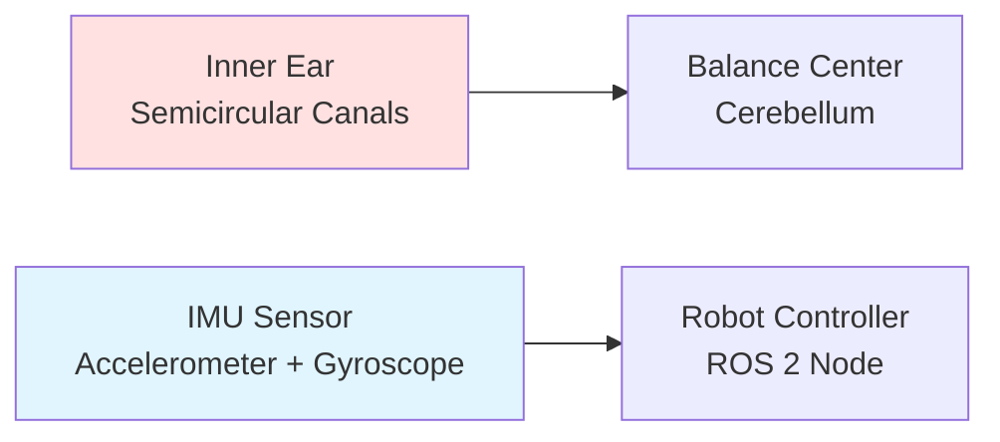
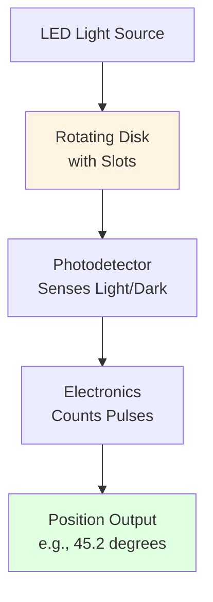
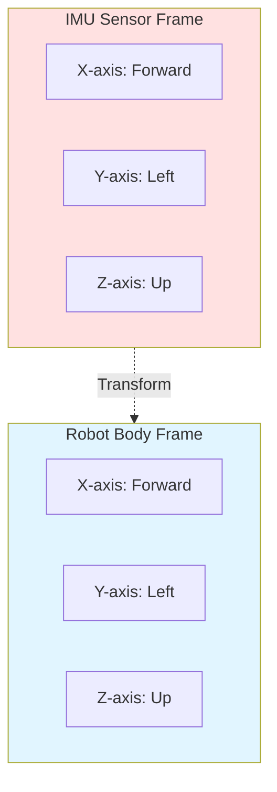
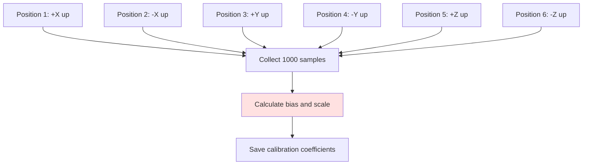

# 1.3.1 IMU & Encoder Basics + Calibration

## What Are Proprioceptive Sensors?

Imagine trying to walk with your eyes closed. You can still sense where your limbs are, right? That's **proprioception** - your body's ability to know its own state without looking.

Robots need the same capability. **Proprioceptive sensors** tell a robot about its internal state:

- **Where are my joints?** (Encoders)
- **Am I tilted?** (IMU - Inertial Measurement Unit)
- **Am I falling?** (IMU acceleration data)
- **How fast am I spinning?** (IMU gyroscope)

These sensors are the robot's "internal sense of self" - critical for balance, movement, and safety.

---

## Real-World Analogy: Your Inner Ear

Your **vestibular system** (inner ear) works just like a robot's IMU:



**What happens when you tilt your head?**
1. Fluid in your inner ear moves
2. Tiny hairs detect the motion
3. Nerves send signals to your brain
4. Brain corrects your posture (within 50ms!)

**What happens when a robot tilts?**
1. IMU detects orientation change
2. Publishes data to ROS 2 topic
3. Balance controller reads the data
4. Commands motors to correct (within 10ms!)

---

## Joint Encoders: The Robot's Joint Angle Sensors

### What is an Encoder?

An **encoder** measures the **position** (angle) of a rotating shaft - typically attached to each motor in a robot joint.

**Types of Encoders:**

**1. Incremental Encoders**
- Measure **relative change** in position
- Output pulses as shaft rotates
- Need homing procedure on startup
- **Example:** 1024 pulses per revolution (PPR)

**2. Absolute Encoders**
- Measure **exact position** at all times
- Remember position even when powered off
- More expensive but safer (no homing needed)
- **Example:** 12-bit resolution = 4096 positions per revolution

### How Encoders Work

**Optical Encoders** (most common in humanoids):



**How it counts position:**
1. Motor shaft spins a slotted disk
2. LED shines through the slots
3. Photodetector sees light → dark → light pulses
4. Electronics count pulses: 1024 pulses = 360° rotation
5. Calculate angle: (pulse_count / 1024) × 360°

### Encoders in ROS 2

**Reading Encoder Data:**

```python
import rclpy
from rclpy.node import Node
from sensor_msgs.msg import JointState

class JointEncoder Reader(Node):
    def __init__(self):
        super().__init__('encoder_reader')

        # Subscribe to joint states from encoder driver
        self.subscription = self.create_subscription(
            JointState,
            '/joint_states',  # Standard ROS 2 topic for encoders
            self.encoder_callback,
            10
        )

    def encoder_callback(self, msg):
        """
        JointState message contains:
        - name: list of joint names
        - position: list of angles (radians)
        - velocity: list of angular velocities (rad/s)
        - effort: list of torques (Nm)
        """
        for i, joint_name in enumerate(msg.name):
            position_deg = msg.position[i] * (180.0 / 3.14159)  # Convert to degrees
            velocity_rpm = msg.velocity[i] * (60.0 / (2 * 3.14159))  # Convert to RPM

            self.get_logger().info(
                f'{joint_name}: {position_deg:.1f}° at {velocity_rpm:.0f} RPM'
            )

def main():
    rclpy.init()
    node = JointEncoderReader()
    rclpy.spin(node)
    rclpy.shutdown()
```

**What you'll see:**
```
[INFO] [encoder_reader]: left_shoulder: 45.2° at 120 RPM
[INFO] [encoder_reader]: left_elbow: -30.5° at 80 RPM
[INFO] [encoder_reader]: right_hip: 12.3° at 50 RPM
```

### Encoder Resolution and Accuracy

**Key Specs:**

| Encoder Type | Resolution | Accuracy | Cost | Use Case |
|--------------|------------|----------|------|----------|
| Incremental (1024 PPR) | 0.35°/step | ±0.5° | $10-30 | Basic joints |
| Incremental (4096 PPR) | 0.088°/step | ±0.1° | $30-80 | Precision joints |
| Absolute (12-bit) | 0.088°/step | ±0.2° | $80-150 | Critical joints (hips, knees) |
| Absolute (14-bit) | 0.022°/step | ±0.05° | $150-300 | High-precision (hands, fingers) |

**Why resolution matters:**

A humanoid knee has ~120° range of motion (0° = fully extended, 120° = fully bent).

- **1024 PPR**: 1024 steps over 120° = 0.12° per step = 1.2mm foot position error (acceptable)
- **512 PPR**: 512 steps over 120° = 0.23° per step = 2.4mm foot position error (poor for walking)

**Rule of thumb:** For stable bipedal walking, you need **&lt;0.15° accuracy** on hip and knee encoders.

---

## IMU (Inertial Measurement Unit): The Robot's Balance Sensor

### What is an IMU?

An **IMU** combines three sensor types into one package:

**1. Accelerometer (3-axis)**
- Measures **linear acceleration** (m/s²)
- Detects which way is "down" (gravity = 9.81 m/s² downward)
- Range: typically ±2g to ±16g (where 1g = 9.81 m/s²)

**2. Gyroscope (3-axis)**
- Measures **angular velocity** (rotation speed in rad/s or °/s)
- Detects how fast the robot is spinning
- Range: ±250°/s to ±2000°/s

**3. Magnetometer (3-axis)** (optional, not in all IMUs)
- Measures **magnetic field** (like a compass)
- Detects absolute heading (North/South/East/West)
- Sensitive to metal and electrical interference

### Popular IMUs for Humanoid Robots

| IMU Model | Chip | Update Rate | Noise | Cost | Interface |
|-----------|------|-------------|-------|------|-----------|
| **BNO055** | Bosch | 100 Hz | Low | $30 | I2C/UART |
| **MPU6050** | InvenSense | 1000 Hz | Medium | $5 | I2C |
| **MPU9250** | InvenSense | 1000 Hz | Medium | $10 | I2C/SPI |
| **ICM-20948** | TDK | 1125 Hz | Very Low | $15 | I2C/SPI |
| **VectorNav VN-100** | VectorNav | 800 Hz | Ultra-Low | $500 | UART/SPI |

**Most popular for humanoids:** **BNO055** (best price/performance ratio, built-in sensor fusion)

### IMU Coordinate Frames

IMUs measure acceleration and rotation relative to their own **body frame**:



**Important:** The IMU frame must be aligned with the robot frame, or you need to apply a transformation!

**Example:** If IMU is mounted sideways:
- IMU X-axis points to robot's left
- IMU Y-axis points to robot's forward
- Need to swap axes in software!

### Reading IMU Data in ROS 2

**Standard ROS 2 IMU Message:**

```python
import rclpy
from rclpy.node import Node
from sensor_msgs.msg import Imu
import math

class IMUReader(Node):
    def __init__(self):
        super().__init__('imu_reader')

        # Subscribe to IMU topic
        self.subscription = self.create_subscription(
            Imu,
            '/imu/data',  # Standard topic name
            self.imu_callback,
            10
        )

    def imu_callback(self, msg):
        """
        Imu message contains:
        - orientation: quaternion (x, y, z, w) - computed orientation
        - angular_velocity: (x, y, z) in rad/s - gyroscope data
        - linear_acceleration: (x, y, z) in m/s² - accelerometer data
        """

        # Extract angular velocity (gyroscope)
        roll_rate = msg.angular_velocity.x * (180.0 / math.pi)  # deg/s
        pitch_rate = msg.angular_velocity.y * (180.0 / math.pi)
        yaw_rate = msg.angular_velocity.z * (180.0 / math.pi)

        # Extract linear acceleration
        accel_x = msg.linear_acceleration.x  # m/s²
        accel_y = msg.linear_acceleration.y
        accel_z = msg.linear_acceleration.z

        # Calculate tilt from accelerometer (works when robot is stationary)
        roll = math.atan2(accel_y, accel_z) * (180.0 / math.pi)
        pitch = math.atan2(-accel_x, math.sqrt(accel_y**2 + accel_z**2)) * (180.0 / math.pi)

        self.get_logger().info(
            f'Tilt: Roll={roll:.1f}° Pitch={pitch:.1f}° | '
            f'Rotation: {roll_rate:.0f}°/s, {pitch_rate:.0f}°/s, {yaw_rate:.0f}°/s'
        )

def main():
    rclpy.init()
    node = IMUReader()
    rclpy.spin(node)
    rclpy.shutdown()
```

**Example Output:**
```
[INFO] [imu_reader]: Tilt: Roll=2.3° Pitch=-1.5° | Rotation: 0°/s, 0°/s, 0°/s
[INFO] [imu_reader]: Tilt: Roll=15.2° Pitch=-3.1° | Rotation: 45°/s, 12°/s, 2°/s
```

---

## Sensor Calibration: Why and How

### Why Calibration is Critical

**Raw sensor data is NOISY and BIASED:**

```
Ideal accelerometer at rest (upright):
  X = 0, Y = 0, Z = 9.81 m/s² (gravity)

Real accelerometer at rest:
  X = 0.15, Y = -0.22, Z = 9.65 m/s²  ❌ WRONG!
```

**Sources of Error:**

1. **Bias (Offset):** Sensor reads non-zero when it should read zero
2. **Scale Error:** Sensor reads 9.5 m/s² when gravity is actually 9.81 m/s²
3. **Noise:** Random fluctuations in measurements
4. **Temperature Drift:** Readings change as sensor heats up
5. **Alignment:** Sensor axes not perfectly perpendicular

**Without calibration, your robot will:**
- Think it's tilted when it's level → fall over
- Accumulate position drift → get lost
- Oscillate trying to balance → unstable walking

### IMU Calibration Procedure

**Step 1: Accelerometer Calibration (6-Position Method)**

Place IMU in 6 orientations (each axis pointing up and down):



**Python Calibration Script:**

```python
import numpy as np

def calibrate_accelerometer(samples_6_positions):
    """
    samples_6_positions: list of 6 numpy arrays, each (N, 3)
    Returns: bias (3,) and scale (3, 3) matrix
    """
    # Expected gravity for each position
    expected = [
        [+9.81, 0, 0],  # +X up
        [-9.81, 0, 0],  # -X up
        [0, +9.81, 0],  # +Y up
        [0, -9.81, 0],  # -Y up
        [0, 0, +9.81],  # +Z up
        [0, 0, -9.81],  # -Z up
    ]

    # Average readings for each position
    measured = [np.mean(samples, axis=0) for samples in samples_6_positions]

    # Solve for bias and scale
    # ... (least-squares optimization)

    return bias, scale_matrix
```

**Step 2: Gyroscope Calibration (Static Bias)**

Place IMU perfectly still for 60 seconds:

```python
def calibrate_gyroscope(static_samples):
    """
    static_samples: numpy array (N, 3) of gyro readings when motionless
    Returns: bias (3,) - average reading when still
    """
    # Gyro should read 0 when not rotating
    bias = np.mean(static_samples, axis=0)
    return bias

# Usage in ROS 2 node
gyro_calibrated = gyro_raw - gyro_bias
```

**Step 3: Apply Calibration in Real-Time**

```python
class CalibratedIMU(Node):
    def __init__(self):
        super().__init__('calibrated_imu')

        # Load calibration from file (saved during calibration procedure)
        self.accel_bias = np.array([0.15, -0.22, -0.16])  # m/s²
        self.accel_scale = np.diag([1.02, 0.98, 1.01])  # scale factors
        self.gyro_bias = np.array([0.03, -0.01, 0.02])  # rad/s

        self.sub = self.create_subscription(Imu, '/imu/raw', self.callback, 10)
        self.pub = self.create_publisher(Imu, '/imu/calibrated', 10)

    def callback(self, raw_msg):
        # Extract raw data
        accel_raw = np.array([
            raw_msg.linear_acceleration.x,
            raw_msg.linear_acceleration.y,
            raw_msg.linear_acceleration.z
        ])

        gyro_raw = np.array([
            raw_msg.angular_velocity.x,
            raw_msg.angular_velocity.y,
            raw_msg.angular_velocity.z
        ])

        # Apply calibration
        accel_cal = self.accel_scale @ (accel_raw - self.accel_bias)
        gyro_cal = gyro_raw - self.gyro_bias

        # Publish calibrated data
        calibrated_msg = Imu()
        calibrated_msg.header = raw_msg.header
        calibrated_msg.linear_acceleration.x = accel_cal[0]
        calibrated_msg.linear_acceleration.y = accel_cal[1]
        calibrated_msg.linear_acceleration.z = accel_cal[2]
        calibrated_msg.angular_velocity.x = gyro_cal[0]
        calibrated_msg.angular_velocity.y = gyro_cal[1]
        calibrated_msg.angular_velocity.z = gyro_cal[2]

        self.pub.publish(calibrated_msg)
```

### Encoder Calibration (Homing Procedure)

**Problem:** Incremental encoders lose position when powered off.

**Solution:** **Homing** - move joints to known reference positions on startup.

**Methods:**

**1. Hard Stop Method**
```python
def home_joint(self, joint_name):
    """Move joint slowly until it hits mechanical stop."""
    # Command slow motion in one direction
    self.command_velocity(joint_name, -0.1)  # rad/s

    # Wait until motor current spikes (hit the stop)
    while self.get_motor_current(joint_name) < self.CURRENT_THRESHOLD:
        time.sleep(0.01)

    # Stop and set this position as 0°
    self.command_velocity(joint_name, 0.0)
    self.set_encoder_zero(joint_name)
```

**2. Limit Switch Method**
```python
def home_joint_with_switch(self, joint_name):
    """Move joint until limit switch triggers."""
    # Move toward home switch
    self.command_velocity(joint_name, -0.2)

    # Wait for switch signal
    while not self.read_limit_switch(joint_name):
        time.sleep(0.01)

    # Stop and set position
    self.command_velocity(joint_name, 0.0)
    self.set_encoder_zero(joint_name)
```

**3. Absolute Encoder (No Homing Needed!)**
- Expensive but safer: robot always knows exact position
- Critical for safety: prevents unexpected motions on startup

---

## Practical Example: Humanoid Balance Monitor

Let's build a complete ROS 2 node that monitors if a humanoid is about to fall:

```python
#!/usr/bin/env python3
import rclpy
from rclpy.node import Node
from sensor_msgs.msg import Imu, JointState
from std_msgs.msg import String
import math

class BalanceMonitor(Node):
    def __init__(self):
        super().__init__('balance_monitor')

        # Subscribers
        self.imu_sub = self.create_subscription(Imu, '/imu/data', self.imu_callback, 10)
        self.joint_sub = self.create_subscription(JointState, '/joint_states', self.joint_callback, 10)

        # Publisher for balance status
        self.status_pub = self.create_publisher(String, '/balance_status', 10)

        # Balance thresholds
        self.MAX_TILT_ANGLE = 15.0  # degrees
        self.MAX_ANGULAR_VEL = 45.0  # deg/s

        # State
        self.current_tilt = 0.0
        self.current_angular_vel = 0.0

        # Timer for status checking
        self.create_timer(0.1, self.check_balance)  # 10 Hz

    def imu_callback(self, msg):
        # Calculate tilt from accelerometer
        ax = msg.linear_acceleration.x
        ay = msg.linear_acceleration.y
        az = msg.linear_acceleration.z

        roll = math.atan2(ay, az) * (180.0 / math.pi)
        pitch = math.atan2(-ax, math.sqrt(ay**2 + az**2)) * (180.0 / math.pi)

        self.current_tilt = max(abs(roll), abs(pitch))

        # Calculate total angular velocity
        wx = msg.angular_velocity.x * (180.0 / math.pi)
        wy = msg.angular_velocity.y * (180.0 / math.pi)
        wz = msg.angular_velocity.z * (180.0 / math.pi)

        self.current_angular_vel = math.sqrt(wx**2 + wy**2 + wz**2)

    def joint_callback(self, msg):
        # Log encoder positions (for debugging)
        self.get_logger().debug(f'Joints: {len(msg.position)} encoders active')

    def check_balance(self):
        """Check if robot is balanced or at risk of falling."""
        status_msg = String()

        if self.current_tilt > self.MAX_TILT_ANGLE:
            status_msg.data = f'⚠️  UNSTABLE: Tilt {self.current_tilt:.1f}° exceeds {self.MAX_TILT_ANGLE}°'
            self.get_logger().warn(status_msg.data)
        elif self.current_angular_vel > self.MAX_ANGULAR_VEL:
            status_msg.data = f'⚠️  UNSTABLE: Rotation {self.current_angular_vel:.0f}°/s too fast'
            self.get_logger().warn(status_msg.data)
        else:
            status_msg.data = f'✅ STABLE: Tilt={self.current_tilt:.1f}° AngVel={self.current_angular_vel:.0f}°/s'
            self.get_logger().info(status_msg.data)

        self.status_pub.publish(status_msg)

def main(args=None):
    rclpy.init(args=args)
    node = BalanceMonitor()
    rclpy.spin(node)
    rclpy.shutdown()

if __name__ == '__main__':
    main()
```

**Running the node:**
```bash
ros2 run my_robot_pkg balance_monitor

# Output:
[INFO] [balance_monitor]: ✅ STABLE: Tilt=2.3° AngVel=5°/s
[INFO] [balance_monitor]: ✅ STABLE: Tilt=3.1° AngVel=8°/s
[WARN] [balance_monitor]: ⚠️  UNSTABLE: Tilt 18.5° exceeds 15°
```

---

## Key Takeaways

1. **Proprioceptive sensors** (encoders + IMU) tell robots about their internal state, just like your sense of balance and limb position.

2. **Encoders measure joint angles** with 0.1-0.35° resolution. Incremental encoders need homing; absolute encoders always know their position.

3. **IMUs combine accelerometer + gyroscope** to measure tilt and rotation at 100-1000 Hz. Essential for balance control in humanoids.

4. **Calibration is non-optional** - uncalibrated sensors have 5-20% errors that will cause falls. Use 6-position method for accelerometers, static averaging for gyroscopes.

5. **ROS 2 provides standard message types** (`sensor_msgs/Imu`, `sensor_msgs/JointState`) that work across all hardware. Your code stays the same even if you change sensors!

---

## Further Reading

- **BNO055 Datasheet**: [Bosch Sensortec](https://www.bosch-sensortec.com/products/smart-sensor-systems/bno055/)
- **ROS 2 IMU Documentation**: [sensor_msgs/Imu](https://docs.ros.org/en/humble/p/sensor_msgs/interfaces/msg/Imu.html)
- **Calibration Theory**: Frosio, I., et al. (2009). "Autocalibration of MEMS Accelerometers." IEEE Trans. Instrumentation.
- **Encoder Tutorial**: [Understanding Encoders](https://www.encoder.com/article-what-is-an-encoder)

---

**Next:** In **1.3.2**, we'll integrate a RealSense D435i depth camera and combine visual data with IMU readings for robust state estimation!
