# 1.3.2 RealSense Camera Integration

## What Are Exteroceptive Sensors?

In the previous section, we covered **proprioceptive sensors** (encoders, IMU) that tell the robot about *itself*. Now we need **exteroceptive sensors** that tell the robot about the *world around it*.

**Exteroceptive sensors include:**
- 📷 **Cameras** - see the environment
- 🔦 **LiDAR** - measure distances with lasers
- 🔊 **Ultrasonic sensors** - detect obstacles with sound waves
- 🎯 **Depth cameras** - combine RGB images with 3D distance data

For humanoid robots, **depth cameras** are the most versatile - they provide both color images (for object recognition) and 3D point clouds (for navigation and manipulation).

---

## Why Intel RealSense D435i?

The **Intel RealSense D435i** is the industry-standard depth camera for robotics. Here's why:

**Key Specs:**

| Feature | Specification | Why It Matters |
|---------|--------------|----------------|
| **Depth Range** | 0.3m - 10m | Perfect for indoor humanoids (reach is ~0.8m, rooms are <10m) |
| **Resolution** | 1280×720 @ 30 FPS | Enough detail for object recognition |
| **Field of View** | 87° × 58° (diagonal 94°) | Wide enough to see in front without head tracking |
| **IMU** | Built-in BMI055 | Accelerometer + gyroscope for visual-inertial odometry |
| **Depth Technology** | Stereo vision (2 infrared cameras) | Works in sunlight (unlike structured light) |
| **Interface** | USB 3.0 | High bandwidth for real-time streaming |
| **ROS 2 Support** | Official `realsense-ros` package | Plug-and-play with ROS 2 Humble |
| **Cost** | ~$300 | 10× cheaper than LiDAR, more informative than webcams |

**Alternatives:**

- **Oak-D** ($150) - Similar performance, cheaper, less support
- **ZED 2** ($450) - Higher resolution, better in low light
- **Azure Kinect** ($400) - Better depth accuracy, larger/heavier

**For learning and most humanoid projects, D435i is the best choice.**

---

## How Stereo Depth Cameras Work

The RealSense D435i uses **stereoscopic vision** - the same principle as your two eyes!

### Human Vision Analogy

Close one eye and try to judge distance. Hard, right? Now open both eyes - you can instantly tell how far away objects are. That's **stereo depth perception**.


**RealSense D435i does the same thing:**

```mermaid
graph TB
    subgraph Camera["RealSense D435i"]
        A[Left IR Camera]
        B[Right IR Camera]
        C[IR Projector<br/>adds texture]
    end

    subgraph Processing["Depth Processor"]
        D[Match features<br/>between images]
        E[Calculate disparity]
        F[Convert to depth<br/>Z = focal_length × baseline / disparity]
    end

    A --> D
    B --> D
    C -.->|Projects dots| Scene[Scene]
    D --> E
    E --> F
    F --> G[Depth Image<br/>distance per pixel]

    style F fill:#ffe1e1
    style G fill:#e1f5ff
```



**Key Insight:** Objects appear at different horizontal positions in left vs. right images. The difference (disparity) is inversely proportional to distance.

- **Close objects:** Large disparity (appear far apart in left/right images)
- **Far objects:** Small disparity (appear nearly the same in both images)

**Formula:**
```
depth (meters) = (focal_length × baseline) / disparity

Where:
- focal_length ≈ 1.88 mm (camera lens property)
- baseline = 50 mm (distance between left/right cameras)
- disparity = pixel shift between left and right images
```

---

## Installing RealSense on Ubuntu 22.04 + ROS 2

### Step 1: Install Intel RealSense SDK

```bash
# Add Intel RealSense repository
sudo mkdir -p /etc/apt/keyrings
curl -sSf https://librealsense.intel.com/Debian/librealsense.pgp | \
  sudo tee /etc/apt/keyrings/librealsense.pgp > /dev/null

echo "deb [signed-by=/etc/apt/keyrings/librealsense.pgp] \
  https://librealsense.intel.com/Debian/apt-repo `lsb_release -cs` main" | \
  sudo tee /etc/apt/sources.list.d/librealsense.list

# Install SDK and tools
sudo apt update
sudo apt install -y librealsense2-dkms librealsense2-utils librealsense2-dev

# Test installation (plug in camera first!)
realsense-viewer
```

**What you should see:**
- Depth camera live stream in a GUI
- Infrared and RGB video feeds
- 3D point cloud visualization

### Step 2: Install ROS 2 RealSense Wrapper

```bash
# Install from apt (easiest method)
sudo apt install -y ros-humble-realsense2-camera ros-humble-realsense2-description

# OR build from source (for latest features):
cd ~/ros2_ws/src
git clone https://github.com/IntelRealSense/realsense-ros.git -b ros2-development
cd ~/ros2_ws
rosdep install --from-paths src --ignore-src -r -y
colcon build --packages-select realsense2_camera
source install/setup.bash
```

### Step 3: Launch Camera Node

```bash
# Basic launch (publishes all topics)
ros2 launch realsense2_camera rs_launch.py

# You should see topics like:
# /camera/color/image_raw          - RGB image (848×480 @ 30 FPS)
# /camera/depth/image_rect_raw     - Depth image (640×480 @ 30 FPS)
# /camera/aligned_depth_to_color/image_raw  - Depth aligned to RGB
# /camera/color/camera_info        - Camera calibration data
# /camera/imu                      - Built-in IMU data
```

**Verify it works:**
```bash
# View RGB image
ros2 run rqt_image_view rqt_image_view

# View depth image (select /camera/depth/image_rect_raw)
ros2 run rqt_image_view rqt_image_view

# List all camera topics
ros2 topic list | grep camera
```

---

## Understanding RealSense ROS 2 Topics

The `realsense2_camera` node publishes **many topics**. Here are the essential ones:

### RGB Image Topics

```bash
/camera/color/image_raw          # Raw RGB image (bgr8 encoding)
/camera/color/camera_info        # Intrinsic calibration (focal length, distortion)
```

**Message Type:** `sensor_msgs/Image`

**What it contains:**
- `width`, `height` - Image dimensions (e.g., 848×480)
- `encoding` - Pixel format (e.g., `bgr8` = 8-bit BGR color)
- `data` - Raw pixel data (array of bytes)

### Depth Image Topics

```bash
/camera/depth/image_rect_raw                    # Raw depth (0.3m - 10m)
/camera/aligned_depth_to_color/image_raw        # Depth aligned to RGB
```

**Message Type:** `sensor_msgs/Image`

**What it contains:**
- Each pixel value = distance in millimeters
- Value 0 = invalid/no depth data
- Value 1500 = object is 1.5 meters away

**Important:** Depth and RGB images have **different resolutions** (640×480 vs. 848×480). Use the `aligned_depth_to_color` topic if you need pixel-perfect correspondence!

### Point Cloud Topic

```bash
/camera/depth/color/points       # 3D point cloud (colored)
```

**Message Type:** `sensor_msgs/PointCloud2`

**What it contains:**
- Millions of 3D points (x, y, z) in meters
- Each point has color (r, g, b) from RGB image
- Used for 3D mapping, obstacle detection, SLAM

---

## Reading Camera Data in ROS 2

### Example 1: Subscribe to RGB Images

```python
#!/usr/bin/env python3
import rclpy
from rclpy.node import Node
from sensor_msgs.msg import Image
from cv_bridge import CvBridge
import cv2

class RGBImageSubscriber(Node):
    def __init__(self):
        super().__init__('rgb_subscriber')

        # CvBridge converts ROS images to OpenCV format
        self.bridge = CvBridge()

        # Subscribe to color image
        self.subscription = self.create_subscription(
            Image,
            '/camera/color/image_raw',
            self.image_callback,
            10
        )

    def image_callback(self, msg):
        """Receive and process RGB image."""
        try:
            # Convert ROS Image message to OpenCV image (numpy array)
            cv_image = self.bridge.imgmsg_to_cv2(msg, desired_encoding='bgr8')

            # Get image dimensions
            height, width, channels = cv_image.shape
            self.get_logger().info(f'Received image: {width}×{height} ({channels} channels)')

            # Example processing: detect red objects
            hsv = cv2.cvtColor(cv_image, cv2.COLOR_BGR2HSV)
            red_mask = cv2.inRange(hsv, (0, 100, 100), (10, 255, 255))
            red_pixels = cv2.countNonZero(red_mask)

            if red_pixels > 1000:
                self.get_logger().warn(f'🔴 Red object detected! ({red_pixels} pixels)')

            # Display image (for debugging)
            cv2.imshow('RealSense RGB', cv_image)
            cv2.waitKey(1)

        except Exception as e:
            self.get_logger().error(f'Error processing image: {e}')

def main():
    rclpy.init()
    node = RGBImageSubscriber()
    try:
        rclpy.spin(node)
    except KeyboardInterrupt:
        pass
    finally:
        cv2.destroyAllWindows()
        rclpy.shutdown()

if __name__ == '__main__':
    main()
```

**Install dependencies:**
```bash
sudo apt install -y python3-opencv
pip install opencv-python cv-bridge
```

### Example 2: Subscribe to Depth Images

```python
#!/usr/bin/env python3
import rclpy
from rclpy.node import Node
from sensor_msgs.msg import Image
from cv_bridge import CvBridge
import cv2
import numpy as np

class DepthImageSubscriber(Node):
    def __init__(self):
        super().__init__('depth_subscriber')
        self.bridge = CvBridge()

        # Subscribe to aligned depth (matches RGB resolution)
        self.subscription = self.create_subscription(
            Image,
            '/camera/aligned_depth_to_color/image_raw',
            self.depth_callback,
            10
        )

    def depth_callback(self, msg):
        """Process depth image."""
        try:
            # Convert to numpy array (depth in millimeters)
            depth_image = self.bridge.imgmsg_to_cv2(msg, desired_encoding='passthrough')

            # Convert mm to meters
            depth_meters = depth_image.astype(float) / 1000.0

            # Get center pixel depth (distance to object in front of camera)
            center_y, center_x = depth_image.shape[0] // 2, depth_image.shape[1] // 2
            center_depth = depth_meters[center_y, center_x]

            if center_depth > 0:  # Valid depth
                self.get_logger().info(f'Object at center: {center_depth:.2f} meters away')

            # Find closest obstacle
            valid_depths = depth_meters[depth_meters > 0]  # Ignore invalid (0) pixels
            if len(valid_depths) > 0:
                min_distance = np.min(valid_depths)
                if min_distance < 0.5:  # Closer than 50 cm
                    self.get_logger().warn(f'⚠️  OBSTACLE! Closest object: {min_distance:.2f}m')

            # Visualize depth (convert to 8-bit grayscale for display)
            depth_display = cv2.normalize(depth_image, None, 0, 255, cv2.NORM_MINMAX)
            depth_display = np.uint8(depth_display)
            depth_colormap = cv2.applyColorMap(depth_display, cv2.COLORMAP_JET)

            cv2.imshow('RealSense Depth', depth_colormap)
            cv2.waitKey(1)

        except Exception as e:
            self.get_logger().error(f'Error processing depth: {e}')

def main():
    rclpy.init()
    node = DepthImageSubscriber()
    try:
        rclpy.spin(node)
    except KeyboardInterrupt:
        pass
    finally:
        cv2.destroyAllWindows()
        rclpy.shutdown()

if __name__ == '__main__':
    main()
```

### Example 3: Subscribe to Point Clouds

```python
#!/usr/bin/env python3
import rclpy
from rclpy.node import Node
from sensor_msgs.msg import PointCloud2
import sensor_msgs_py.point_cloud2 as pc2

class PointCloudSubscriber(Node):
    def __init__(self):
        super().__init__('pointcloud_subscriber')

        self.subscription = self.create_subscription(
            PointCloud2,
            '/camera/depth/color/points',
            self.pointcloud_callback,
            10
        )

    def pointcloud_callback(self, msg):
        """Process 3D point cloud."""
        # Convert PointCloud2 to list of (x, y, z, rgb) points
        points = list(pc2.read_points(msg, field_names=('x', 'y', 'z', 'rgb'), skip_nans=True))

        num_points = len(points)
        self.get_logger().info(f'Received {num_points} 3D points')

        # Find points within reach (0.5m - 1.0m in front)
        reachable_points = [
            (x, y, z) for x, y, z, rgb in points
            if 0.5 < x < 1.0 and abs(y) < 0.3 and abs(z) < 0.3
        ]

        if reachable_points:
            self.get_logger().info(f'✋ {len(reachable_points)} points within arm reach')

def main():
    rclpy.init()
    node = PointCloudSubscriber()
    rclpy.spin(node)
    rclpy.shutdown()

if __name__ == '__main__':
    main()
```

---

## Camera Calibration and Intrinsics

Every camera has **intrinsic parameters** - optical properties unique to that specific camera.

### What is Camera Calibration?

**Intrinsic parameters:**
- **Focal length** (fx, fy): Determines field of view
- **Principal point** (cx, cy): Center of image (usually near width/2, height/2)
- **Distortion coefficients** (k1, k2, p1, p2, k3): Lens distortion (barrel/pincushion effects)

**Why it matters:**
To convert a pixel (u, v) to a 3D ray direction, you need the intrinsics!

```
X_world = (u - cx) × Z / fx
Y_world = (v - cy) × Z / fy
Z_world = depth_value
```

### Reading Calibration from ROS 2

The RealSense driver publishes calibration automatically:

```python
from sensor_msgs.msg import CameraInfo

class CalibrationReader(Node):
    def __init__(self):
        super().__init__('calibration_reader')

        self.subscription = self.create_subscription(
            CameraInfo,
            '/camera/color/camera_info',
            self.camera_info_callback,
            10
        )

    def camera_info_callback(self, msg):
        """Extract intrinsic parameters."""
        # Intrinsic matrix (3x3)
        K = msg.k.reshape(3, 3)  # K = [[fx, 0, cx], [0, fy, cy], [0, 0, 1]]

        fx = K[0, 0]  # Focal length X
        fy = K[1, 1]  # Focal length Y
        cx = K[0, 2]  # Principal point X
        cy = K[1, 2]  # Principal point Y

        self.get_logger().info(
            f'Camera intrinsics: fx={fx:.1f}, fy={fy:.1f}, cx={cx:.1f}, cy={cy:.1f}'
        )

        # Distortion coefficients [k1, k2, p1, p2, k3]
        distortion = msg.d
        self.get_logger().info(f'Distortion: {distortion}')
```

**Typical D435i values:**
```
fx ≈ 615-625 pixels
fy ≈ 615-625 pixels
cx ≈ 315-325 pixels (half of 640)
cy ≈ 235-245 pixels (half of 480)
```

---

## Practical Application: Obstacle Detection

Let's build a complete obstacle detection node that uses depth data to warn when objects are too close:

```python
#!/usr/bin/env python3
import rclpy
from rclpy.node import Node
from sensor_msgs.msg import Image
from std_msgs.msg import String
from cv_bridge import CvBridge
import numpy as np

class ObstacleDetector(Node):
    def __init__(self):
        super().__init__('obstacle_detector')

        self.bridge = CvBridge()

        # Subscribe to depth
        self.depth_sub = self.create_subscription(
            Image,
            '/camera/aligned_depth_to_color/image_raw',
            self.depth_callback,
            10
        )

        # Publish warnings
        self.warning_pub = self.create_publisher(String, '/obstacle_warnings', 10)

        # Detection parameters
        self.DANGER_ZONE = 0.5  # meters
        self.WARNING_ZONE = 1.0  # meters

    def depth_callback(self, msg):
        """Analyze depth image for obstacles."""
        depth_image = self.bridge.imgmsg_to_cv2(msg, desired_encoding='passthrough')
        depth_meters = depth_image.astype(float) / 1000.0

        # Define regions of interest (ROIs)
        height, width = depth_meters.shape

        # Center region (in front of robot)
        roi_center = depth_meters[height//3:2*height//3, width//3:2*width//3]

        # Left and right regions
        roi_left = depth_meters[height//3:2*height//3, 0:width//3]
        roi_right = depth_meters[height//3:2*height//3, 2*width//3:width]

        # Calculate average distance in each region (ignoring zeros)
        def safe_mean(region):
            valid = region[region > 0]
            return np.mean(valid) if len(valid) > 0 else float('inf')

        dist_center = safe_mean(roi_center)
        dist_left = safe_mean(roi_left)
        dist_right = safe_mean(roi_right)

        # Generate warnings
        warning_msg = String()

        if dist_center < self.DANGER_ZONE:
            warning_msg.data = f'🚨 STOP! Obstacle ahead: {dist_center:.2f}m'
            self.get_logger().error(warning_msg.data)
        elif dist_center < self.WARNING_ZONE:
            warning_msg.data = f'⚠️  Caution: Object at {dist_center:.2f}m ahead'
            self.get_logger().warn(warning_msg.data)
        elif dist_left < self.WARNING_ZONE:
            warning_msg.data = f'⚠️  Obstacle on LEFT: {dist_left:.2f}m'
            self.get_logger().warn(warning_msg.data)
        elif dist_right < self.WARNING_ZONE:
            warning_msg.data = f'⚠️  Obstacle on RIGHT: {dist_right:.2f}m'
            self.get_logger().warn(warning_msg.data)
        else:
            warning_msg.data = f'✅ Clear: C={dist_center:.1f}m L={dist_left:.1f}m R={dist_right:.1f}m'
            self.get_logger().info(warning_msg.data)

        self.warning_pub.publish(warning_msg)

def main():
    rclpy.init()
    node = ObstacleDetector()
    rclpy.spin(node)
    rclpy.shutdown()

if __name__ == '__main__':
    main()
```

**Test it:**
```bash
# Terminal 1: Launch camera
ros2 launch realsense2_camera rs_launch.py

# Terminal 2: Run obstacle detector
ros2 run my_robot_pkg obstacle_detector

# Terminal 3: Listen to warnings
ros2 topic echo /obstacle_warnings
```

---

## Combining RGB + Depth: Object Distance Measurement

The real power of the RealSense is combining color and depth:

```python
def detect_red_object_distance(self):
    """Find red objects and measure their distance."""

    # Get RGB image
    rgb_image = self.latest_rgb  # from RGB callback

    # Get aligned depth
    depth_image = self.latest_depth  # from depth callback

    # Detect red pixels (HSV color space)
    hsv = cv2.cvtColor(rgb_image, cv2.COLOR_BGR2HSV)
    red_mask = cv2.inRange(hsv, (0, 100, 100), (10, 255, 255))

    # Find contours of red regions
    contours, _ = cv2.findContours(red_mask, cv2.RETR_EXTERNAL, cv2.CHAIN_APPROX_SIMPLE)

    for contour in contours:
        if cv2.contourArea(contour) > 500:  # Ignore small noise
            # Get bounding box
            x, y, w, h = cv2.boundingRect(contour)
            center_x, center_y = x + w//2, y + h//2

            # Get depth at object center
            object_distance = depth_image[center_y, center_x] / 1000.0  # mm to m

            if object_distance > 0:  # Valid depth
                self.get_logger().info(
                    f'🔴 Red object detected at ({center_x}, {center_y}), '
                    f'distance: {object_distance:.2f}m'
                )
```

---

## Key Takeaways

1. **RealSense D435i** is the standard depth camera for ROS 2 robotics - provides RGB, depth, point clouds, and IMU data over USB 3.0.

2. **Stereo vision** works like human eyes - two cameras calculate depth by comparing images. IR projector adds texture to featureless surfaces.

3. **ROS 2 integration** is seamless via `realsense2_camera` package. One launch command publishes all topics (RGB, depth, point cloud, IMU).

4. **Aligned depth** (`/camera/aligned_depth_to_color/image_raw`) matches RGB resolution - use this for pixel-perfect RGB + depth fusion.

5. **Camera intrinsics** (focal length, principal point) are essential for converting pixels to 3D coordinates. Published on `/camera/color/camera_info`.

6. **Combine RGB and depth** for powerful applications: colored 3D mapping, object distance measurement, obstacle avoidance with semantic understanding.

---

## Troubleshooting

**Problem:** `realsense-viewer` crashes or shows "No device connected"

```bash
# Solution 1: Check USB connection
lsusb | grep Intel
# Should show: "Intel Corp. Intel(R) RealSense(TM) Depth Camera 435i"

# Solution 2: Fix permissions
sudo apt install librealsense2-dkms
sudo reboot

# Solution 3: Use USB 3.0 port (blue inside)
```

**Problem:** ROS 2 node publishes no images

```bash
# Check if topics exist
ros2 topic list | grep camera

# Check topic frequency
ros2 topic hz /camera/color/image_raw

# View raw image
ros2 run rqt_image_view rqt_image_view
```

**Problem:** Depth image is all black

```bash
# Increase exposure or infrared laser power
ros2 param set /camera/camera depth_module.laser_power 240  # Max is 360

# Check if infrared is blocked (look for red dots from camera)
```

---

## Further Reading

- **Official RealSense ROS 2 Docs**: [GitHub - IntelRealSense/realsense-ros](https://github.com/IntelRealSense/realsense-ros)
- **D435i Datasheet**: [Intel RealSense D435i](https://www.intelrealsense.com/depth-camera-d435i/)
- **Stereo Vision Theory**: Hartley, R. & Zisserman, A. (2004). *Multiple View Geometry in Computer Vision*
- **Point Cloud Processing**: [PCL (Point Cloud Library)](https://pointclouds.org/)

---

**Next:** In **1.3.3**, we'll combine IMU and RealSense data using sensor fusion techniques for robust state estimation - the foundation of autonomous navigation!
