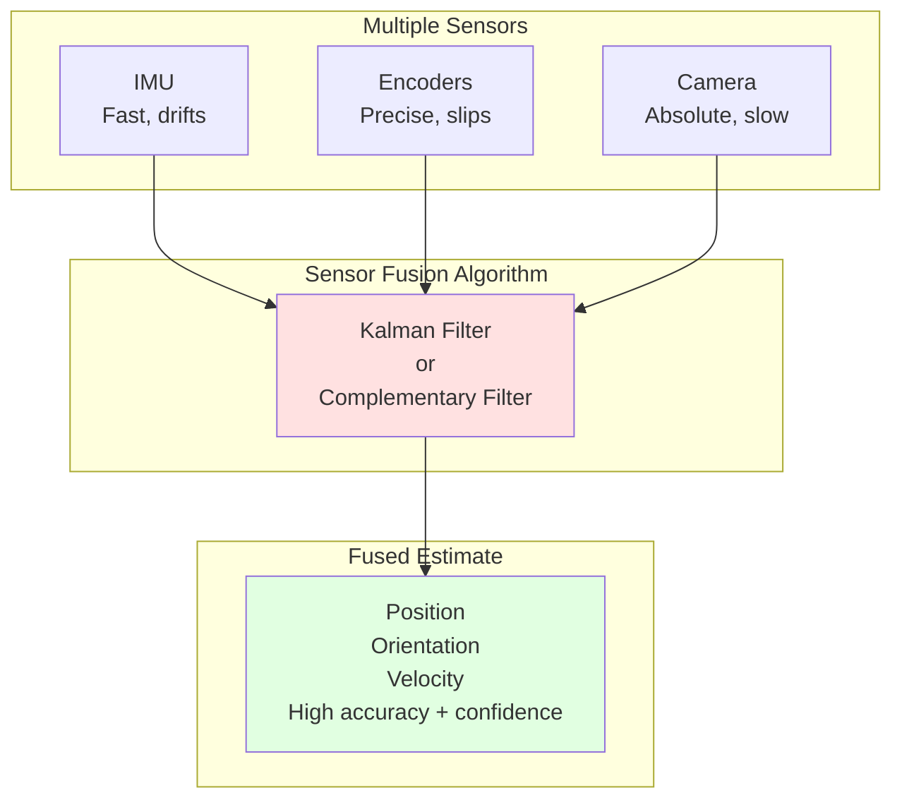
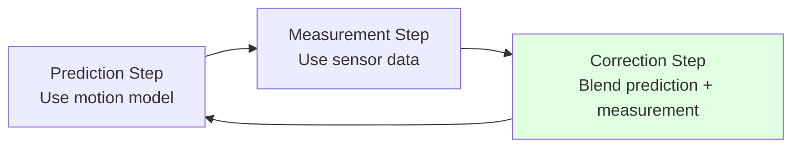
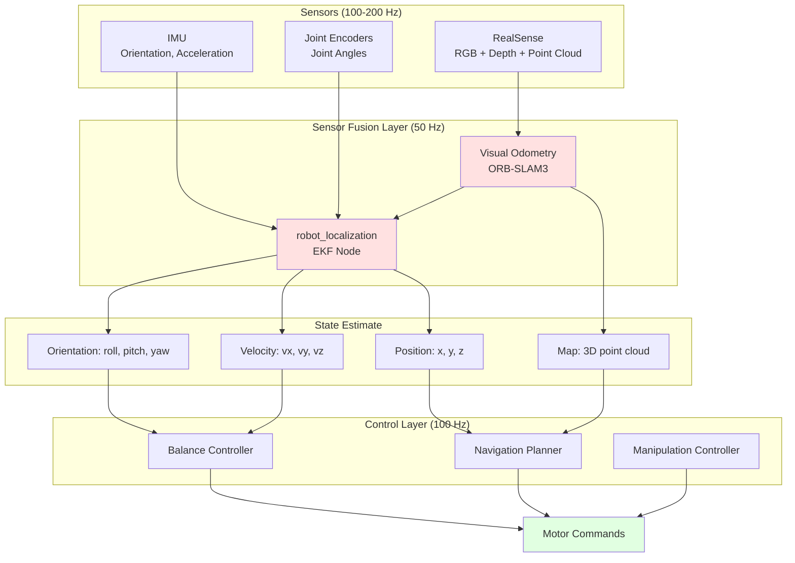

# 1.3.3 Sensor Fusion for State Estimation

## The Problem: Individual Sensors Are Unreliable

Imagine you're a humanoid robot trying to answer one simple question: **"Where am I, and where am I going?"**

You have multiple sensors:
- **IMU**: Says you're tilted 5° to the left
- **Encoders**: Say your left knee is at 30°, right knee at 32°
- **RealSense camera**: Sees a wall 2.3 meters ahead

But here's the problem:

- **IMU** drifts over time (after 60 seconds, it might think you've rotated 720° when you haven't moved!)
- **Encoders** have backlash and slip (wheels skid, gears have play)
- **Camera** fails in darkness, can't measure distance to featureless walls

**No single sensor gives you the complete, accurate picture.**

---

## The Solution: Sensor Fusion

**Sensor fusion** is the art of combining multiple imperfect sensors into one reliable estimate of the robot's state.

### Real-World Analogy: Navigating in Fog

Imagine driving in thick fog:

- **Speedometer** tells you your speed (but not direction or exact position)
- **Compass** tells you direction (but drifts slowly over time)
- **GPS** tells you position (but updates only once per second and has 3-meter error)
- **Landmarks** (when you see them!) give precise position (but are rare in fog)

**What do you do?**

1. Use **GPS** to get coarse position
2. Use **compass + speedometer** to track movement between GPS updates
3. When you see a **landmark**, correct accumulated errors
4. **Average** multiple measurements to reduce noise

**This is exactly what sensor fusion does for robots!**



---

## Types of Sensor Fusion Algorithms

### 1. Complementary Filter: Simple and Fast

**Idea:** Combine sensors that have **complementary strengths**.

**Example: Tilt Estimation (IMU only)**

- **Accelerometer**: Good for long-term tilt (trusts gravity direction)
- **Gyroscope**: Good for short-term rotation (fast, but drifts)

**Complementary filter:**
```
tilt_estimate = α × (tilt_gyro) + (1 - α) × (tilt_accel)

Where:
- α ≈ 0.98  (98% trust gyroscope, 2% trust accelerometer)
- tilt_gyro = previous_tilt + gyro_rate × dt
- tilt_accel = atan2(accel_y, accel_z)
```

**Why it works:**
- Gyroscope is **trusted for fast changes** (captures actual rotation)
- Accelerometer **slowly corrects drift** (pulls estimate toward gravity direction)

**Python Implementation:**

```python
class ComplementaryFilter:
    def __init__(self, alpha=0.98):
        self.alpha = alpha
        self.roll = 0.0
        self.pitch = 0.0
        self.last_time = None

    def update(self, accel_x, accel_y, accel_z, gyro_x, gyro_y, current_time):
        """
        accel: m/s² (accelerometer readings)
        gyro: rad/s (gyroscope readings)
        """
        if self.last_time is None:
            self.last_time = current_time
            return self.roll, self.pitch

        # Calculate time step
        dt = current_time - self.last_time
        self.last_time = current_time

        # Gyroscope integration (predict)
        roll_gyro = self.roll + gyro_x * dt
        pitch_gyro = self.pitch + gyro_y * dt

        # Accelerometer tilt (measure)
        import math
        roll_accel = math.atan2(accel_y, accel_z)
        pitch_accel = math.atan2(-accel_x, math.sqrt(accel_y**2 + accel_z**2))

        # Complementary fusion
        self.roll = self.alpha * roll_gyro + (1 - self.alpha) * roll_accel
        self.pitch = self.alpha * pitch_gyro + (1 - self.alpha) * pitch_accel

        return self.roll, self.pitch
```

**Pros:**
- Extremely simple to implement (5 lines of math)
- Fast: runs at 1000+ Hz on microcontrollers
- No tuning required (α ≈ 0.98 works for most robots)

**Cons:**
- Only works for 2-sensor fusion (gyro + accel)
- Can't handle more complex scenarios (multiple cameras, GPS, etc.)

---

### 2. Kalman Filter: Optimal for Linear Systems

The **Kalman filter** is the gold standard for sensor fusion. It's used in everything from smartphone GPS to SpaceX rocket navigation.

**How it works (simplified):**



**1. Prediction (Time Update):**
```
predicted_state = A × previous_state + B × control_input
predicted_covariance = A × covariance × A^T + Q (process noise)
```

**Example:** Robot was at position `x=1.0m` and moving at `v=0.5 m/s`. After 0.1 seconds:
```
predicted_x = 1.0 + 0.5 × 0.1 = 1.05 m
```

**2. Measurement (Sensor Update):**
```
sensor_measurement = camera says x=1.03m (with ±0.02m error)
```

**3. Correction (Kalman Gain):**
```
kalman_gain = predicted_covariance / (predicted_covariance + sensor_noise)
corrected_state = predicted_state + kalman_gain × (measurement - predicted_state)
```

**Example:**
- Prediction: 1.05m (trusted 60%)
- Measurement: 1.03m (trusted 40%)
- Result: `1.05 + 0.4 × (1.03 - 1.05) = 1.042m` ✅

**When to trust prediction vs. measurement?**
- If **process noise is low** (robot moves smoothly): Trust prediction more
- If **sensor noise is low** (high-quality camera): Trust measurement more

**Pros:**
- Mathematically optimal (minimizes mean squared error)
- Provides uncertainty estimates (covariance matrix)
- Handles multiple sensors naturally

**Cons:**
- Assumes **linear** motion (doesn't work well for rotations, which are nonlinear)
- Requires tuning: process noise `Q`, measurement noise `R`
- Computationally expensive for high-dimensional states

---

### 3. Extended Kalman Filter (EKF): For Nonlinear Systems

Real robots have **nonlinear** motion:
- Rotation combines in complex ways (quaternions, not simple addition)
- Camera measurements are projections (perspective math)

**EKF solution:** Linearize the nonlinear equations around the current estimate.

**Used for:**
- **IMU orientation tracking** (quaternion math is nonlinear)
- **Visual odometry** (camera projection is nonlinear)
- **Robot localization** (motion in 2D/3D is nonlinear)

**Key difference from Kalman Filter:**
```
# Kalman: Linear prediction
x_pred = A × x

# EKF: Nonlinear prediction, then linearize
x_pred = f(x, u)  # Nonlinear function
A = Jacobian of f  # Compute locally
```

**Complexity:** Requires calculus to compute Jacobians. Most ROS 2 libraries (like `robot_localization`) handle this automatically.

---

### 4. Robot Localization Package: Pre-Built EKF/UKF

Instead of implementing Kalman filters from scratch, use ROS 2's **`robot_localization`** package!

**Features:**
- Fuses **IMU + encoders + GPS + camera odometry**
- Implements both EKF and UKF (Unscented Kalman Filter)
- Outputs `/odometry/filtered` topic with fused state

**Installation:**
```bash
sudo apt install ros-humble-robot-localization
```

**Configuration (YAML file):**

```yaml
# ekf_config.yaml
ekf_filter_node:
  ros__parameters:
    frequency: 30.0  # Hz
    two_d_mode: false  # Set true for ground robots, false for humanoids

    # Which sensors to use
    odom0: /wheel/odometry        # Wheel encoders
    odom0_config: [true, true, false,   # Use x, y position
                   false, false, false, # Ignore orientation
                   false, false, false, # Ignore velocities
                   false, false, false, # Ignore accelerations
                   false, false, false] # Ignore jerks

    imu0: /imu/data               # IMU
    imu0_config: [false, false, false,  # Ignore position from IMU
                  true, true, true,     # Use orientation (roll, pitch, yaw)
                  false, false, false,  # Ignore linear velocity
                  true, true, true,     # Use angular velocity
                  true, true, true]     # Use linear acceleration

    # Process noise covariance (how much to trust motion model)
    process_noise_covariance: [0.05, 0.0, ...]  # Diagonal matrix

    # Initial state covariance (uncertainty at startup)
    initial_estimate_covariance: [1e-9, 0.0, ...]
```

**Launching:**
```bash
ros2 run robot_localization ekf_node --ros-args --params-file ekf_config.yaml
```

**Result:** Publishes fused odometry on `/odometry/filtered`:
```bash
ros2 topic echo /odometry/filtered
```

---

## Practical Implementation: IMU + Encoder Fusion

Let's build a complete sensor fusion node for a humanoid robot.

### Goal: Estimate Robot Pose (Position + Orientation)

**Inputs:**
- `/joint_states` (encoders) - 100 Hz
- `/imu/data` (IMU) - 200 Hz

**Output:**
- `/robot_pose` (fused estimate) - 50 Hz

**Code:**

```python
#!/usr/bin/env python3
import rclpy
from rclpy.node import Node
from sensor_msgs.msg import Imu, JointState
from geometry_msgs.msg import PoseStamped
import numpy as np
from scipy.spatial.transform import Rotation as R

class SensorFusionNode(Node):
    def __init__(self):
        super().__init__('sensor_fusion')

        # Subscribe to sensors
        self.imu_sub = self.create_subscription(Imu, '/imu/data', self.imu_callback, 10)
        self.joint_sub = self.create_subscription(JointState, '/joint_states', self.joint_callback, 10)

        # Publish fused pose
        self.pose_pub = self.create_publisher(PoseStamped, '/robot_pose', 10)

        # State estimates
        self.position = np.array([0.0, 0.0, 0.0])  # x, y, z in meters
        self.orientation = np.array([1.0, 0.0, 0.0, 0.0])  # quaternion (w, x, y, z)
        self.velocity = np.array([0.0, 0.0, 0.0])

        # Complementary filter for orientation
        self.alpha = 0.98
        self.last_imu_time = None

        # Timer for publishing
        self.create_timer(0.02, self.publish_pose)  # 50 Hz

    def imu_callback(self, msg):
        """Fuse IMU orientation with dead reckoning."""
        current_time = self.get_clock().now().seconds_nanoseconds()[0] + \
                       self.get_clock().now().seconds_nanoseconds()[1] * 1e-9

        if self.last_imu_time is None:
            self.last_imu_time = current_time
            return

        dt = current_time - self.last_imu_time
        self.last_imu_time = current_time

        # Extract IMU data
        gyro = np.array([
            msg.angular_velocity.x,
            msg.angular_velocity.y,
            msg.angular_velocity.z
        ])

        accel = np.array([
            msg.linear_acceleration.x,
            msg.linear_acceleration.y,
            msg.linear_acceleration.z
        ])

        # Gyroscope integration (predict orientation change)
        angle_change = gyro * dt  # radians
        gyro_rotation = R.from_rotvec(angle_change)
        predicted_orientation = R.from_quat(self.orientation) * gyro_rotation

        # Accelerometer measurement (use only for roll/pitch, not yaw)
        accel_roll = np.arctan2(accel[1], accel[2])
        accel_pitch = np.arctan2(-accel[0], np.sqrt(accel[1]**2 + accel[2]**2))
        accel_orientation = R.from_euler('xyz', [accel_roll, accel_pitch, 0.0])

        # Complementary fusion (SLERP - Spherical Linear Interpolation)
        fused_rotation = R.from_quat(predicted_orientation.as_quat()) * (1 - self.alpha) + \
                         accel_orientation * self.alpha
        # Note: Proper SLERP implementation needed for production code

        self.orientation = fused_rotation.as_quat()

    def joint_callback(self, msg):
        """Update position estimate from joint encoders (dead reckoning)."""
        # For bipedal robot, use forward kinematics to estimate foot position
        # Then integrate foot velocity to estimate body position

        # Simplified: assume robot is standing still if joints barely move
        # In real implementation, use full kinematics

        self.get_logger().debug(f'Joint states: {len(msg.position)} joints')

    def publish_pose(self):
        """Publish fused pose estimate."""
        pose_msg = PoseStamped()
        pose_msg.header.stamp = self.get_clock().now().to_msg()
        pose_msg.header.frame_id = 'world'

        # Position
        pose_msg.pose.position.x = self.position[0]
        pose_msg.pose.position.y = self.position[1]
        pose_msg.pose.position.z = self.position[2]

        # Orientation (quaternion)
        pose_msg.pose.orientation.w = self.orientation[0]
        pose_msg.pose.orientation.x = self.orientation[1]
        pose_msg.pose.orientation.y = self.orientation[2]
        pose_msg.pose.orientation.z = self.orientation[3]

        self.pose_pub.publish(pose_msg)

        # Log for debugging
        roll, pitch, yaw = R.from_quat(self.orientation).as_euler('xyz', degrees=True)
        self.get_logger().info(
            f'Pose: x={self.position[0]:.2f}m '
            f'Roll={roll:.1f}° Pitch={pitch:.1f}° Yaw={yaw:.1f}°'
        )

def main():
    rclpy.init()
    node = SensorFusionNode()
    rclpy.spin(node)
    rclpy.shutdown()

if __name__ == '__main__':
    main()
```

---

## Visual-Inertial Odometry (VIO): Camera + IMU Fusion

**VIO** combines:
- **Camera**: Tracks visual features (corners, edges) between frames
- **IMU**: Measures motion between frames

**Why combine them?**

| Sensor | Strengths | Weaknesses |
|--------|-----------|------------|
| **Camera** | Absolute scale, no drift | Fails in darkness, slow (30 Hz), computationally expensive |
| **IMU** | Fast (200 Hz), works in dark | Drifts quickly, no absolute position |

**Together:** Camera provides scale and corrects drift, IMU fills gaps between camera frames.

### ROS 2 VIO Packages

**1. ORB-SLAM3 (State-of-the-art)**

```bash
# Install dependencies
sudo apt install ros-humble-vision-opencv ros-humble-cv-bridge

# Clone and build
cd ~/ros2_ws/src
git clone https://github.com/thien94/orb_slam3_ros2.git
cd ~/ros2_ws
colcon build --packages-select orb_slam3_ros2
```

**Launch with RealSense:**
```bash
# Terminal 1: RealSense
ros2 launch realsense2_camera rs_launch.py

# Terminal 2: ORB-SLAM3
ros2 launch orb_slam3_ros2 rgbd_inertial.launch.py
```

**Output:**
- `/orb_slam3/camera_pose` - 6DOF pose (x, y, z, roll, pitch, yaw)
- `/orb_slam3/map_points` - 3D map of environment

**2. VINS-Fusion (Lightweight)**

```bash
sudo apt install ros-humble-vins
```

**3. Kimera-VIO (MIT)**
- Real-time semantic mapping
- Outputs full 3D mesh of environment

---

## Tuning Sensor Fusion: The Art of Covariance Matrices

**Process Noise Covariance (Q):**
- How much do you trust your motion model?
- **High Q**: "My model is noisy, trust sensors more"
- **Low Q**: "My model is accurate, trust sensors less"

**Measurement Noise Covariance (R):**
- How much do you trust your sensors?
- **High R**: "Sensors are noisy, trust model more"
- **Low R**: "Sensors are accurate, trust measurements more"

**Rule of thumb:**

```python
# For IMU orientation (very accurate)
R_imu_orientation = np.diag([0.01, 0.01, 0.01])  # ±0.1° error

# For camera position (moderate accuracy)
R_camera_position = np.diag([0.05, 0.05, 0.1])  # ±5cm XY, ±10cm Z

# For wheel odometry (drifts on slippery floors)
R_wheel_odometry = np.diag([0.1, 0.1, 0.2])  # ±10cm XY, ±20cm Z
```

**How to tune:**
1. Record sensor data while robot moves on known path
2. Compare fused estimate to ground truth
3. Adjust Q and R to minimize error
4. Repeat until error is acceptable

---

## Complete Sensor Fusion Architecture

Here's how all sensors work together in a modern humanoid:



---

## Performance Metrics: How Good Is Your Fusion?

### Metric 1: Absolute Trajectory Error (ATE)

**Definition:** Average distance between estimated path and true path.

```python
def compute_ate(estimated_poses, ground_truth_poses):
    """
    estimated_poses: list of (x, y, z) tuples
    ground_truth_poses: list of (x, y, z) tuples (from motion capture or GPS)
    """
    errors = []
    for est, gt in zip(estimated_poses, ground_truth_poses):
        error = np.linalg.norm(np.array(est) - np.array(gt))
        errors.append(error)

    ate = np.mean(errors)
    return ate

# Good fusion: ATE < 5 cm for indoor humanoid
# Acceptable: ATE < 10 cm
# Poor: ATE > 20 cm
```

### Metric 2: Drift Rate

**Definition:** Position error per meter traveled.

```
drift_rate = final_position_error / total_distance_traveled

Good: < 1% (1 cm error per 1 m traveled)
Acceptable: < 5%
Poor: > 10%
```

### Metric 3: Orientation Error

```
orientation_error = |estimated_yaw - true_yaw|

Good: < 2°
Acceptable: < 5°
Poor: > 10°
```

---

## Common Pitfalls and Fixes

### Problem 1: IMU Drift After 60 Seconds

**Cause:** Gyroscope bias drift.

**Fix:** Add magnetometer (compass) for absolute yaw reference.

```python
# Use magnetometer to reset yaw drift
if has_magnetometer:
    yaw_mag = atan2(mag_y, mag_x)
    yaw_fused = 0.95 * yaw_gyro + 0.05 * yaw_mag  # 5% trust magnetometer
```

### Problem 2: Position Estimate Jumps When Camera Sees New Features

**Cause:** Measurement noise R is too low (trusting camera too much).

**Fix:** Increase camera measurement noise.

```yaml
# In robot_localization config
odom0_config: [true, true, false, ...]
odom0_queue_size: 10  # Average over 10 measurements
odom0_differential: true  # Use velocity, not absolute position
```

### Problem 3: Robot Thinks It's Tilted When Level

**Cause:** Accelerometer measures **gravity + robot acceleration**.

**Fix:** Only trust accelerometer when robot is **stationary**.

```python
# Detect if robot is moving
accel_magnitude = np.linalg.norm(accel)
is_stationary = abs(accel_magnitude - 9.81) < 0.5  # Within 0.5 m/s² of gravity

if is_stationary:
    # Trust accelerometer for tilt
    alpha = 0.98
else:
    # Don't trust accelerometer (might be accelerating)
    alpha = 0.999  # Almost pure gyro integration
```

---

## Key Takeaways

1. **No single sensor is perfect** - IMUs drift, encoders slip, cameras fail in darkness. Sensor fusion combines strengths and cancels weaknesses.

2. **Complementary filters are simple** (5 lines) and fast (1000 Hz), great for IMU-only orientation. Kalman filters are mathematically optimal but complex.

3. **ROS 2 `robot_localization`** package provides pre-built EKF/UKF fusion for IMU + encoders + GPS + camera odometry. Use it instead of writing Kalman filters from scratch!

4. **Visual-Inertial Odometry (VIO)** combines camera + IMU for drift-free navigation. ORB-SLAM3 is state-of-the-art for ROS 2.

5. **Tuning is critical** - process noise Q and measurement noise R determine how much to trust each sensor. Start conservative (high noise), then reduce.

6. **Measure performance** - use ATE (absolute trajectory error) and drift rate to quantify fusion quality. Good humanoid fusion: ATE < 5 cm, drift < 1%.

---

## Lab Exercise: Build Your Own Sensor Fusion Node

**Goal:** Fuse IMU + RealSense VIO for robust humanoid state estimation.

**Tasks:**
1. Launch RealSense with IMU enabled
2. Run ORB-SLAM3 for visual odometry
3. Configure `robot_localization` to fuse IMU + VIO
4. Walk robot in a 2m × 2m square
5. Measure ATE compared to known path

**Acceptance criteria:**
- Fused pose published at 50 Hz
- ATE < 10 cm after 2-minute test
- No crashes when camera loses tracking

**Starter code:** [github.com/your-repo/lab03-sensor-fusion](https://github.com/)

---

## Further Reading

- **Kalman Filter Tutorial**: Welch, G. & Bishop, G. (2006). "An Introduction to the Kalman Filter." UNC-Chapel Hill.
- **robot_localization Docs**: [docs.ros.org/en/humble/p/robot_localization](http://docs.ros.org/en/humble/p/robot_localization/)
- **VIO Survey**: Huang, G. (2019). "Visual-Inertial Navigation: A Concise Review." arXiv:1906.02650.
- **ORB-SLAM3**: Campos, C., et al. (2021). "ORB-SLAM3: An Accurate Open-Source Library for Visual, Visual-Inertial and Multi-Map SLAM." IEEE Trans. Robotics.

---

**Congratulations!** You've completed Chapter 1.3. You now understand how humanoid robots sense their internal state (encoders, IMU), perceive the world (RealSense camera), and fuse all data into reliable state estimates - the foundation for intelligent behavior!

**Next:** Module 2 will cover edge computing platforms (NVIDIA Jetson), mechanical design, and power systems that bring these sensors to life in physical robots!
