# 1.2.1 URDF Basics & Xacro Macros

## What is URDF? (Starting from Scratch)

**URDF (Unified Robot Description Format)** is an XML file that describes your robot's physical structure: bones (links), joints, sensors, and visual appearance.

**Think of URDF like a blueprint:**

- 🏗️ **Architect's blueprint** describes building structure (walls, doors, windows)
- 🤖 **URDF** describes robot structure (chassis, joints, wheels, sensors)

```mermaid
graph LR
    A[Your Robot] -->|Described by| B[URDF File]
    B --> C[Links<br/>📦 Physical parts]
    B --> D[Joints<br/>🔗 Connections]
    B --> E[Sensors<br/>📷 Cameras, IMUs]
    B --> F[Visual/Collision<br/>🎨 Appearance]

    style B fill:#FFD700
```



**Why do we need URDF?**

- ✅ **Visualization**: See robot in RViz before building hardware
- ✅ **Simulation**: Test in Gazebo/Isaac Sim without real robot
- ✅ **Kinematics**: Calculate how joints affect end-effector position
- ✅ **Planning**: Motion planners (MoveIt) need robot geometry
- ✅ **Sensor placement**: Define camera/IMU positions for sensor fusion

---

## Real-World Example: Humanoid Robot

Let's build a simplified humanoid upper body with:

- **Torso** (1 link)
- **2 Arms** (shoulder, elbow, wrist joints each)
- **Head** (neck joint, camera sensor)


---

## URDF Fundamentals: Links and Joints

### What is a Link?

A **link** is a rigid body part (bone) - something that doesn't bend. Examples:

- Upper arm (from shoulder to elbow)
- Forearm (from elbow to wrist)
- Hand
- Torso

**Link Structure:**

```xml
<link name="left_upper_arm">
  <!-- Visual appearance (what you see in RViz) -->
  <visual>
    <geometry>
      <cylinder radius="0.05" length="0.3"/>
    </geometry>
    <material name="blue"/>
  </visual>

  <!-- Collision shape (for physics simulation) -->
  <collision>
    <geometry>
      <cylinder radius="0.05" length="0.3"/>
    </geometry>
  </collision>

  <!-- Mass and inertia (for dynamics) -->
  <inertial>
    <mass value="2.0"/>
    <inertia ixx="0.01" ixy="0" ixz="0" iyy="0.01" iyz="0" izz="0.001"/>
  </inertial>
</link>
```

**Key Components:**

1. **Visual**: How it looks (for RViz, human visualization)
2. **Collision**: Simplified shape (for collision detection in simulation)
3. **Inertial**: Mass and inertia tensor (for physics simulation)

**Common Geometries:**

- `<box size="x y z"/>` - Rectangular box
- `<cylinder radius="r" length="l"/>` - Cylinder
- `<sphere radius="r"/>` - Sphere
- `<mesh filename="model.stl"/>` - Custom 3D model

---

### What is a Joint?

A **joint** connects two links and defines how they move relative to each other. Think of it like a hinge on a door.

**Joint Types:**

```mermaid
graph LR
    A[Joint Types]
    A --> B[revolute<br/>🔄 Hinge<br/>limited rotation]
    A --> C[continuous<br/>🔁 Wheel<br/>unlimited rotation]
    A --> D[prismatic<br/>↔️ Slider<br/>linear motion]
    A --> E[fixed<br/>🔒 Welded<br/>no motion]
    A --> F[floating<br/>🎈 Free<br/>6 DOF]
    A --> G[planar<br/>📐 2D plane<br/>3 DOF]
```



**Joint Structure (Revolute Example):**

```xml
<joint name="shoulder_joint" type="revolute">
  <parent link="torso"/>
  <child link="left_upper_arm"/>

  <!-- Joint origin relative to parent link -->
  <origin xyz="0.15 0.3 0.5" rpy="0 0 0"/>

  <!-- Axis of rotation (Z-axis in this case) -->
  <axis xyz="0 0 1"/>

  <!-- Joint limits -->
  <limit lower="-1.57" upper="1.57" effort="100" velocity="1.0"/>
</joint>
```

**Key Parameters:**

- **parent/child**: Which links are connected
- **origin**: Joint position (xyz) and orientation (roll-pitch-yaw)
- **axis**: Which axis the joint rotates around (usually X, Y, or Z)
- **limit**: Min/max angles (radians), max torque (effort), max speed (velocity)

---

## Your First URDF: Simple Robot Arm

Let's build a 2-DOF robot arm step by step!

```mermaid
graph LR
    A[🏗️ Base<br/>Fixed to ground] -->|Shoulder Joint<br/>Revolute| B[📏 Upper Arm<br/>0.3m cylinder]
    B -->|Elbow Joint<br/>Revolute| C[📏 Forearm<br/>0.25m cylinder]
    C -->|Fixed| D[✋ End Effector<br/>Gripper/Tool]

    style A fill:#FFD700
    style D fill:#90EE90
```



### Step 1: Create Base Link

```xml
<?xml version="1.0"?>
<robot name="simple_arm">

  <!-- Base link (fixed to ground) -->
  <link name="base_link">
    <visual>
      <geometry>
        <box size="0.1 0.1 0.05"/>
      </geometry>
      <material name="gray">
        <color rgba="0.5 0.5 0.5 1.0"/>
      </material>
    </visual>
    <collision>
      <geometry>
        <box size="0.1 0.1 0.05"/>
      </geometry>
    </collision>
    <inertial>
      <mass value="5.0"/>
      <inertia ixx="0.01" ixy="0" ixz="0" iyy="0.01" iyz="0" izz="0.02"/>
    </inertial>
  </link>

</robot>
```

### Step 2: Add Upper Arm Link

```xml
  <!-- Upper arm link -->
  <link name="upper_arm">
    <visual>
      <origin xyz="0 0 0.15" rpy="0 0 0"/>  <!-- Cylinder centered at 0.15m -->
      <geometry>
        <cylinder radius="0.03" length="0.3"/>
      </geometry>
      <material name="blue">
        <color rgba="0 0 1 1.0"/>
      </material>
    </visual>
    <collision>
      <origin xyz="0 0 0.15" rpy="0 0 0"/>
      <geometry>
        <cylinder radius="0.03" length="0.3"/>
      </geometry>
    </collision>
    <inertial>
      <mass value="2.0"/>
      <inertia ixx="0.015" ixy="0" ixz="0" iyy="0.015" iyz="0" izz="0.0018"/>
    </inertial>
  </link>
```

### Step 3: Add Shoulder Joint

```xml
  <!-- Shoulder joint (connects base to upper arm) -->
  <joint name="shoulder_joint" type="revolute">
    <parent link="base_link"/>
    <child link="upper_arm"/>
    <origin xyz="0 0 0.05" rpy="0 0 0"/>  <!-- Top of base -->
    <axis xyz="0 1 0"/>  <!-- Rotate around Y-axis -->
    <limit lower="-1.57" upper="1.57" effort="50" velocity="1.0"/>
  </joint>
```

### Step 4: Add Forearm and Elbow

```xml
  <!-- Forearm link -->
  <link name="forearm">
    <visual>
      <origin xyz="0 0 0.125" rpy="0 0 0"/>
      <geometry>
        <cylinder radius="0.025" length="0.25"/>
      </geometry>
      <material name="red">
        <color rgba="1 0 0 1.0"/>
      </material>
    </visual>
    <collision>
      <origin xyz="0 0 0.125" rpy="0 0 0"/>
      <geometry>
        <cylinder radius="0.025" length="0.25"/>
      </geometry>
    </collision>
    <inertial>
      <mass value="1.5"/>
      <inertia ixx="0.008" ixy="0" ixz="0" iyy="0.008" iyz="0" izz="0.0009"/>
    </inertial>
  </link>

  <!-- Elbow joint -->
  <joint name="elbow_joint" type="revolute">
    <parent link="upper_arm"/>
    <child link="forearm"/>
    <origin xyz="0 0 0.3" rpy="0 0 0"/>  <!-- Top of upper arm -->
    <axis xyz="0 1 0"/>
    <limit lower="-2.0" upper="0" effort="30" velocity="1.0"/>
  </joint>
</robot>
```

**Complete file:** Save as `simple_arm.urdf`

---

## Visualizing in RViz

### Step 1: Launch RViz with URDF

```bash
# Install required packages (if not already)
sudo apt install ros-humble-joint-state-publisher-gui ros-humble-urdf-tutorial

# Launch visualization
ros2 launch urdf_tutorial display.launch.py model:=simple_arm.urdf
```

### Step 2: Interact with Robot

A GUI will appear with sliders for each joint. Move them to see the robot move in real-time!

**What you'll see:**

- Blue upper arm
- Red forearm
- Coordinate frames (red=X, green=Y, blue=Z)
- Moving sliders changes joint angles

---

## Xacro: Making URDF Less Repetitive

**Problem:** URDF is verbose. For a humanoid with 23 joints, you'd copy-paste the same link/joint structure 23 times!

**Solution:** **Xacro (XML Macros)** - A preprocessor that adds:

- Variables
- Math operations
- Macros (reusable templates)
- Conditional logic

### Example: Parameterized Arm

**Without Xacro** (repetitive):

```xml
<link name="left_upper_arm">
  <visual><geometry><cylinder radius="0.03" length="0.3"/></geometry></visual>
</link>
<link name="right_upper_arm">
  <visual><geometry><cylinder radius="0.03" length="0.3"/></geometry></visual>
</link>
```

**With Xacro** (reusable):

```xml
<robot name="robot" xmlns:xacro="http://www.ros.org/wiki/xacro">

  <!-- Define constants -->
  <xacro:property name="arm_radius" value="0.03"/>
  <xacro:property name="arm_length" value="0.3"/>

  <!-- Define macro -->
  <xacro:macro name="arm_link" params="side">
    <link name="${side}_upper_arm">
      <visual>
        <geometry>
          <cylinder radius="${arm_radius}" length="${arm_length}"/>
        </geometry>
      </visual>
    </link>
  </xacro:macro>

  <!-- Use macro -->
  <xacro:arm_link side="left"/>
  <xacro:arm_link side="right"/>

</robot>
```

**Benefits:**

- ✅ Change `arm_radius` once, updates everywhere
- ✅ Reuse macro for left/right arms
- ✅ Math: `length="${arm_length * 2}"` works!
- ✅ Cleaner, more maintainable code

### Convert Xacro to URDF

```bash
# Convert xacro to URDF
ros2 run xacro xacro robot.urdf.xacro > robot.urdf

# Then visualize
ros2 launch urdf_tutorial display.launch.py model:=robot.urdf
```

---

## Best Practices

### 1. Naming Conventions

✅ **Good:**

- `base_link` (root frame)
- `left_shoulder_link`, `left_elbow_link`
- `camera_link`, `imu_link`

❌ **Bad:**

- `link1`, `link2` (unclear)
- `LeftShoulder` (camelCase, not ROS style)

### 2. Coordinate Frames

**ROS Convention (REP-103):**

- **X**: Forward
- **Y**: Left
- **Z**: Up


### 3. Units

Always use **SI units**:

- Length: meters (m)
- Mass: kilograms (kg)
- Angles: radians (rad)
- Time: seconds (s)

### 4. Joint Limits

**Set realistic limits:**

```xml
<!-- Elbow can't bend backwards -->
<limit lower="-0.1" upper="2.5" effort="100" velocity="2.0"/>
```

**effort**: Maximum torque (N⋅m)  
**velocity**: Maximum speed (rad/s)

---

## Checkpoint: Build Your Own Robot Arm

**Task:** Modify `simple_arm.urdf` to add a wrist joint and gripper.

**Requirements:**

1. Add `wrist_link` (0.1m cylinder)
2. Add `wrist_joint` (revolute, rotates around Z-axis)
3. Add `gripper_link` (small box)
4. Visualize in RViz

**Hint:** Copy the elbow joint structure and modify the parent/child links.

**Solution:** Check `solutions/simple_arm_with_gripper.urdf` when you're done!

---

## Summary

**What you learned:**

- ✅ URDF describes robot structure (links + joints)
- ✅ Links are rigid bodies with visual/collision/inertial properties
- ✅ Joints connect links and define motion (revolute, continuous, fixed, etc.)
- ✅ Visualize robots in RViz before building hardware
- ✅ Xacro reduces repetition with variables and macros
- ✅ Follow ROS conventions for naming and coordinate frames

**Next:** Section 1.2.2 - Adding sensors to URDF (cameras, IMUs, LiDAR)

---

## Further Reading

- [URDF Official Tutorial](http://wiki.ros.org/urdf/Tutorials)
- [Xacro Documentation](http://wiki.ros.org/xacro)
- [REP-103: Standard Units](https://www.ros.org/reps/rep-0103.html)
- [REP-120: Coordinate Frames](https://www.ros.org/reps/rep-0120.html)
