# 1.2.3 Validating Kinematics & Joint Limits

## Why Validation Matters

**Scenario:** You build a humanoid arm in URDF. It looks great in RViz! You deploy to the real robot and... 💥 **the elbow bends backwards and breaks**.

**Problem:** Your URDF had unrealistic joint limits or incorrect kinematics.

```mermaid
graph LR
    A[Design URDF] -->|Looks good?| B{Validate?}
    B -->|No| C[Deploy to Robot]
    C --> D[💥 Hardware Damage<br/>$10,000 repair]
    B -->|Yes| E[Test in Simulation]
    E --> F[Find Bugs]
    F --> G[Fix Issues]
    G --> H[✅ Safe Deployment]

    style D fill:#FF6B6B
    style H fill:#90EE90
```



**This section teaches you to catch errors BEFORE they break hardware!**

---

## What is Forward Kinematics?

**Forward Kinematics (FK)** answers: "If I set joint angles to [θ₁, θ₂, θ₃], where does the end effector end up?"

```mermaid
graph LR
    A[Joint Angles<br/>θ₁=30°, θ₂=45°, θ₃=-20°] -->|Forward Kinematics| B[End Effector Position<br/>x=0.5m, y=0.2m, z=0.3m]

    style A fill:#FFD700
    style B fill:#90EE90
```



**Real-World Example:**

- Robot: "My shoulder is at 30°, elbow at 90°"
- FK calculates: "Your hand is at (0.4, 0.2, 0.8) meters"

### Visualizing FK in RViz

```bash
# Launch robot with joint state publisher GUI
ros2 launch urdf_tutorial display.launch.py model:=robot.urdf

# Move sliders to set joint angles
# Watch end effector position change in real-time!
```

**What you see:**

- TF frames showing each link's position
- End effector trace as you move joints
- Coordinate axes (X=red, Y=green, Z=blue)

---

## What is Inverse Kinematics?

**Inverse Kinematics (IK)** answers the reverse: "I want the hand at (x, y, z). What joint angles do I need?"

```mermaid
graph LR
    A[Desired Position<br/>x=0.5m, y=0.2m, z=0.3m] -->|Inverse Kinematics| B[Joint Angles<br/>θ₁=?, θ₂=?, θ₃=?]

    style A fill:#90EE90
    style B fill:#FFD700
```



**Challenge:** IK is **much harder** than FK!

- May have multiple solutions (elbow up vs. elbow down)
- May have no solution (target unreachable)
- May require numerical optimization

### IK with MoveIt 2

MoveIt 2 is the motion planning framework for ROS 2. It includes IK solvers:

```bash
# Install MoveIt 2
sudo apt install ros-humble-moveit

# Run IK solver (we'll configure this in Lab 2)
ros2 launch my_robot_moveit demo.launch.py
```

---

## Validating Joint Limits

### Step 1: Check Physical Constraints

**Example: Human-like shoulder**

Real human shoulder:

- Forward flexion: 0° to 180°
- Extension: 0° to 60°
- Abduction: 0° to 180°

**Bad URDF:**

```xml
<joint name="shoulder_joint" type="revolute">
  <limit lower="-3.14" upper="3.14"/>  ❌ Too much range!
</joint>
```

**Good URDF:**

```xml
<joint name="shoulder_joint" type="revolute">
  <limit lower="-0.5" upper="3.0"/>  ✅ Realistic: -29° to 172°
</joint>
```

### Step 2: Test Range of Motion

```python
#!/usr/bin/env python3
import rclpy
from rclpy.node import Node
from sensor_msgs.msg import JointState

class JointLimitTester(Node):
    def __init__(self):
        super().__init__('joint_limit_tester')
        self.pub = self.create_publisher(JointState, '/joint_states', 10)
        self.timer = self.create_timer(0.1, self.test_limits)
        self.angle = -3.14

    def test_limits(self):
        msg = JointState()
        msg.name = ['shoulder_joint']
        msg.position = [self.angle]
        self.pub.publish(msg)

        self.angle += 0.05  # Increment
        if self.angle > 3.14:
            self.angle = -3.14  # Reset

        self.get_logger().info(f'Testing angle: {self.angle:.2f}')

def main():
    rclpy.init()
    node = JointLimitTester()
    rclpy.spin(node)
```

**Run and watch in RViz:**

- Does the arm move smoothly?
- Does it hit impossible poses?
- Does it self-collide?

---

## Checking for Self-Collisions

**Problem:** Joints might allow poses where links intersect (e.g., forearm passes through torso).

```mermaid
graph LR
    A[Joint Config<br/>θ₁=0°, θ₂=180°] -->|Check| B{Collision?}
    B -->|Yes| C[❌ Invalid Pose<br/>Forearm in torso]
    B -->|No| D[✅ Valid Pose]

    style C fill:#FF6B6B
    style D fill:#90EE90
```



### Method 1: Visual Inspection in RViz

```bash
ros2 launch urdf_tutorial display.launch.py model:=robot.urdf
```

**Manually test poses:**

1. Move joint sliders to extreme positions
2. Look for visual intersections
3. Note problematic configurations

### Method 2: Collision Checking with check_urdf

```bash
# Install URDF tools
sudo apt install liburdfdom-tools

# Check URDF syntax
check_urdf robot.urdf

# Output shows:
# - Link tree structure
# - Joint limits
# - Mass properties
# - Errors/warnings
```

### Method 3: MoveIt Collision Checking

MoveIt can automatically check millions of configurations:

```python
# In MoveIt config (collision_checking.yaml)
collision_detection:
  check_collisions: true
  allowed_collision_matrix:
    # Define which links can touch (e.g., gripper fingers)
    - link1: left_finger
      link2: right_finger
      enabled: true  # These can collide
```

---

## Validating Mass and Inertia

**Why it matters:** Incorrect mass/inertia causes:

- Wrong gravity compensation
- Unstable simulation
- Inaccurate dynamics

### Calculating Inertia Tensors

**For simple shapes:**

**Box (width w, depth d, height h):**

```
Ixx = (1/12) * m * (d² + h²)
Iyy = (1/12) * m * (w² + h²)
Izz = (1/12) * m * (w² + d²)
```

**Cylinder (radius r, height h):**

```
Ixx = Iyy = (1/12) * m * (3r² + h²)
Izz = (1/2) * m * r²
```

**Sphere (radius r):**

```
Ixx = Iyy = Izz = (2/5) * m * r²
```

### Example: Forearm Link

```xml
<link name="forearm">
  <!-- Cylinder: radius=0.03m, length=0.25m, mass=1.5kg -->
  <inertial>
    <mass value="1.5"/>
    <inertia
      ixx="0.008"   <!-- (1/12) * 1.5 * (3*0.03² + 0.25²) -->
      iyy="0.008"
      izz="0.000675"  <!-- (1/2) * 1.5 * 0.03² -->
      ixy="0" ixz="0" iyz="0"/>
  </inertial>
</link>
```

### Tool: MeshLab for Complex Shapes

For CAD meshes (STL files):

```bash
# Install MeshLab
sudo apt install meshlab

# Open mesh, go to:
# Filters → Quality Measure and Computations → Compute Geometric Measures
# Shows: Volume, center of mass, inertia tensor
```

---

## Testing Workspace Reachability

**Workspace:** The 3D volume where the end effector can reach.

```mermaid
graph TB
    A[Robot Base] --> B[Reachable Zone<br/>Sphere of radius L₁+L₂+L₃]
    B --> C[Actual Workspace<br/>Limited by joint constraints]

    style B fill:#FFD700
    style C fill:#90EE90
```



### Workspace Visualization Script

```python
#!/usr/bin/env python3
import numpy as np
import matplotlib.pyplot as plt
from mpl_toolkits.mplot3d import Axes3D

def forward_kinematics_2dof(theta1, theta2, L1=0.3, L2=0.25):
    """Calculate end effector position for 2-DOF arm"""
    x = L1 * np.cos(theta1) + L2 * np.cos(theta1 + theta2)
    y = L1 * np.sin(theta1) + L2 * np.sin(theta1 + theta2)
    return x, y

# Sample workspace
points_x = []
points_y = []

for theta1 in np.linspace(-1.57, 1.57, 50):  # -90° to 90°
    for theta2 in np.linspace(-2.0, 0, 50):   # -115° to 0°
        x, y = forward_kinematics_2dof(theta1, theta2)
        points_x.append(x)
        points_y.append(y)

# Plot
plt.figure(figsize=(8, 8))
plt.scatter(points_x, points_y, s=1, alpha=0.5)
plt.xlabel('X (m)')
plt.ylabel('Y (m)')
plt.title('Robot Arm Workspace')
plt.grid(True)
plt.axis('equal')
plt.show()
```

**What you'll see:**

- Dense point cloud showing reachable area
- Holes/gaps = unreachable zones
- Helps verify joint limits are correct

---

## Dynamic Simulation Validation

Test your URDF in a physics simulator:

### Step 1: Launch Gazebo

```bash
# Install Gazebo integration
sudo apt install ros-humble-gazebo-ros-pkgs

# Launch robot in Gazebo
ros2 launch my_robot_gazebo spawn_robot.launch.py
```

### Step 2: Apply Test Forces

```bash
# Apply upward force to end effector
ros2 service call /apply_force gazebo_msgs/srv/ApplyBodyWrench \
  "{body_name: 'forearm', \
    reference_frame: 'world', \
    wrench: {force: {x: 0, y: 0, z: 10}}}"
```

**What to check:**

- Does arm move realistically?
- Does it fall under gravity correctly?
- Are joint limits enforced?
- Does it vibrate/explode? (sign of bad inertia)

---

## Validation Checklist

Before deploying to real hardware:

### ✅ Syntax Validation

```bash
check_urdf robot.urdf
```

### ✅ Joint Limits

- [ ] Limits match real hardware specs
- [ ] No impossible rotations (e.g., elbow bending backwards)
- [ ] Tested full range of motion in RViz

### ✅ Collisions

- [ ] No self-collisions at extreme poses
- [ ] Allowed collision matrix configured for gripper
- [ ] Tested with MoveIt collision checker

### ✅ Mass Properties

- [ ] Masses match real hardware (±10%)
- [ ] Inertia tensors calculated correctly
- [ ] Center of mass in correct location

### ✅ Kinematics

- [ ] Forward kinematics produces expected positions
- [ ] Inverse kinematics finds valid solutions
- [ ] Workspace matches physical robot

### ✅ Dynamics

- [ ] Stable in Gazebo simulation
- [ ] Responds correctly to gravity
- [ ] No jitter or explosions

---

## Common URDF Errors and Fixes

| Error                          | Symptom                    | Fix                                       |
| ------------------------------ | -------------------------- | ----------------------------------------- |
| **Zero inertia**               | Robot explodes in Gazebo   | Add realistic inertia values (min 0.0001) |
| **Inverted joint axis**        | Joint rotates backwards    | Check `<axis xyz="..."/>` direction       |
| **Wrong joint limits**         | Hardware damage            | Verify with datasheet, add safety margin  |
| **Missing collision geometry** | Robot phases through walls | Add `<collision>` tags to all links       |
| **Incorrect transforms**       | Sensors in wrong position  | Check `<origin xyz="..." rpy="..."/>`     |
| **Negative mass**              | Physics error              | Mass must be positive                     |

---

## Checkpoint: Validate Your Robot

**Task:** Validate the humanoid arm from previous sections

**Steps:**

1. Run `check_urdf` - fix any errors
2. Test full range of motion in RViz
3. Check for self-collisions
4. Calculate inertia for forearm link
5. Spawn in Gazebo and verify stable behavior

**Acceptance Criteria:**

- ✅ No URDF syntax errors
- ✅ Arm moves smoothly through full range
- ✅ No self-collisions at extreme poses
- ✅ Stable in Gazebo (no jitter/explosions)

---

## Summary

**What you learned:**

- ✅ Forward vs. inverse kinematics
- ✅ Validate joint limits against real hardware
- ✅ Check for self-collisions
- ✅ Calculate mass and inertia correctly
- ✅ Visualize robot workspace
- ✅ Test dynamics in Gazebo simulation
- ✅ Use `check_urdf` tool for validation

**Next:** Section 1.2.4 - Package testing and CI basics

---

## Further Reading

- [MoveIt 2 Tutorials](https://moveit.picknik.ai/main/index.html)
- [URDF Joint Limits](http://wiki.ros.org/urdf/XML/joint)
- [Gazebo Physics](https://classic.gazebosim.org/tutorials?cat=physics)
- [Inertia Calculator](http://www.kwon3d.com/theory/moi/moi.html)
