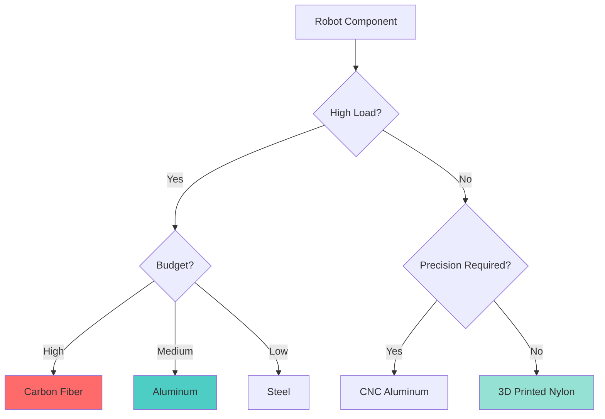
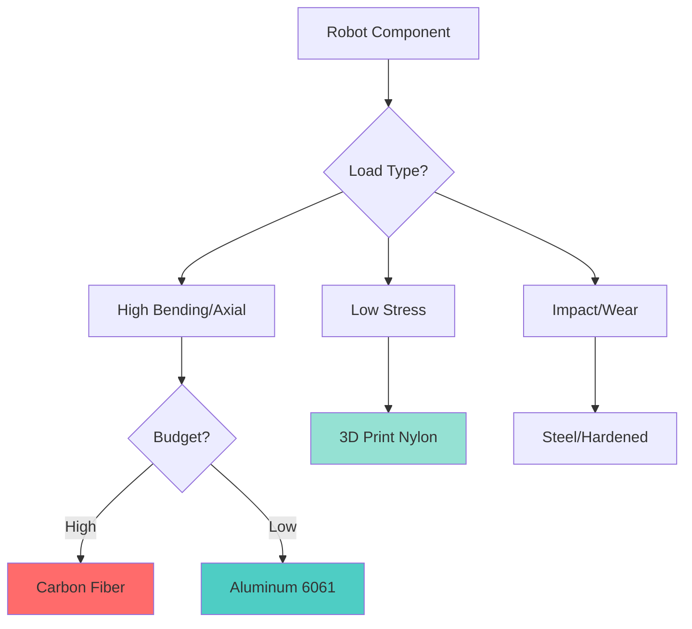

# 2.1.3 Material Selection - Choosing the Right Material for Robot Links

## Introduction

**Question:** Why does the Unitree G1's thigh cost $800 while the gripper costs $15?

**Answer:** The thigh uses **carbon fiber** (expensive, strong, lightweight) while the gripper uses **3D printed nylon** (cheap, flexible, easy to replace).

In this section, you'll learn how to choose materials based on strength, weight, cost, and manufacturability. By the end, you'll understand why **different robot parts use different materials**.

---

## Material Properties Overview

### The Key Metrics

| Property | Symbol | Unit | Meaning |
|----------|--------|------|---------|
| **Density** | ρ | kg/m³ | Mass per unit volume (lower = lighter) |
| **Yield Strength** | σ_y | MPa | Stress before permanent deformation |
| **Young's Modulus** | E | GPa | Stiffness (resistance to elastic deformation) |
| **Specific Strength** | σ_y/ρ | kN·m/kg | Strength-to-weight ratio |
| **Specific Stiffness** | E/ρ | MN·m/kg | Stiffness-to-weight ratio |
| **Cost** | $ | $/kg | Material + manufacturing cost |

**Robot Design Goal:** Maximize specific strength and stiffness while minimizing cost.

---

### Common Robot Materials Comparison

| Material | Density | Yield Strength | Young's Modulus | Specific Strength | Cost |
|----------|---------|----------------|-----------------|-------------------|------|
| **Aluminum 6061-T6** | 2700 kg/m³ | 275 MPa | 69 GPa | 102 kN·m/kg | $5/kg |
| **Carbon Fiber (UD)** | 1600 kg/m³ | 600 MPa | 150 GPa | 375 kN·m/kg | $40/kg |
| **Titanium Ti-6Al-4V** | 4430 kg/m³ | 900 MPa | 114 GPa | 203 kN·m/kg | $30/kg |
| **Steel 4140** | 7850 kg/m³ | 415 MPa | 200 GPa | 53 kN·m/kg | $2/kg |
| **ABS (3D printed)** | 1050 kg/m³ | 40 MPa | 2.3 GPa | 38 kN·m/kg | $20/kg |
| **Nylon 12 (SLS)** | 1010 kg/m³ | 48 MPa | 1.6 GPa | 48 kN·m/kg | $60/kg |

**Key Insights:**
- **Carbon fiber** has 3.7× better strength-to-weight ratio than aluminum
- **Aluminum** is the best budget option (good properties, low cost)
- **3D printed plastics** are weak but cheap and fast to iterate

---

## Material Selection by Robot Part

### Decision Matrix



---

### Application Guide

**Use Carbon Fiber for:**
- ✅ Thighs, shins (legs support full robot weight)
- ✅ Upper arms (extended arm creates high bending moment)
- ✅ Main torso structure
- ✅ High-speed linkages (lightweight = less inertia)

**Use Aluminum for:**
- ✅ Forearms (medium load)
- ✅ Joint brackets and mounts
- ✅ Actuator housings
- ✅ Prototype iterations (easy to CNC machine)

**Use 3D Printed Nylon/ABS for:**
- ✅ Grippers and end effectors
- ✅ Low-stress covers and fairings
- ✅ Cable management clips
- ✅ Rapid prototyping (overnight prints)

**Use Steel for:**
- ✅ Gears and transmission components (wear resistance)
- ✅ Fasteners (bolts, screws)
- ✅ High-load bearing surfaces

**Avoid Titanium unless:**
- ❌ You have a huge budget ($10k+ per robot)
- ❌ Need corrosion resistance (underwater robots)
- ❌ Medical/aerospace applications (biocompatibility)

---

## Deep Dive: Carbon Fiber

### Why It's the Gold Standard for Humanoids

**Advantages:**
- 🏆 **Highest specific strength** (3.7× aluminum)
- 🏆 **Highest specific stiffness** (2.2× aluminum)
- 🏆 **Fatigue resistant** (doesn't weaken over millions of cycles like aluminum)
- 🏆 **Aesthetic** (sleek black finish, professional look)

**Disadvantages:**
- ❌ **Expensive** ($40/kg vs $5/kg aluminum)
- ❌ **Anisotropic** (strong along fibers, weak perpendicular)
- ❌ **Difficult to machine** (requires diamond tooling, creates toxic dust)
- ❌ **Brittle** (cracks instead of deforming like aluminum)

---

### Carbon Fiber Manufacturing Methods

**Method 1: Pre-preg Layup (Professional)**

**Process:**
1. Purchase pre-impregnated carbon fiber sheets ($100/m²)
2. Create mold (3D printed or CNC machined)
3. Lay up fiber sheets in desired orientation
4. Vacuum bag to remove air bubbles
5. Cure in autoclave or oven (120°C, 2 hours)

**Pros:** Excellent quality, industry-standard
**Cons:** Requires autoclave ($10k+), slow (1-2 days per part)

**Use For:** Production runs (>10 parts)

---

**Method 2: Wet Layup (DIY-Friendly)**

**Process:**
1. Purchase dry carbon fiber fabric ($30/m²)
2. Mix epoxy resin (2:1 ratio)
3. Wet out fabric with resin using brush
4. Lay up on mold
5. Vacuum bag (optional but recommended)
6. Cure at room temperature (24 hours)

**Pros:** No autoclave needed, budget-friendly
**Cons:** Lower quality (voids, inconsistent resin ratio)

**Use For:** Prototypes, hobbyist builds

---

**Method 3: Carbon Fiber Tubes (Easiest)**

**Process:**
1. Purchase pre-made pultruded carbon fiber tubes ($20-80 each)
2. Cut to length with diamond saw
3. Drill mounting holes (carefully!)

**Pros:** Zero manufacturing time, excellent quality
**Cons:** Limited to standard diameters (10mm, 15mm, 20mm, etc.)

**Use For:** Arms, legs (most robot links are cylindrical anyway!)

**Recommended Supplier:** DragonPlate, RockWest Composites

---

### Fiber Orientation

**Critical Concept:** Carbon fiber is **anisotropic** - properties depend on fiber direction.

**Example: UD (Unidirectional) Carbon Fiber**

```
Fibers aligned along X-axis:
════════════════════════ → High strength along X
                         → Weak perpendicular to X

Cross-ply (0°/90°):
═══════════
║║║║║║║║║║║
═══════════  → Strong in both X and Y
             → Heavier (twice as many layers)
```

**Design Rule:**
- Align fibers along **primary load direction** (e.g., length of arm for bending resistance)
- Use ±45° layers for **torsion resistance** (twisting)
- Use 0°/90° for **bi-axial loading** (forces in multiple directions)

---

### Example: Carbon Fiber Thigh Design

**Requirements:**
- Length: 400mm
- Must support 350N compressive load (full robot weight)
- Must resist 50 Nm bending moment (leg extended)

**Material Selection:**
```
Carbon fiber tube:
- Outer diameter: 50mm
- Wall thickness: 3mm
- Layup: [0°/45°/-45°/0°] (quasi-isotropic)
- Cost: $65 per tube
```

**Performance:**
```python
import numpy as np

# Material properties (UD carbon fiber, 0° direction)
E = 150e9  # Pa (GPa converted)
sigma_yield = 600e6  # Pa (MPa converted)

# Geometry
R_outer = 0.025  # m (50mm diameter)
R_inner = 0.022  # m (3mm wall)
L = 0.400  # m

# Moment of inertia
I = (np.pi/4) * (R_outer**4 - R_inner**4)
print(f"Moment of inertia: {I:.2e} m⁴")

# Bending stress
M = 50  # Nm
sigma_bending = (M * R_outer) / I
print(f"Bending stress: {sigma_bending/1e6:.1f} MPa")

# Safety factor
SF = sigma_yield / sigma_bending
print(f"Safety factor: {SF:.2f}")

# Mass
area = np.pi * (R_outer**2 - R_inner**2)
rho_cf = 1600  # kg/m³
mass = area * L * rho_cf
print(f"Mass: {mass:.3f} kg")
```

**Output:**
```
Moment of inertia: 3.00e-07 m⁴
Bending stress: 41.7 MPa
Safety factor: 14.4 ✅ (very safe!)
Mass: 0.285 kg
```

**Conclusion:** Carbon fiber thigh is lightweight (0.285 kg) and has huge safety margin. An aluminum equivalent would weigh 0.48 kg (68% heavier).

---

## Deep Dive: Aluminum

### The Workhorse Material

**Why Aluminum is Popular:**
- ✅ **Easy to machine** (standard CNC mills, no special tooling)
- ✅ **Weldable** (TIG welding for complex joints)
- ✅ **Cheap** ($5/kg, 8× cheaper than carbon fiber)
- ✅ **Ductile** (bends before breaking, forgiving)
- ✅ **Readily available** (stock at any hardware store)

---

### Aluminum Alloy Selection

| Alloy | Strength | Machinability | Weldability | Applications |
|-------|----------|---------------|-------------|--------------|
| **6061-T6** | 275 MPa | Excellent | Good | General-purpose robot parts |
| **7075-T6** | 505 MPa | Good | Poor | High-stress links (if budget allows) |
| **2024-T3** | 345 MPa | Good | Poor | Aircraft-grade (rarely needed for robots) |
| **5052-H32** | 195 MPa | Excellent | Excellent | Sheet metal, covers |

**Recommendation:** Use **6061-T6** for 95% of aluminum parts. Only upgrade to 7075 if FEA shows stress > 200 MPa.

---

### Aluminum Manufacturing

**CNC Machining:**
```
CAD model → CAM toolpath → CNC mill → Finished part
Time: 1-4 hours per part
Cost: $50-200 per part (depending on complexity)
```

**Pros:** High precision (±0.05mm), excellent surface finish
**Cons:** Expensive for complex geometries, material waste (90% of stock becomes chips)

**Use For:** Joint brackets, motor mounts, gearboxes

---

**Extrusion + Machining (Hybrid Approach):**
```
1. Purchase extruded aluminum profile (T-slot, angle, tube)
2. Cut to length
3. Drill/tap holes as needed
```

**Pros:** Very cheap ($10-30 per part), fast
**Cons:** Limited to simple shapes

**Use For:** Frame structures, robot chassis

---

### Example: Aluminum Forearm Design

**Requirements:**
- Length: 250mm
- Must support 10 kg payload (98.1 N)
- Budget: < $30 per part

**Design:**
```
Aluminum 6061-T6 tube:
- Outer diameter: 30mm
- Wall thickness: 2mm
- Sourced from: McMaster-Carr (#8486K17)
- Cost: $18 per 1m (need 0.25m → $4.50)
```

**Machining:**
```
1. Cut to 250mm length (bandsaw, 5 min)
2. Drill 4× M6 holes for joint mounting (15 min)
3. Deburr edges (5 min)

Total fabrication time: 25 minutes
Total cost: $4.50 (material) + $0 (DIY labor) = $4.50 ✅
```

**Performance:**
```
Max stress (from Section 2.1.1 calculation): 92 MPa
Safety factor: 275 MPa / 92 MPa = 3.0 ✅
Mass: 0.45 kg
```

**Conclusion:** Aluminum forearm is affordable, safe, and easy to manufacture. Perfect for prototyping!

---

## Deep Dive: 3D Printed Plastics

### When to Use Additive Manufacturing

**Advantages:**
- 🚀 **Fast iteration** (print overnight, test next day)
- 🚀 **Complex geometries** (topology optimized, organic shapes)
- 🚀 **Low-volume production** (no mold required)
- 🚀 **Customization** (easy to modify CAD and re-print)

**Disadvantages:**
- ❌ **Weak** (10× weaker than aluminum)
- ❌ **Anisotropic** (layer lines are weak points)
- ❌ **Creep** (deforms under sustained load)
- ❌ **Limited temperature range** (ABS softens at 100°C)

---

### 3D Printing Technology Comparison

| Technology | Strength | Surface Finish | Cost/Part | Use Case |
|------------|----------|----------------|-----------|----------|
| **FDM (PLA)** | Low | Fair | $2-10 | Visual prototypes, low-stress |
| **FDM (Nylon)** | Medium | Fair | $5-20 | Functional prototypes, gears |
| **SLA (Resin)** | Low | Excellent | $10-30 | High-detail parts, molds |
| **SLS (Nylon 12)** | High | Good | $30-100 | Production parts, end-use |
| **MJF (PA 12)** | High | Excellent | $40-120 | Professional parts |

**Budget Recommendation:** FDM with Nylon filament (good strength, affordable)

**Professional Recommendation:** SLS (Nylon 12) for production parts (no layer lines, isotropic)

---

### Optimizing FDM Prints for Strength

**Key Settings:**

```yaml
Material: Nylon (e.g., NylonX, PA6-CF)
Layer height: 0.2mm
Wall thickness: 3mm (6 perimeters at 0.5mm nozzle)
Infill: 50% gyroid (strong, lightweight)
Print orientation: Load direction parallel to layers (critical!)
```

**Example: Gripper Finger**

```
Bad Orientation (weak):        Good Orientation (strong):
  ════════                       ║║║║║║║║
  ════════                       ║║║║║║║║
  ════════  ← Force              ║║║║║║║║  ← Force
  ════════                       ║║║║║║║║
Layer lines separate!          Layers resist shear!
```

**Rule:** Print so that primary load is **perpendicular** to layer lines (layers under compression/tension, not shear).

---

### Material Properties: FDM Plastics

| Material | Strength (XY) | Strength (Z) | Flexibility | Cost |
|----------|---------------|--------------|-------------|------|
| **PLA** | 50 MPa | 35 MPa | Brittle | $20/kg |
| **ABS** | 40 MPa | 30 MPa | Tough | $25/kg |
| **PETG** | 50 MPa | 45 MPa | Tough | $25/kg |
| **Nylon** | 70 MPa | 50 MPa | Flexible | $50/kg |
| **NylonX (CF)** | 90 MPa | 65 MPa | Tough | $80/kg |

**Recommendation for Robot Parts:**
1. **NylonX (carbon fiber nylon)** for structural parts (best FDM strength)
2. **PETG** for covers, fairings (good impact resistance, cheap)
3. **TPU (flexible)** for grippers, gaskets (only if you need compliance)

---

### Example: 3D Printed Gripper Design

**Requirements:**
- Must grip 1 kg object
- Must withstand 50N grip force
- Must fit RealSense camera mount (from Lab 3)

**Design:**
```
Material: NylonX (carbon fiber nylon)
Dimensions: 120mm length, 15mm thick walls
Manufacturing: Prusa MK4 FDM printer
Print time: 8 hours
Cost: $4 (40g × $80/kg / 1000)
```

**FEA Results:**
```
Max stress: 28 MPa
Nylon yield strength: 70 MPa
Safety factor: 70 / 28 = 2.5 ✅
```

**Conclusion:** 3D printed gripper is adequate for light payloads and costs only $4! For heavier payloads (>5kg), switch to aluminum.

---

## Material Cost-Performance Trade-offs

### Decision Framework

**Low-Budget Robot (<$500 total):**
- Frame: Aluminum extrusion + 3D printed brackets
- Links: Aluminum tubes
- Gripper: 3D printed nylon
- **Total material cost:** ~$150

**Mid-Range Robot ($1k-3k):**
- Frame: Mix of aluminum and carbon fiber tubes
- High-stress links: Carbon fiber (thighs, upper arms)
- Medium-stress links: Aluminum (forearms, shins)
- Gripper: CNC aluminum + 3D printed fingers
- **Total material cost:** ~$800

**High-End Robot (>$5k):**
- Frame: Custom carbon fiber chassis (topology optimized)
- All major links: Carbon fiber with metal inserts
- Gripper: CNC aluminum with force sensors
- **Total material cost:** ~$2500

---

### ROI Analysis: When to Upgrade Materials

**Scenario:** Should you upgrade forearm from aluminum to carbon fiber?

**Aluminum Forearm:**
- Mass: 0.45 kg
- Cost: $20
- Strength: Adequate (SF = 3.0)

**Carbon Fiber Forearm:**
- Mass: 0.28 kg (37% lighter)
- Cost: $80
- Strength: Excellent (SF = 8.5)

**Benefits of Upgrade:**
```
Weight saved: 0.17 kg per arm × 2 arms = 0.34 kg
Payload increase: ~0.3 kg (almost 1:1 for humanoids)
Value of payload: ?
```

**Decision:**
- **If** you need every gram of payload → Upgrade ✅
- **If** aluminum is strong enough → Save $120, stick with aluminum ❌

**Rule of Thumb:** Only upgrade to carbon fiber if:
1. FEA shows aluminum SF < 2.0, OR
2. Weight reduction enables new capability (e.g., longer runtime, higher speed)

---

## Special Materials

### Titanium

**When to Use:**
- Underwater robots (corrosion resistance)
- Medical robots (biocompatibility)
- Extreme environments (high temperature)

**Cost:** 6× more expensive than aluminum, difficult to machine

**Verdict:** Overkill for 99% of humanoid robots.

---

### Magnesium

**Properties:**
- 35% lighter than aluminum
- Good strength (200 MPa)
- Expensive ($15/kg)
- **Flammable** (burns in air above 600°C)

**Use Case:** Aerospace (weight-critical), racing drones

**Verdict:** Too dangerous for humanoids (friction, sparks → fire risk).

---

### Composites Beyond Carbon Fiber

**Fiberglass:**
- Cheap ($10/kg)
- 1/3 the strength of carbon fiber
- Heavier than aluminum
- **Verdict:** Use for low-stress fairings only

**Aramid (Kevlar):**
- Excellent impact resistance
- Poor compressive strength
- Expensive ($60/kg)
- **Verdict:** Ballistic protection (not structural)

---

## Summary

### Material Selection Cheat Sheet



---

### Key Takeaways

1. ✅ **Carbon fiber** is best for legs/arms (lightweight, strong)
2. ✅ **Aluminum** is best for prototypes (cheap, easy to machine)
3. ✅ **3D printing** is best for complex geometries (grippers, covers)
4. ✅ **Specific strength (σ/ρ)** is the key metric for robot materials
5. ✅ **Upgrade to carbon fiber only if aluminum is insufficient** (cost-performance trade-off)

---

## Practice Problems

### Problem 1: Material Comparison

**Task:** Calculate specific strength for all materials in the comparison table. Rank them from best to worst.

**Hint:** Specific strength = Yield strength / Density

---

### Problem 2: Cost-Performance Analysis

**Scenario:** You need a 300mm thigh link that supports 400N compressive load.

**Option A:** Aluminum 6061 tube (40mm OD, 2mm wall)
**Option B:** Carbon fiber tube (40mm OD, 2mm wall)

Calculate:
1. Mass of each
2. Cost of each
3. Safety factor of each
4. Which would you choose and why?

---

### Problem 3: 3D Printing Orientation

**Task:** You're printing a gripper finger that experiences 50N grip force.

**Question:** Which print orientation minimizes layer line shear? Draw the layer lines and force direction.

---

## Further Reading

### Recommended Resources

**Books:**
- "Materials Selection in Mechanical Design" - Ashby (The Bible of material selection)
- "Composite Materials: Engineering and Science" - Matthews & Rawlings

**Online Tools:**
- **CES EduPack** - Material property database with selection tools
- **Granta Design Selector** - Professional material selection software

**Suppliers:**
- **Carbon Fiber:** DragonPlate, RockWest Composites
- **Aluminum:** McMaster-Carr, OnlineMetals
- **3D Printing:** Prusa Research (FDM), Formlabs (SLA), Xometry (SLS)

---

## Next Chapter

Congratulations! You've completed **Chapter 2.1: Mechanical Design**.

You now understand:
- ✅ How to optimize link geometry for strength and weight
- ✅ How to calculate and control center of mass
- ✅ How to select materials based on requirements

**Next:** Chapter 2.2: Actuation Systems - Learn about the **motors and transmissions** that move robot joints!

Continue to **[Chapter 2.2: Actuation Systems](../actuation-systems/2.2.1-servo-motors.md)** 🦾⚙️

---

**Section Status:** ✅ Complete
**Estimated Reading Time:** 45 minutes
**Hands-On Exercises:** 30 minutes (FDM printing recommended)
