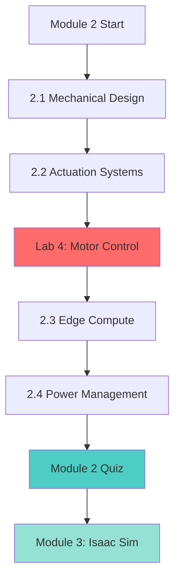

# Module 2: Core Architecture - Motors, Compute & Power

## Introduction

Welcome to Module 2! Now that you understand the "robotic nervous system" (ROS 2, sensors, and robot description), it's time to dive into the **physical hardware** that brings robots to life.

In this module, you'll learn how modern humanoid robots like **Unitree G1**, **Figure 02**, and **Tesla Optimus** are engineered from the ground up. We'll cover:

1. **Mechanical Design** - Link optimization, center of mass, materials
2. **Actuation Systems** - Motors, harmonic drives, and force control
3. **Edge Compute** - NVIDIA Jetson, CUDA, and real-time AI inference
4. **Power Management** - Batteries, thermal design, and efficiency

By the end of this module, you'll understand the **hardware-software integration** that enables physical AI systems to operate autonomously in the real world.

---

## Learning Objectives

After completing Module 2, you will be able to:

1. ✅ **Design mechanically optimized robot links** with proper mass distribution
2. ✅ **Select and configure actuators** for different joint types and load requirements
3. ✅ **Implement CUDA-accelerated perception** on NVIDIA Jetson edge devices
4. ✅ **Design power systems** that balance weight, runtime, and thermal constraints
5. ✅ **Optimize real-time performance** using TensorRT and model quantization
6. ✅ **Integrate motor control** with ROS 2 using hardware interfaces

---

## Module Structure

### Chapter 2.1: Mechanical Design
**Estimated Time:** 3 hours

Learn how to optimize robot link geometry for strength, weight, and manufacturability.

**Topics:**
- **2.1.1 Link Optimization** - Topology optimization, FEA simulation
- **2.1.2 Center of Mass** - CoM calculation, balance, and stability
- **2.1.3 Material Selection** - Carbon fiber, aluminum, 3D printing trade-offs

**Real-World Examples:** Unitree G1's carbon fiber construction, Figure 02's topology-optimized chassis

---

### Chapter 2.2: Actuation Systems
**Estimated Time:** 4 hours

Understand the motors and transmissions that power humanoid movement.

**Topics:**
- **2.2.1 Servo Motors** - Brushless DC motors, encoders, feedback control
- **2.2.2 Harmonic Drives** - Gear reduction, backlash elimination, torque density
- **2.2.3 Series Elastic Actuators** - Force control, compliance, safe human interaction

**Real-World Examples:** Tesla Optimus's custom actuators, Boston Dynamics' hydraulic systems

---

### Chapter 2.3: Edge Compute Architecture
**Estimated Time:** 4 hours

Deploy AI models on embedded GPUs for real-time perception and decision-making.

**Topics:**
- **2.3.1 Jetson Architecture** - Orin vs Xavier, CUDA cores, memory bandwidth
- **2.3.2 CUDA Optimization** - Kernel fusion, memory coalescing, profiling
- **2.3.3 TensorRT Deployment** - INT8 quantization, dynamic shapes, plugin development

**Real-World Examples:** Agility Robotics Digit's onboard compute, ANYmal's sensor fusion

---

### Chapter 2.4: Power Management
**Estimated Time:** 3 hours

Design battery systems that maximize runtime while managing heat and safety.

**Topics:**
- **2.4.1 Battery Systems** - LiPo vs NMC chemistry, C-rating, BMS design
- **2.4.2 Thermal Design** - Heat sinks, active cooling, thermal throttling
- **2.4.3 Power Distribution** - Buck/boost converters, ripple filtering, grounding

**Real-World Examples:** Boston Dynamics Spot's 90-minute runtime, Unitree G1's battery pack

---

## Hands-On Lab

### Lab 4: Motor Control with PID Tuning
**Difficulty:** 🟡 Intermediate
**Estimated Time:** 2 hours

Build a ROS 2 motor controller that:
1. Reads encoder feedback at 1 kHz
2. Implements PID position control
3. Tunes gains using Ziegler-Nichols method
4. Visualizes step response in PlotJuggler

**Hardware:** Arduino + encoder motor (or simulation in Gazebo)

**Deliverables:**
- PID controller node in rclpy
- Parameter tuning YAML config
- Performance plots (rise time, overshoot, steady-state error)

---

## Prerequisites

### Required Knowledge

**From Module 1:**
- ✅ ROS 2 fundamentals (nodes, topics, services)
- ✅ URDF robot description and coordinate frames
- ✅ Basic Linux command line usage

**Additional:**
- ✅ Physics (Newton's laws, torque, angular velocity)
- ✅ Basic calculus (derivatives for PID control)
- ✅ Electrical circuits (voltage, current, power)

**Optional but Helpful:**
- Python NumPy for matrix operations
- Experience with embedded systems (Arduino, Raspberry Pi)
- CAD software (Fusion 360, SolidWorks) for mechanical design visualization

---

## Required Hardware

### For Lab 4 (Motor Control)

**Option A: Physical Hardware**
- Arduino Uno or Mega ($25)
- Brushless DC motor with encoder ($40)
- Motor driver (L298N or similar, $8)
- 12V power supply ($15)
- Breadboard and jumper wires ($10)

**Total: ~$100**

**Option B: Simulation (No Hardware Needed)**
- Use Gazebo with `ros2_control` plugin
- Simulated motor dynamics
- Virtual encoder feedback

**Recommended:** Start with simulation, then test on real hardware if available.

---

## Software Setup

### NVIDIA Jetson Setup (Chapter 2.3)

If you have an NVIDIA Jetson device (Nano, Xavier NX, Orin Nano):

```bash
# Install JetPack 6.0 (includes CUDA 12.2, TensorRT 8.6)
# Follow official NVIDIA guide: https://developer.nvidia.com/embedded/jetpack

# Verify CUDA installation
nvcc --version  # Should show CUDA 12.2

# Install TensorRT Python bindings
sudo apt install python3-libnvinfer python3-libnvinfer-dev
```

**Don't have a Jetson?** We'll provide cloud-based alternatives (Google Colab with GPU).

---

### Arduino Setup (Lab 4)

```bash
# Install Arduino CLI
curl -fsSL https://raw.githubusercontent.com/arduino/arduino-cli/master/install.sh | sh

# Install PlatformIO (alternative)
pip install platformio

# Install ROS 2 serial bridge
sudo apt install ros-humble-rosserial-arduino
```

---

## Real-World Context

### Why This Module Matters

**Industry Example: Unitree G1**

| Component | Specification | Design Choice |
|-----------|--------------|---------------|
| **Actuators** | 23 custom brushless motors | High torque density (30 Nm in elbow) |
| **Compute** | NVIDIA Jetson Orin | Real-time VLA inference at 10 Hz |
| **Battery** | 6S LiPo, 5000mAh | 2 hours runtime, quick-swap design |
| **Weight** | 35 kg total | Carbon fiber links, aluminum joints |

**This module teaches you how to make similar design decisions** for your own robot platform.

---

### Career Relevance

**Job Roles Using These Skills:**
- **Robotics Mechatronics Engineer** - $95k-$140k (US)
- **Embedded AI Engineer** - $110k-$160k
- **Motor Control Engineer** - $85k-$130k
- **Hardware Systems Architect** - $120k-$180k

**Companies Hiring:**
- Boston Dynamics, Agility Robotics, Figure AI
- NVIDIA (Robotics Division), Tesla (Optimus Team)
- Waymo, Cruise, Zoox (Autonomous Vehicles)

---

## Learning Path



**Recommended Schedule:**
- **Week 3:** Chapters 2.1-2.2 + Lab 4
- **Week 4:** Chapters 2.3-2.4 + Quiz

---

## Key Concepts Preview

### Actuator Specifications You'll Learn

| Metric | Servo Motor | Harmonic Drive | Series Elastic |
|--------|-------------|----------------|----------------|
| **Torque Density** | Low (0.5 Nm/kg) | High (30 Nm/kg) | Medium (5 Nm/kg) |
| **Backdrivability** | Poor | Poor | Excellent |
| **Force Control** | Position only | Position only | Force + Position |
| **Cost** | $50 | $2000 | $500 |
| **Use Case** | Grippers | Joints | Human interaction |

### NVIDIA Jetson Comparison

| Model | CUDA Cores | TensorRT FP16 | Power | Price |
|-------|-----------|---------------|-------|-------|
| **Nano** | 128 | 472 GFLOPS | 10W | $149 |
| **Xavier NX** | 384 | 21 TOPS | 15W | $399 |
| **Orin Nano** | 1024 | 40 TOPS | 15W | $499 |
| **Orin NX** | 1024 | 100 TOPS | 25W | $799 |

**Rule of Thumb:** 1 TOPS ≈ 30 FPS for YOLOv8 object detection

---

## Textbook Alignment

This module covers **Part 2** of the Physical AI curriculum:

- ✅ **Module 1:** ROS 2, URDF, Sensors (Completed)
- 🔄 **Module 2:** Motors, Compute, Power (Current)
- ⏳ **Module 3:** NVIDIA Isaac Sim (Next)
- ⏳ **Module 4:** Vision-Language-Action Models

---

## Assessment

### Module 2 Quiz (15 Questions)

**Topics Covered:**
- Mechanical design calculations (CoM, moment of inertia)
- Motor specifications (torque, speed, power)
- CUDA programming concepts (threads, blocks, memory hierarchy)
- Battery chemistry and thermal management
- PID control tuning

**Passing Score:** 12/15 (80%)

**Time Limit:** None (self-paced)

---

## Getting Help

### Troubleshooting Resources

**Hardware Issues:**
- **Motor not spinning:** Check power supply voltage, motor driver connections
- **Encoder noise:** Add pull-up resistors, use shielded cables
- **Thermal shutdown:** Verify heat sink installation, reduce duty cycle

**Software Issues:**
- **CUDA out of memory:** Reduce batch size, use model quantization
- **ROS 2 controller not starting:** Check `ros2_control` YAML config
- **TensorRT build failure:** Verify ONNX opset version compatibility

**Community Support:**
- GitHub Discussions: [Book Repository](https://github.com/shazilk-dev/physical-ai-and-robotics-book/discussions)
- ROS 2 Answers: https://answers.ros.org/
- NVIDIA Developer Forums: https://forums.developer.nvidia.com/

---

## Additional Resources

### Recommended Reading

**Mechanical Design:**
- **Book:** "Robot Modeling and Control" by Spong, Hutchinson, Vidyasagar
- **Paper:** "Design and Optimization of Humanoid Robots" (IEEE Robotics & Automation Magazine)

**Motor Control:**
- **Tutorial:** "PID Control for Real Robots" (The Construct)
- **Book:** "Modern Control Engineering" by Ogata

**Edge AI:**
- **Course:** NVIDIA DLI - "Getting Started with AI on Jetson Nano"
- **Documentation:** TensorRT Developer Guide (https://docs.nvidia.com/deeplearning/tensorrt/)

---

## Next Steps

Ready to start? Begin with **Chapter 2.1: Mechanical Design** to learn how to optimize robot links for strength and weight.

**Let's build the hardware foundation for intelligent robots!** 🦾⚙️

---

**Module Status:** 🚧 In Development
**Last Updated:** December 2025
**Maintainer:** Physical AI Textbook Team
