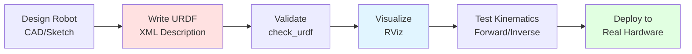

# Lab 2: URDF Humanoid - Build a Simplified Upper Body Robot

## Overview

**Difficulty:** Intermediate
**Estimated Time:** 60-90 minutes
**Module:** 1.2 URDF & Robot Description

In this lab, you'll build a **simplified humanoid robot** with an upper body (torso, arms, head) using URDF (Unified Robot Description Format). You'll visualize it in RViz, test joint movements, and validate the kinematics—the same workflow used by companies like Boston Dynamics and Tesla for robot development.

## Learning Objectives

By completing this lab, you will:

1. ✅ Create a multi-link URDF file with proper kinematic chains
2. ✅ Define joints (revolute, fixed) with limits and dynamics
3. ✅ Add visual and collision geometries
4. ✅ Launch and visualize your robot in RViz
5. ✅ Use `joint_state_publisher_gui` to test joint movements
6. ✅ Validate URDF syntax and check for errors
7. ✅ Understand the URDF → RViz → Robot Control pipeline

## Prerequisites

**Required Knowledge:**
- Section 1.2.1: URDF Basics & Xacro Macros
- Section 1.2.2: Sensors in URDF
- Lab 1: Your First ROS 2 Node (completed)

**Required Software:**
- ROS 2 Humble (Ubuntu 22.04)
- RViz (`ros-humble-rviz2`)
- Joint State Publisher GUI (`ros-humble-joint-state-publisher-gui`)
- URDF Validator tools

**Install required packages:**
```bash
sudo apt install -y \
  ros-humble-rviz2 \
  ros-humble-joint-state-publisher-gui \
  ros-humble-xacro \
  ros-humble-robot-state-publisher \
  ros-humble-urdf-tutorial
```

## Robot Specifications

You'll build a **simplified humanoid upper body** with:

**Links (Rigid Bodies):**
- Base/Torso (main body)
- Head
- Left Upper Arm
- Left Forearm
- Right Upper Arm
- Right Forearm

**Joints (Connections):**
- Neck (1 DOF - yaw rotation)
- Left Shoulder (2 DOF - pitch + roll)
- Left Elbow (1 DOF - pitch)
- Right Shoulder (2 DOF - pitch + roll)
- Right Elbow (1 DOF - pitch)

**Total: 7 Degrees of Freedom (DOF)**

**Dimensions** (inspired by Unitree G1):
- Torso: 0.3m × 0.2m × 0.4m (W × D × H)
- Upper arm: 0.25m length
- Forearm: 0.25m length
- Head: 0.15m diameter sphere
- Total reach: ~0.5m per arm

## Lab Structure

```
lab02-urdf-humanoid/
├── README.md                        # This file
├── SETUP_GUIDE.md                   # Detailed setup instructions
│
├── starter/                         # Start here
│   ├── package.xml
│   ├── CMakeLists.txt
│   ├── urdf/
│   │   └── humanoid.urdf            # URDF with 10 TODOs
│   ├── launch/
│   │   └── display.launch.py        # Launch file (complete)
│   ├── rviz/
│   │   └── humanoid.rviz            # RViz config (complete)
│   └── meshes/                      # (Optional) Custom 3D models
│
├── solutions/                       # Reference implementation
│   ├── package.xml
│   ├── CMakeLists.txt
│   ├── urdf/
│   │   └── humanoid.urdf            # Complete URDF
│   ├── launch/
│   │   └── display.launch.py
│   └── rviz/
│       └── humanoid.rviz
│
├── tests/
│   ├── test_urdf_validity.py       # Syntax validation
│   ├── test_joint_limits.py        # Joint range checks
│   └── test_kinematics.py          # Forward kinematics test
│
└── assets/
    ├── expected_rviz.png            # Screenshot of correct visualization
    ├── joint_ranges.txt             # Expected joint limits
    └── reference_dimensions.txt     # Link measurements
```

## Instructions

### Step 1: Set Up Package

```bash
# Navigate to workspace
cd ~/ros2_ws/src

# Copy starter code
cp -r /path/to/labs/lab02-urdf-humanoid/starter humanoid_description

# Build
cd ~/ros2_ws
colcon build --packages-select humanoid_description
source install/setup.bash
```

### Step 2: Understand URDF Structure

Open `urdf/humanoid.urdf` and review the skeleton:

```xml
<?xml version="1.0"?>
<robot name="simple_humanoid">

  <!-- BASE LINK: Torso -->
  <link name="torso">
    <!-- TODO 1: Add visual geometry (box: 0.3 × 0.2 × 0.4) -->
    <!-- TODO 2: Add collision geometry (same as visual) -->
    <!-- TODO 3: Add inertial properties (mass: 5kg) -->
  </link>

  <!-- HEAD -->
  <link name="head">
    <!-- TODO 4: Define head geometry (sphere, radius 0.075m) -->
  </link>

  <joint name="neck" type="revolute">
    <!-- TODO 5: Define neck joint (connects torso → head) -->
    <!-- Axis: Z (yaw rotation), Limits: -90° to +90° -->
  </joint>

  <!-- LEFT ARM -->
  <!-- TODO 6: Define left_upper_arm link -->
  <!-- TODO 7: Define left_shoulder joint (2 DOF - requires 2 joints!) -->
  <!-- TODO 8: Define left_forearm link -->
  <!-- TODO 9: Define left_elbow joint -->

  <!-- RIGHT ARM -->
  <!-- TODO 10: Mirror left arm for right side -->

</robot>
```

### Step 3: Implement TODOs (50-70 minutes)

**Your tasks:**

**TODO 1-3: Torso (Main Body)**
- Visual: Blue box (0.3 × 0.2 × 0.4 m)
- Collision: Same as visual
- Inertial: Mass 5kg, appropriate inertia tensor

**TODO 4-5: Head & Neck**
- Head: Red sphere (radius 0.075m)
- Neck joint: Revolute, Z-axis, ±90° limits

**TODO 6-9: Left Arm (4 links + 3 joints)**
- Left shoulder pitch: X-axis, -45° to +180° (forward/backward)
- Left shoulder roll: Y-axis, 0° to +90° (outward)
- Left elbow: X-axis, 0° to +135° (bend inward)

**TODO 10: Right Arm**
- Mirror left arm with sign inversions

**Hints:**
- Use `<origin xyz="x y z" rpy="r p y"/>` to position joints
- Joint axis: X = red, Y = green, Z = blue (in RViz)
- Check Section 1.2.1 for URDF syntax reference

### Step 4: Validate URDF

```bash
# Check for syntax errors
check_urdf humanoid.urdf

# Expected output:
# robot name is: simple_humanoid
# ---------- Successfully Parsed XML ---------------
# root Link: torso has 3 child(ren)
#     child(1):  head
#     child(2):  left_upper_arm
#     child(3):  right_upper_arm
```

### Step 5: Visualize in RViz

```bash
# Launch visualization
ros2 launch humanoid_description display.launch.py

# RViz should open with:
# - Robot model visible (blue torso, red head, green arms)
# - Joint sliders on the left (from joint_state_publisher_gui)
# - TF frames showing coordinate axes
```

**Test joint movements:**
- Move neck slider: Head should rotate left/right
- Move shoulder sliders: Arms should raise/lower
- Move elbow sliders: Forearms should bend

### Step 6: Run Automated Tests

```bash
# Test URDF validity
python3 tests/test_urdf_validity.py

# Test joint limits
python3 tests/test_joint_limits.py

# Test kinematics (forward kinematics check)
python3 tests/test_kinematics.py
```

## Acceptance Criteria

Your URDF passes if:

- ✅ `check_urdf` reports no errors
- ✅ Robot visualizes correctly in RViz (7 links visible)
- ✅ All 7 joints move independently in GUI
- ✅ Joint limits match specifications
- ✅ No collisions in default pose (arms at sides)
- ✅ Forward kinematics: Hand positions match expected values
- ✅ TF tree has proper parent-child relationships

## Common Issues & Fixes

**Issue 1: Robot doesn't appear in RViz**
```bash
# Check if robot_state_publisher is running
ros2 node list
# Should show: /robot_state_publisher

# Check TF tree
ros2 run tf2_tools view_frames
# Should generate frames.pdf with all links
```

**Issue 2: Joints don't move**
```bash
# Verify joint_state_publisher_gui is running
ros2 topic list | grep joint
# Should show: /joint_states

# Echo joint states
ros2 topic echo /joint_states
```

**Issue 3: "Failed to build tree" error**
- Each link must have exactly ONE parent (except root)
- Check for circular dependencies
- Ensure `<parent>` and `<child>` link names are correct

**Issue 4: Weird robot pose in RViz**
- Check `<origin>` tags: XYZ positions and RPY rotations
- Verify joint axes (X/Y/Z in `<axis>` tags)
- Use RViz "Reset" button to return to default view

## Extension Challenges

1. **Add hands:** Create 2-finger grippers with 2 DOF each
2. **Add colors:** Use `<material>` tags for realistic appearance
3. **Add sensors:** Attach camera to head using Section 1.2.2
4. **Use Xacro:** Convert URDF to Xacro with macros for left/right arms
5. **Add lower body:** Extend to full humanoid with legs (14+ DOF total)

## Understanding the Workflow

This lab teaches the **standard robot development pipeline**:



**Real-world usage:**
- **Boston Dynamics Atlas:** URDF with 28 DOF for simulation before hardware testing
- **Tesla Optimus:** URDF for Isaac Sim training before physical deployment
- **NASA Rovers:** URDF for mission planning and obstacle avoidance

## Solution

Complete implementation available in `solutions/urdf/humanoid.urdf`.

**To compare:**
```bash
# View solution side-by-side
diff starter/urdf/humanoid.urdf solutions/urdf/humanoid.urdf
```

## Next Steps

After completing this lab:

1. ✅ Review Section 1.2.3: Validating Kinematics & Joint Limits
2. ✅ Try extension challenges
3. ✅ Proceed to Lab 3: Sensor Fusion (IMU + Camera)
4. ✅ (Optional) Convert URDF to Xacro for parametric designs

---

## Resources

- **URDF Specification:** http://wiki.ros.org/urdf/XML
- **RViz User Guide:** https://docs.ros.org/en/humble/Tutorials/Intermediate/RViz/RViz-User-Guide/RViz-User-Guide.html
- **Joint State Publisher:** http://wiki.ros.org/joint_state_publisher
- **Example URDFs:** https://github.com/ros/urdf_tutorial

---

**Ready to build your first humanoid?** Start with `starter/urdf/humanoid.urdf` and follow the TODOs! 🤖

**Estimated time breakdown:**
- Setup & understanding: 10 minutes
- Implementing TODOs 1-5 (torso, head): 20 minutes
- Implementing TODOs 6-10 (arms): 30 minutes
- Testing & debugging: 20 minutes
- **Total: 80 minutes**
