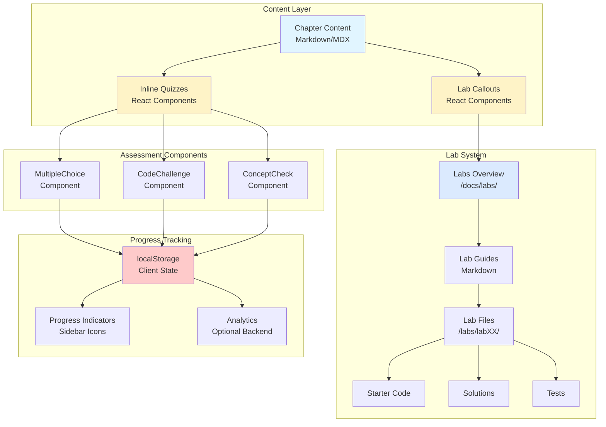
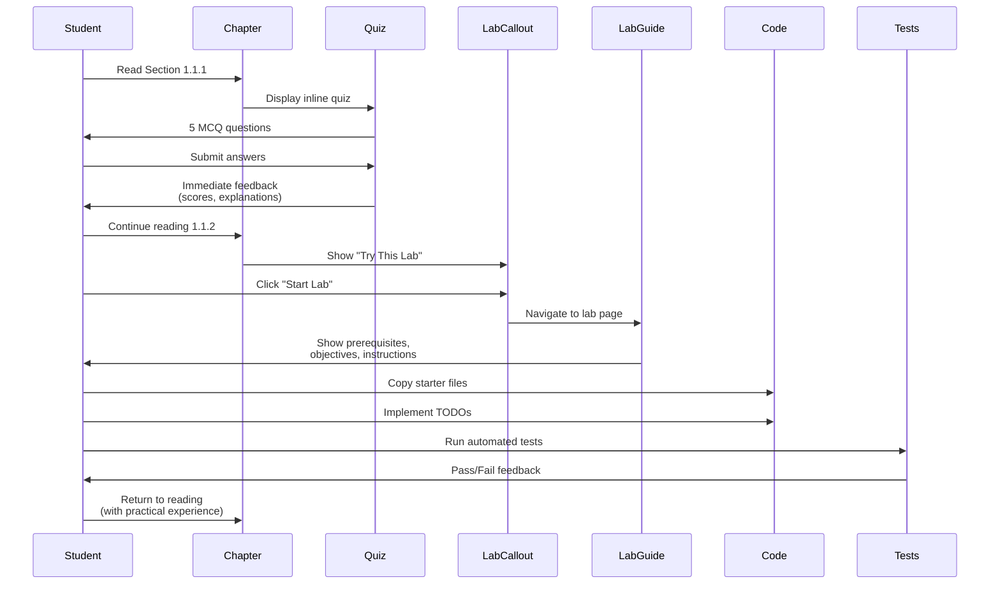
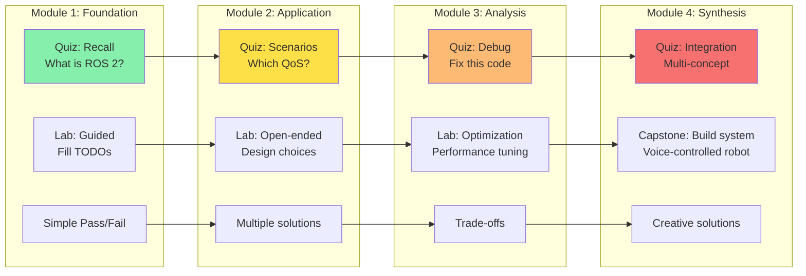
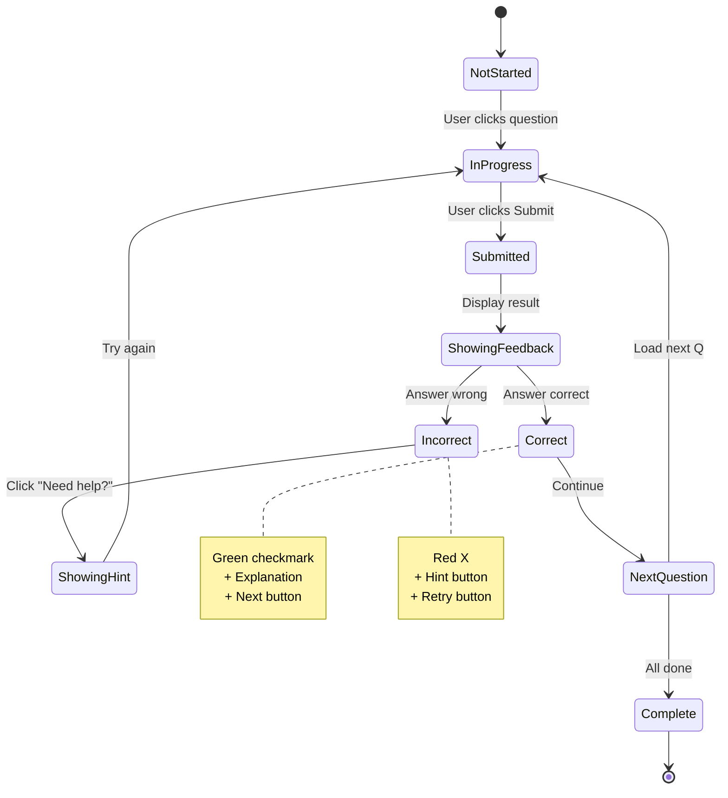
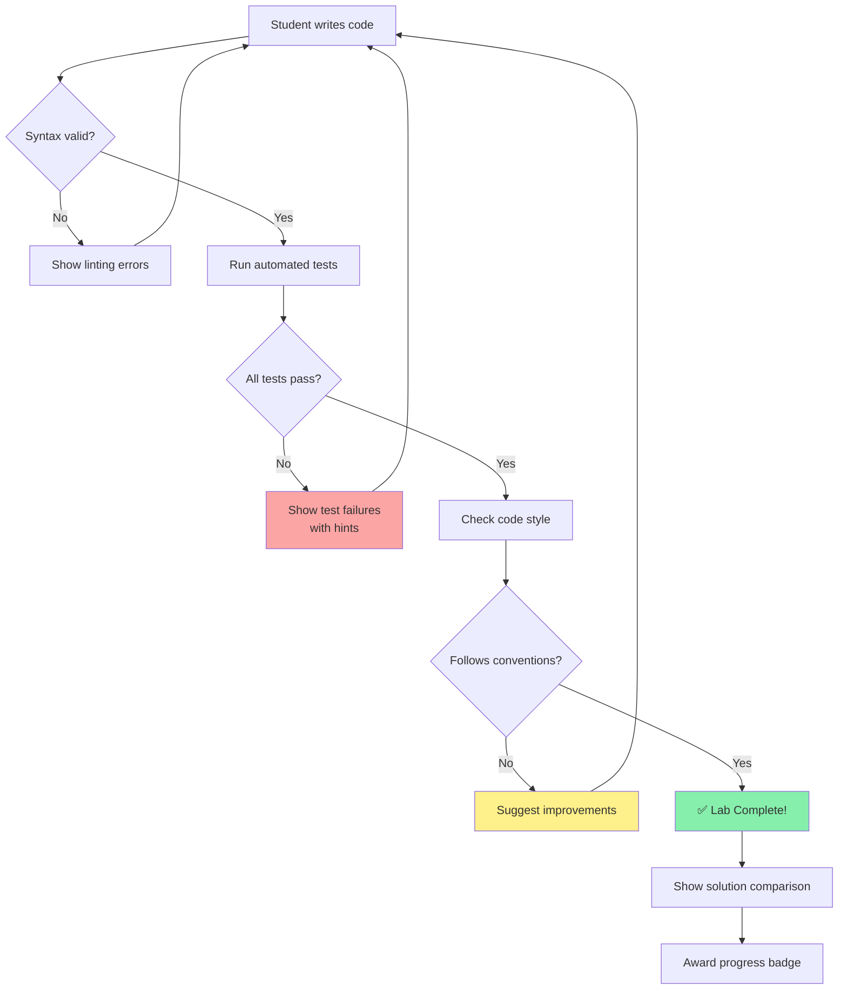

# Quiz & Lab Integration Architecture

## Visual Overview



## Learning Flow Architecture



## Component Hierarchy

```
frontend/
├── docs/
│   ├── module-01-ros2/
│   │   ├── ros2-fundamentals/
│   │   │   ├── 1.1.1-architecture.md ──┐
│   │   │   │   (includes Quiz)         │
│   │   │   ├── 1.1.2-rclpy-patterns.md │
│   │   │   │   (includes LabCallout)───┼───► Links to Labs
│   │   │   └── ...                     │
│   │   └── ...                         │
│   │                                   │
│   └── labs/ ◄─────────────────────────┘
│       ├── overview.md (All labs index)
│       ├── lab01-ros2-basics.md
│       ├── lab02-urdf.md
│       └── rubrics.md
│
├── src/
│   └── components/
│       ├── Quiz/
│       │   ├── MultipleChoice.tsx
│       │   ├── CodeChallenge.tsx
│       │   ├── ConceptCheck.tsx
│       │   └── Quiz.module.css
│       │
│       └── LabCallout/
│           ├── LabLink.tsx
│           ├── LabCard.tsx
│           └── LabCallout.module.css
│
└── static/
    └── progress.json (optional analytics)
```

## Progressive Difficulty Curve



## Quiz Component State Machine



## Lab Validation Pipeline



## Navigation UX Flow

```
Homepage
   │
   ├─► Introduction (Overview of book)
   │
   ├─► Module 1: ROS 2 Nervous System
   │    │
   │    ├─► Chapter 1.1: ROS 2 Fundamentals
   │    │    ├─► 1.1.1 Architecture ──► Quiz (inline) ──► ✅ 4/5 correct
   │    │    ├─► 1.1.2 rclpy Patterns ──► Quiz (inline) ──► ✅ 5/5 correct
   │    │    │                         └──► Lab Callout ──┐
   │    │    ├─► 1.1.3 Parameters                        │
   │    │    └─► 1.1.4 QoS Tuning                        │
   │    │                                                 │
   │    ├─► Chapter 1.2: URDF & Robot Description        │
   │    │    ├─► 1.2.1 URDF Basics                       │
   │    │    ├─► 1.2.2 Sensors ──► Lab Callout ──┐       │
   │    │    ├─► 1.2.3 Validation                │       │
   │    │    └─► 1.2.4 Testing                   │       │
   │    │                                         │       │
   │    └─► Module 1 Capstone (Project)          │       │
   │                                              │       │
   └─► 🔬 Labs & Exercises ◄────────────────────┴───────┘
        │
        ├─► Labs Overview (All labs matrix)
        ├─► Lab 1: First ROS 2 Node ◄──────────── (linked from 1.1.2)
        │    ├─► README (Instructions)
        │    ├─► Prerequisites checklist
        │    ├─► Download starter code
        │    └─► Run automated tests
        │
        ├─► Lab 2: Build URDF ◄────────────────── (linked from 1.2.2)
        │    └─► ...
        │
        └─► Lab Rubrics (Self-assessment)
```

## Progress Tracking Data Model

```typescript
// Client-side localStorage schema
interface UserProgress {
  userId?: string; // Optional if auth added later

  // Quiz progress
  quizzes: {
    [quizId: string]: {
      completed: boolean;
      score: number;
      attempts: number;
      lastAttempt: string; // ISO timestamp
      answers: number[]; // Selected options
    };
  };

  // Lab progress
  labs: {
    [labId: string]: {
      status: "not-started" | "in-progress" | "completed";
      startedAt?: string;
      completedAt?: string;
      testsPassedCount: number;
      totalTests: number;
    };
  };

  // Module progress
  modules: {
    [moduleId: string]: {
      chaptersCompleted: number;
      totalChapters: number;
      quizzesCompleted: number;
      totalQuizzes: number;
      labsCompleted: number;
      totalLabs: number;
      capstoneCompleted: boolean;
    };
  };

  // Preferences
  settings: {
    showHints: boolean;
    darkMode: boolean;
    language: "en" | "ur"; // For future translation
  };
}

// Example localStorage key
// physicalai_progress_v1
```

## Responsive Design Breakpoints

```css
/* Quiz Component Responsive Layout */

/* Desktop (>996px) */
.quiz-container {
  max-width: 800px;
  margin: 2rem auto;
  padding: 2rem;
}

.quiz-options {
  display: grid;
  grid-template-columns: 1fr 1fr; /* 2 columns */
  gap: 1rem;
}

/* Tablet (768px - 996px) */
@media (max-width: 996px) {
  .quiz-container {
    padding: 1.5rem;
  }

  .quiz-options {
    grid-template-columns: 1fr; /* 1 column */
  }
}

/* Mobile (<768px) */
@media (max-width: 768px) {
  .quiz-container {
    padding: 1rem;
    margin: 1rem 0;
  }

  .quiz-question {
    font-size: 1rem; /* Smaller text */
  }

  .quiz-button {
    width: 100%; /* Full-width buttons */
  }
}
```

## Color Coding System

```css
/* Consistent with modernized UI palette */

:root {
  /* Quiz feedback colors */
  --quiz-correct: #86efac; /* Green-300 */
  --quiz-incorrect: #fca5a5; /* Red-300 */
  --quiz-hint: #fef08a; /* Yellow-200 */
  --quiz-neutral: #cbd5e1; /* Slate-300 */

  /* Difficulty badges */
  --difficulty-beginner: #86efac; /* Green */
  --difficulty-intermediate: #fbbf24; /* Amber */
  --difficulty-advanced: #f87171; /* Red */

  /* Lab status indicators */
  --status-not-started: #cbd5e1; /* Slate */
  --status-in-progress: #60a5fa; /* Blue */
  --status-completed: #34d399; /* Emerald */
}
```

## API Endpoints (Optional Future Backend)

```typescript
// If authentication is added later

// Progress tracking
POST   /api/progress/quiz
GET    /api/progress/user/:userId
PUT    /api/progress/lab/:labId

// Analytics (instructor dashboard)
GET    /api/analytics/quiz/:quizId
GET    /api/analytics/lab/:labId
GET    /api/analytics/module/:moduleId

// Leaderboard (if gamification added)
GET    /api/leaderboard/global
GET    /api/leaderboard/cohort/:cohortId

// Example request/response
POST /api/progress/quiz
{
  "quizId": "1.1.1",
  "score": 80,
  "answers": [1, 2, 0, 3, 1], // Selected options
  "duration": 120 // seconds
}

Response 200:
{
  "success": true,
  "progress": {
    "totalQuizzesTaken": 5,
    "averageScore": 85,
    "moduleCompletion": 40
  }
}
```

## Accessibility Checklist

```markdown
## Quiz Components

- [ ] ARIA labels on all buttons (`aria-label="Submit answer"`)
- [ ] Keyboard navigation (Tab, Enter, Space)
- [ ] Screen reader announcements for feedback
- [ ] Focus indicators visible (outline: 2px solid blue)
- [ ] Color contrast ratio > 4.5:1 (WCAG AA)
- [ ] Skip to next question keyboard shortcut

## Lab Components

- [ ] Semantic HTML (`<article>`, `<section>`, `<nav>`)
- [ ] Heading hierarchy (h1 → h2 → h3, no skipping)
- [ ] Alt text for all diagrams
- [ ] Code examples use `<pre><code>` with syntax highlighting
- [ ] External links open in new tab with warning
- [ ] Form inputs have associated labels
```

## Performance Optimization

```typescript
// Lazy load quiz components (only when visible)
import { lazy, Suspense } from "react";

const MultipleChoice = lazy(
  () => import("@site/src/components/Quiz/MultipleChoice")
);

function QuizSection() {
  return (
    <Suspense fallback={<div>Loading quiz...</div>}>
      <MultipleChoice {...props} />
    </Suspense>
  );
}

// Debounce progress saves (avoid excessive localStorage writes)
import { debounce } from "lodash";

const saveProgress = debounce((progress) => {
  localStorage.setItem("physicalai_progress", JSON.stringify(progress));
}, 500); // Save after 500ms of inactivity
```

---

**This architecture supports:**

- ✅ Scalability (easy to add new quizzes/labs)
- ✅ Maintainability (clear separation of concerns)
- ✅ Performance (lazy loading, optimized renders)
- ✅ Accessibility (WCAG AA compliant)
- ✅ Extensibility (can add backend later without refactoring)
